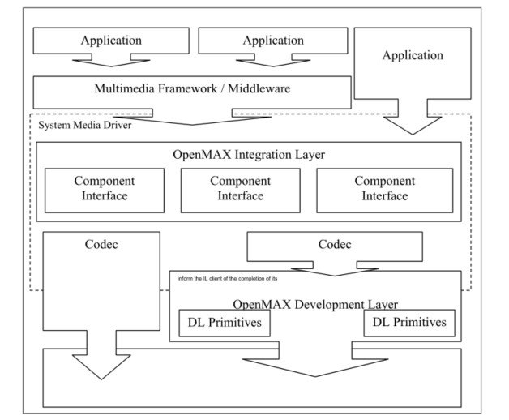

# Overview

## 1.1  Introduction
This document details the Application Programming nterface (API) for the OpenMAX Integration Layer (IL). Developed as an open standard by The Khronos Group, the IL serves as a low-level interface for audio, video, and imaging codecs used in embedded and/or mobile devices. The principal goal of the IL is to give codecs a degree of system abstraction for the purpose of portability across operating systems and software stacks.

### 1.1.1 About the Khronos Group
The Khronos Group is a member-funded industry consortium focused on the creation of open standard APIs to enable the authoring and playback of dynamic media on a wide variety of platforms and devices. All Khronos members may contribute to the development of Khronos API specifications, may vote at various stages before public deployment, and may accelerate the delivery of their multimedia platforms and applications through early access to specification drafts and conformance tests. The Khronos Group is responsible for open APIs such as OpenGL ES, OpenML, and OpenVG.

### 1.1.2 A Brief History of OpenMAX
The OpenMAX set of APIs was originally conceived as a method of enabling portability of codecs and media applications throughout the mobile device landscape. Brought into the Khronos Group in mid-2004 by a handful of key mobile hardware companies, OpenMAX has gained the contributions of companies and institutions stretching the breadth of the multimedia field. As such, OpenMAX stands to unify the industry in taking steps toward media codec portability. Stepping beyond mobile platforms, the general nature of the OpenMAX IL API makes it applicable to all media platforms.

##1.2  The OpenMAX Integration Layer
The OpenMAX IL API strives to give media codecs portability across an array of platforms. The interface abstracts the hardware and software architecture in the system. Each codec and relevant transform is encapsulated in a component interface. The OpenMAX IL API allows the user to load, control, connect, and unload the individual components. This flexible core architecture allows the Integration Layer to easily implement almost any media use case and mesh with existing graph-based media frameworks.

###1.2.1 Key Features and Benefits
The OpenMAX IL API gives applications and media frameworks the ability to interface with multimedia codecs and supporting components (i.e., sources and sinks) in a unified manner. The codecs themselves may be any combination of hardware or software and are completely transparent to the user. Without a standardized interface of this nature, codec vendors must write to proprietary or closed interfaces to integrate into mobile devices. In this case, the portability of the codec is minimal at best, costing many development-years of effort in re-tooling these solutions between systems. Thus, the IL incorporates a specialized arsenal of features, honed to combat the problem of portability among many vastly different media systems. Such features include:

- A flexible component-based API core
- Ability to easily plug in new codecs
- Coverage of targeted domains (audio, video, and imaging) while remaining easily extensible by both the Khronos Group and individual vendors
- Capable of being implemented as either static or dynamic libraries
- Retention of key features and configuration options needed by parent software (such as media frameworks)
- Ease of communication between the client and the codecs and between codecs themselves
 
### 1.2.2 Design Philosophy
As previously stated, the key focus of the OpenMAX IL API is portability of media codecs. The diversity of existing devices and media implementation solutions necessitates that the OpenMAX IL target the higher level of the media software stack as
the key initial user. For most operating systems, this means an existing media framework. Thus, much of the OpenMAX IL API is defined by requirements generated by the needs of media frameworks. Similarly, the IL is designed to allow the media framework layer to be as lightweight as possible. The result is an interface that is easily pluggable into most software stacks across operating system and framework boundaries. Likewise, several features of media frameworks were perceived to be handled at higher levels and not included in the API. Among these is the issue of file handling, which, if desired, may
be easily added to the IL structure outside of the standard. The design of the API also strove to accommodate as many system architectures as possible. The resulting design uses highly asynchronous communications, which allows processing to take place in another thread, on multiple processing elements, or on specialized hardware. In addition, the ability of hardware-accelerated codecs to communicate directly with one another via tunneling affords implementation architectures even greater flexibility and efficiency.

###1.2.3 Software Landscape
In most systems, a user-level media framework already exists. The OpenMAX IL API is designed to easily fit below these frameworks with little to no overhead between the interfaces. In most cases, the media framework provided by the operating system can be replaced with a thin layer that simply translates the API. Figure 1-1 illustrates the software landscape for the OpenMAX IL API.

**Figure 1-1. OpenMAX IL API Software Landscape**

To remove possible reader confusion, the OpenMAX standard also defines a set of Development Layer (DL) primitives on which codecs can be built. The DL primitives and their full relationship to the IL are specified in other OpenMAX specification
documents.

###1.2.4 Stakeholders
A few categories of stakeholders represent the broad array of companies participating in the production of multimedia solutions, each with their own interest in the IL API.

####1.2.4.1  Silicon Vendors
Silicon vendors (SV) are responsible for delivering a representative set of OpenMAX IL components that are specific to the vendor’s platform. The vendors are anticipated to also supply components that are representative of the capabilities of their platforms.

####1.2.4.2  Independent Software Vendors
Independent software vendors (ISV) are anticipated to deliver additional differentiated OpenMAX IL components that may or may not be specific to a given silicon vendor’s platform.

####1.2.4.3  Operating System Vendors
Operating System Vendors (OSV) are anticipated to deliver software multimedia framework and standard reference OpenMAX IL components that enable integration of the representative silicon vendor’s components and ISV components. The OSV is responsible for conformance testing of the standard reference OpenMAX components.

####1.2.4.4  Original Equipment Manufacturers
Original Equipment Manufacturers (OEM) are anticipated to modify and optimize the integration of OpenMAX components provided by SVs, ISVs, and OSVs to their specific product architectures to enable delivery of OpenMAX integrated multimedia devices. OEMs may also develop and integrate their own proprietary OpenMAX components.
 
###1.2.5 The Interface
The OpenMAX IL API is a component-based media API that consists of two main segments: the core API and the component API.

####1.2.5.1  Core
The OpenMAX IL core is used for dynamically loading and unloading components and for facilitating component communication. Once loaded, the API allows the user to communicate directly with the component, which eliminates any overhead for high
commands. Similarly, the core allows a user to establish a communication tunnel between two components. Once established, the core API is no longer used and communications flow directly between components.

####1.2.5.2  Components
In the OpenMAX Integration Layer, components represent individual blocks of functionality. Components can be sources, sinks, codecs, filters, splitters, mixers, or any other data operator. Depending on the implementation, a component could possibly represent a piece of hardware, a software codec, another processor, or a combination thereof.

The individual parameters of a component can be set or retrieved through a set of associated data structures, enumerations, and interfaces. The parameters include data relevant to the component’s operation (i.e., codec options) or the actual execution state of the component.

Buffer status, errors, and other time-sensitive data are relayed to the application via a set of callback functions. These are set via the normal parameter facilities and allow the API to expose more of the asynchronous nature of system architectures.

Data communication to and from a component is conducted through interfaces called ports. Ports represent both the connection for components to the data stream and the buffers needed to maintain the connection. Users may send data to components through input ports or receive data through output ports. Similarly, a communication tunnel between two components can be established by connecting the output port of one component to a similarly formatted input port of another component.

##1.3  Definitions
When this specification discusses requirements and features of the OpenMAX IL API, specific words are used to convey their necessity in an implementation. Table 1-1 shows a list of these words.

| Word | Definition |
| ------------- |
| May  | The stated functionality is an optional requirement for an implementation of the OpenMAX IL API. Optional features are not required by the specification but may have conformance requirements if they are implemented. This is an optional feature as in “The component may have vendor specific extensions.” |
| Shall | The stated functionality is a requirement for an implementation of the OpenMAX IL API. If a component fails to meet a shall statement, it is not considered to conform to this specification. Shall is always used as a requirement, as in “The component designers shall produce good documentation.” |
| Should | The stated functionality is not a requirement for an implementation of the OpenMAX IL API but is recommended or is a good practice. Should is usually used as follows: “The component should begin processing buffers immediately after it transitions to the OMX_StateExecuting state.” While this is good practice, there may be a valid reason to delay processing buffers, such as not having input data available. |
| Will | The stated functionality is not a requirement for an implementation of the OpenMAX IL API. Will is usually used when referring to a third party, as in “the application framework will correctly handle errors.” |

**Table 1-1. Definitions of Commonly Used Words**

##1.4  Authors
The following individuals, listed alphabetically by company, contributed to the OpenMAX Integration Layer Application Programming Interface Specification.

-  Gordon Grigor (ATI)
-  Andrew Rostaing (Beatnik)
-  Chris Grigg (Beatnik)
-  Russell Tillitt (Beatnik)
-  Roger Nixon (Broadcom)
-  Brian Murray (Freescale)
-  Norbert Schwagmann (Infineon)
-  Mark Kokes (Nokia)
-  Samu Kaajas (Nokia)
-  Yeshwant Muthusamy (Nokia)
-  Jim Van Welzen (NVIDIA)
-  David Siorpaes (STMicroelectronics)
-  Diego Melpignano (STMicroelectronics)
-  Giulio Urlini (STMicroelectronics)
-  Kevin Butchart (Symbian)
-  Viviana Dudau (Symbian)
-  David Newman (Texas Instruments)
-  Leo Estevez (Texas Instruments)
-  Richard Baker (Texas Instruments)