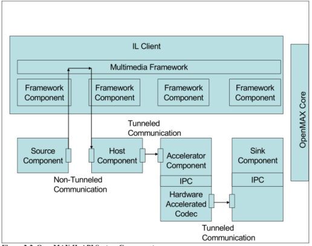
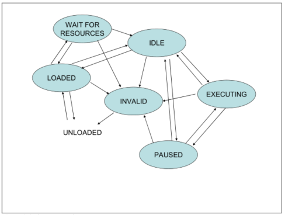
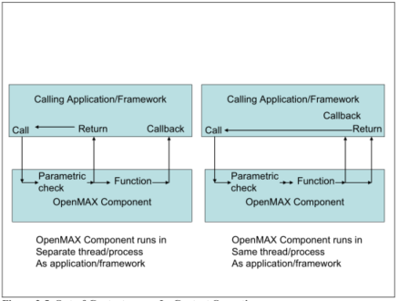
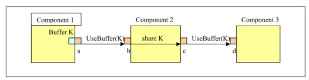
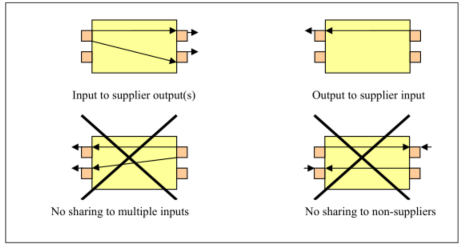
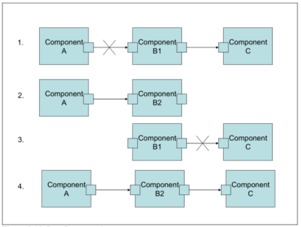
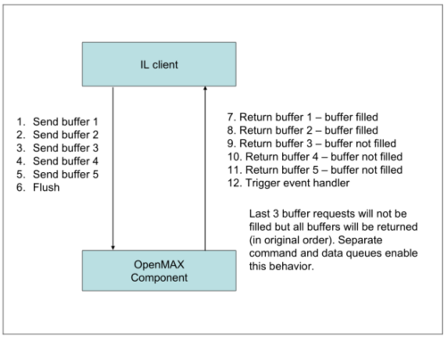
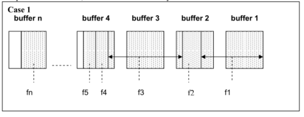
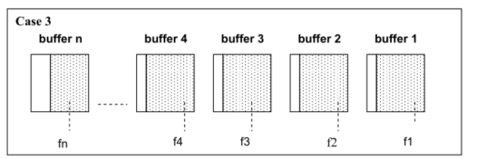

#OpenMAX IL 介绍和框架
本章介绍了OpenMAX的特点和框架

##2.1  OpenMAX IL 简介
OpenMAX IL层API定义了一个用于在系统提供的软件组件的接入层软件接口。目的是让拥有不同方法的组件提供一个标准化的接口和命令集， 来构建和销毁组件。

###2.1.1 架构概述
如果一个系统，需要四种多媒体处理模块，记为F1，F2，F3和F4。这些模块可能来自不同的公司或部门。每一个处理模块可能都有不同的初始化/销毁，配置和数据传输接口。OpenMAX IL的API可以将这些不同的接口或模块封装为标准的组件。

该API包括一个可以让来自不同的供应商/组织之间可以彼此交换数据的相互兼容组件的标准协议。

The OpenMAX IL API interfaces with a higher-level entity denoted as the IL client, which is typically a functional piece of a filter graph multimedia framework or an application. The IL client interacts with a centralized IL entity called the core. The IL client uses the OpenMAX core for loading and unloading components, setting up direct communication between two OpenMAX components, and accessing the component’s method functions.

一个高级的实体表示为OpenMAX IL IL客户端API接口，这通常是一个过滤图多媒体框架或应用程序的一个功能块。IL客户端与一个称为核心的集中式IL实体交互。IL客户使用OpenMAX核心加载和卸载组件，建立直接的沟通两OpenMAX组件之间，以及访问组件功能的方法。

An IL client always communicates with a component via the IL core. In most cases, this communication equates to calling one of the IL core’s macros, which translates directly to a call on one of the component methods. Exceptions (where the IL client calls an actual core function that works) include component creation and destruction and connection via tunneling of two components.

IL客户端总是通过IL核心与组件进行通信。在大多数情况下，这种沟通等同于称一个IL核心的宏，可以直接调用一个组件的方法。异常（其中IL客户端调用实际的核心功能）包括组件创建和销毁和连接通过两个组件的隧道。

Components embody the media processing function or functions. Although this specification clearly defines the functionality of the OpenMAX core, the component provider defines the functionality of a given component. Components operate on four types of data that are defined according to the parameter structures that they export: audio, video, image, and other (e.g., time data for synchronization).

组件内嵌了多媒体处理功能。虽然本规范明确规定了OpenMAX Core的功能，组件供应商定义了组件的功能。组件可以操作四种类型的数据：音频，视频，图像，和其他（例如，同步的时间数据）。

An OpenMAX component provides access to a standard set of component functions via its component handle. These functions allow a client to get and set component and port configuration parameters, get and set the state of the component, send commands to the component, receive event notifications, allocate buffers, establish communications with a single component port, and establish communication between two component ports. 

一个组件提供了一个通过OpenMAX组件处理组件的功能标准。这些函数允许客户端获取和设置组件和端口的配置参数，获取和设置组件的状态，发送命令到组件，接收事件通知，分配缓冲区，与一个单一的组件端口建立通信，并建立两个组件接口之间的通信。

Every OpenMAX component shall have at least one port to claim OpenMAX conformance. Although a vendor may provide an OpenMAX-compatible component without ports, the bulk of conformance testing is dependent on at least one conformant port. The four types of ports defined in OpenMAX correspond to the types of data a port may transfer: audio, video, and image data ports, and other ports. Each port is defined as either an input or output depending on whether it consumes or produces buffers. In a system containing four multimedia processing functions F1, F2, F3, and F4, a system implementer might provide a standard OpenMAX interface for each of the functions. The implementer might just as easily choose any combination of functions. The delineation for the separation of this functionality is based on ports. Figure 2-1 shows a few possible
partitions for an OpenMAX implementation that provides these functions.

每个OpenMAX部件应至少有一个端口要求OpenMAX一致性。虽然供应商可以提供一个兼容的组件没有OpenMAX端口、协议一致性测试的大部分是依赖于至少一个符合港口。定义四种类型的OpenMAX端口对应一个端口可以传输数据的类型：音频、视频、图像数据的端口，其他端口。每个端口被定义为输入或输出取决于它是否消耗或产生缓冲区。在一个系统中含有四的多媒体处理功能，F1，F2，F3和F4，，系统的实现可以提供每一功能OpenMAX接口标准。实施者只能选择函数的任意组合。这个功能的分离是基于端口的划分。图2-1显示了几个可能的为实现这些功能分区提供了OpenMAX。

**表 2-1. OpenMAX实现的几种形式**

###2.1.2 名词解释
本小节介绍了OpenMax IL 中所用的字母缩写和关键词定义

####2.1.2.1  字母缩写
表2-1 列举了OpenMAX IL中首字母缩写的含义.

| 首字母缩写 | 含义 |
| ------------- | ------------- |
| IPC | 进程间通信 |
| OMX | OpenMAX功能和结构的名称前缀。例如，一个组件可以处于OMX_StateExecuting状态。|

**表 2-1. 首字母缩写**

####2.1.2.2  关键词定义
表 2-2 列举了OpenMAX IL中关键词的定义.

| 关键词 | 含义 |
| ------------- | ------------- |
| Accelerated component | OpenMAX组件封装了一部分在加速器中运行的功能。加速组件具有某些特殊的特性，如能够支持某些类型的管道(tunnel)。|
| Accelerator | 硬件加速功能处理器。这种硬件模块也可称为硬件加速器。注意，加速器也可以不是硬件而是运行在另一个处理器上的软件模块。|
| AMR | 自适应多媒体检索的缩写，是一种从3GGP组织提出的自适应码率编解码算法。|
| Host processor | 多核系统中控制多媒体加速的处理器，通常运行高级操作系统。|
| IL client |  调用OpenMAX核心（Core）或组件(component)方法的软件层。IL客户端可能是低于GUI的软件层，如Gstreamer，也可能在GUI下面几层。在此文档中，应用是指任何调用OpenMAX方法的软件模块。|
| Main memory | CPU和加速器共享的外部存储器。|
| OpenMAX component | 封装目标系统所需功能的组件。OpenMAX封装了提供功能的标准接口。 |
| OpenMAX core | 与系统平台相关的代码，提供了找到并加载OpenMAX组件到内存的必要功能。当应用不再需要此OpenMAX组件时，Core也负责销毁内存中的组件。总的来说，加载OpenMAX组件到内存后，Core将不参与组件和应用程序之间的通信|
| Resource manager | 管理系统中硬件资源的软件模块。 |
| RTP |  实时协议的缩写，它是用于传输实时数据的因特网标准协议，包括音频和视频。|
| Synchronization | 组件之间相互控制的机制。|
| Tunnels/Tunneling | 两个OpenMAX组件之间标准数据通路。|

**表 2-2. 关键词定义**

###2.1.3 系统组件
图2-2显示了使用OpenMAX进行通信的各种类型。每个组件可以有任意数量的端口用于数据通信。具有单个输出端口的组件称为源组件(Source component)。具有单个输入端口的组件称为接收器组件(sink component)。完全运行在主处理器上的组件称为主组件。在松耦合的加速器上运行的组件称为加速器组件。OpenMAX可能直接与应用程序或异构的多媒体框架集成。

下面描述了三种类型的通信。非通道通信(Non-tunneled)指的是IL客户端和组件之间的数据Buffer交换机制。通道(Tunneling)指的是组件之间直接交换数据Buffer的标准机制。专有通信(Proprietary）指的是两个组件之间直接信息数据通信，也可以当通道请求（tunneling request）时，作为一个两个组件通道的替代方案。

**表 2-2. OpenMAX IL 系统组件**

####2.1.3.1  组件Profiles
OpenMAX组件功能分为两个profile：base profile和interop profile。

Base profile 应该支持非管道（non-tunneled）通信， 可能支持专有通信（proprietary），不支持管道（tunneled）通信。

Interop profile是base profile的一个超集，它应该支持管道（tunneled）和非管道（non-tunneled）通信，可能支持专有通信。

Interop profile和base profile的主要区别是是否支持管道（tunneled）通信。定义base profile的意义在于简化OpenMAX的实现难度，因为并不需要实现tunneled 通信

###2.1.4 组件状态
每一个OpenMAX组件的运行可以视为一系列状态的转移，如图2-3。每一个组件的初始状态为unloaded。组件可以通过调用OpenMAX Core的接口进行装载。其他的状态转移可以通过直接和组件进行通信来完成。

当使用不正确的数据进行状态转移的时候，组件可以进入非法（invalide）状态。例如，如果回调函数的指针指向非法地址的时候，组件可能会超时并且向IL客户端发出错误警告。IL客户端检测到非法状态时， 应该停止运行，释放，卸载并且重新加载这个组件。图2-3描绘了所有的状态均可以跳转到非法状态，但非法状态只能跳转到unload状态，并且重新加载组件。

**表 2-3. 组件状态**

由于需要获得所需要的资源， 进入IDLE状态可能会失败。当从LOADED向IDLE转移失败时， IL客户端可以重试或者转入等待资源（Wait for resource）状态。当进入等待资源（wait for resource）状态是， 组件会向资源管理器注册，当资源可以可以获得时得到提醒。资源管理器随后将组件转至IDLE状态。IL客户端发送控制命令进行除了非法（invalide）状态以外的所以其他状态转移。

IDLE状态表明组件已经获得所有所需资源，但此时并没有处理数据。EXECUTING状态表明组件正在接受数据Buffer，进行处理，并且会发出响应的回调（见第3节）。PAUSE状态保持了数据buffer执行的上下文，但并不处理或交换数据或。从PAUSED到EXECUTING的状态转移可以当组件由挂起到继续时能够处理buffer。

从EXECLUTING到PAUSED或者IDLE的转移可能会导致处理过的buffer上下文丢失，这时候需要重新开始一个新的流。IDLE到LOADED的转可能会导致运行的资源例如通信Buffer的丢失。

###2.1.5 组件架构
表2-4描述了组件的架构。注意，该组件只有一个入口（通过一个拥有一系列标准方法接口的句柄），但可能会有多个回调，取决于组件有多少个端口（port）。每个组件会调用指定的IL客户端的事件处理程序（event handler）。每个端口（port）会调用（或回调）制定的外部方法。每个端口（port）会和一个指向buffer头的队列关联。这些buffer头指向真正的buffer。命令函数（command functions）也有一个命令队列。所有的参数或者配置函数需要提供一个指定的索引并包括一个参数或配置的结构，如图2-4。

**图 2-4. OpenMAX IL API 组件架构**

端口必须支持向IL客户端的回调。当组件是interop profile的时候，必须支持和其他组件之间的通信。

###2.1.6 通信行为
一旦OpenMAX core获得了组件的句柄，便可以开始对组件进行配置工作。当端口的数量被确定后，组件数据通信的方法便可以调用，并且是不可以阻塞的。
每一个端口会指定一个特定的数据格式，并且组件会进入合适的状态。数据通信是和组件的端口（port）绑定的。IL客户端总是会调用输入端口`OMX_EmptyThisBuffer`接口（具体信息可以看3.2.2.17小节），调用输出端口（port）的`OMX_FillThisBuffer`（具体信息可以看3.2.2.18小节）。如果是同步执行，在返回之前，回调用回调函数`OMX_EmptyBufferDone` 或 `OMX_FillBufferDone`。 图2-5表述了同步执行和异步执行的对比行为。注意， IL客户端不应该假设返回和回调的先后顺序， 必须对同步和异步的OpenMAX组件都进行异构集成。

**图 2-5. 异步对比同步操作**

与组件的数据通信总是指向特定的组件端口。每一个端口（port）有一个分配供使用的buffer，最小数量由组件制定。端口将buffer头与每一块buffer相关联。buffer头拥有buffer数据的引用，并且提供响应的元数据（metadata）。每个组件端口应该既可以分配自己的buffer也可以使用分配好的buffer，往往某一种方案会比其他的效率高。 

###2.1.7 管道（tunneled） buffer的分配和共享
本小结描述了管道（tunnel）组件的buffer分配和共享。对于给定的管道，会有一个端口提供buffer并且将buffer转递给接受的端口。最简单的情况，提供者同时会分配这些buffer。然而，在适当的情况下，管道（tunnel）组件会选择复用buffer，以免多次内存拷贝。这种做法被称为buffer共享

两个端口之间的管道表示了两个端口之间的依赖关系。buffer共享扩展了这个依赖关系，使得共享同一组buffer的所有端口形成隐式依赖链。该依赖链中的一个端口分配所有的共享buffer。

共享buffer是在组件内部实现的，并且对其他组件透明。接受端口并不知道提供者是分配还是复用了这些buffer。此外，输出也不知道输入是否复用了这些buffer。

严格的说，一个组件只需要遵守他所需要的外部语义，并且实现buffer共享。更具体的说，外部语义要求一个组件能够做到如下：

-  在所有输出端口（Provide buffer）上提供buffer。
-  精确地在其端口上传递buffer要求。
-  从一个输出端口向一个输入端口通过调用`OMX_EmptyThisBuffer`转递数据
-  从一个输入端口向一个输出端口通过调用`OMX_FillThisBuffer`返回一个buffer

如果一个组件使用共享buffer, 它需要实现如下功能：

-  在某些输出端口上提供可复用的buffer
-  当端口上有buffer通信的需求时可以共享端口。
-  调用`OMX_EmptyThisBuffer`和其对应的回调函数`OMX_EmptyBufferDone`之间， 内部会从输出端口到另一个输出端口传递一个buffer
  

OpenMAX虽然没有明确要求组件支持共享, 但定义了外部构件语义需要兼容共享方式。本节讨论在共享buffer的上下文中实现这些语义。如果没有组件共享buffer，则实现简化为一组简单的步骤和过称。

####2.1.7.1  相关术语
本节描述了tunneled buffer的分配和共享。图2-6描绘了概念。

**图 2-6. Buffer分配和共享关系的例子**

在一对管道连接的端口中，端口会调用他的邻居端口`UseBuffer`接口告知自己为输出端口。输出端口并不一定需要分配内存，它可以复用同组件下另一端口的buffer。在图2-6中，端口a和c描绘了输出端口。

从邻居端口接收到`UseBuffer`调用的端口是一个输出端口。图2-6中的端口b和d描绘了出入端口。

一个端口的管道端口是指其共享管道的邻居端口。例如，在图2-6中端口b是端口a的管道端口。同理，a也是b的管道端口。

一个分配器端口（allocator port）是一个输出端口，而且可有分配自己的buffer。图2-6中的端口a是唯一的分配器端口。

共享端口（sharing port）是可以复用同一组件中其他端口buffer的端口。例如，图2-6中端口c就是共享端口。

一个管道组件指的是至少有一个管道的组件。

端口buffer的需求包括了buffer的数量和每块buffer的大小。buffer所需的最大值是指所需数量的最大值和所需大小的最大值。一个端口通过其管道端口调用`OMX_GetParameter`接口，并传入结构体`OMX_PORTDEFINITIONTYPE`参数来获得buffer的需求。注意，一个端口可能从其共享buffer的端口而不是接受`OMX_GetParameter`接口来确定其buffer的需求，因为他们隶属于同一个组件。

####2.1.7.2  IL客户端组建设置
为了配置管道组件，IL客户端需要按顺序进行下面的操作：

1. 加载所有的管道组件并配置这些组件的管道。
2. 将所有的管道组件的状态由loaded转为idle。

如果IL客户端没有按此进行操作，一个管道组件可能由于组件间的依赖关系而永远无法转移到idle状态。

####2.1.7.3  共享时组件状态由loaded到idle的转移
在`OMX_SetupTunnel`调用时，管道的两个端口会确立哪个端口（输入或输出）是buffer提供者。因此，当一个组件被要求从loaded转移到idle时，它会知道它所有提供者和接受者端口的角色。

当命令组件由loaded转移到idle的时候，它需要按顺序进行下面的操作：

1. 组件决定那种buffer共享它需要实现。如果有，需要遵循下列规则：

	- a) A component may re-use a buffer only from one of its one input ports on one or more of its output ports or from one of its output ports on one of its input ports.组件可以仅在其一个或多个输出端口上或其一个输出端口的一个输出端口上从一个输入端口重新使用缓冲区。
	- b) 只有提供者端口可以复用其他端口的buffer。
	- c) A component sharing buffers over multiple output ports requires read-only output port as shown in Figure 2-7.一个组件在多个输出端口共享缓存需要只读输出端口，如图2-7所示。

**图 2-7. 可能的共享关系**

2. The component determines which of its supplier ports, if any, are also allocator ports. A supplier port is also an allocator port only if it does not re-use buffers from a non-supplier port on the same component (i.e., is not a sharing port). In Figure 2-8, a supplier port is a port with an arrow pointing away. A non-supplier port is a port with an arrow pointing toward it. An arrow from one port represents a sharing relationship. A port with boxes (buffers) adjacent to it represents an allocator port.
该组件确定其供应商端口，如果有的话，也是分配器端口。一个供应商的港口也只有当它不重用缓冲区在同一组件的非供应商端口分配器端口（即，不是一个共享端口）。在图2-8中，供应商的港口是一个箭头指向端口。非供应商端口是一个箭头指向它的端口。来自一个端口的箭头表示共享关系。一口箱子（缓冲区）毗邻，它代表了一个分配器端口。

**Figure 2-8. Determining Allocators**

3. The component allocates its buffers for each of its allocator ports as follows: 该组件分配的缓冲区为每个端口的配置如下：
	- a) For each port that re-uses the allocator ports buffer, the allocator port determines the buffer requirements of the sharing port. See obligation A below.每个端口，再使用分配器端口缓冲，分配器端口决定了共享端口的缓冲要求。见义务如下。
	- b) The allocator port determines the buffer requirements of its tunneled port via an `OMX_GetParameter` call. See obligation B below.分配器端口决定其隧道端口缓冲要求通过` omx_getparameter `呼叫。参见以下义务B。
	- c) The allocator port allocates buffers according to the maximum of its own requirements, the requirements of the tunneled port, and the requirement of all of the sharing ports.分配器端口分配缓冲区，根据自己的需求最大，对隧道口的要求，和所有的共享端口的要求。
	- d) The allocator port informs the non-supplier port that it is tunneling with of the actual number of buffers via an `OMX_SetParameter` call on `OMX_IndexParamPortDefinition` by setting the value of `nBufferCountActual` appropriately. See obligation E below.分配器端口通知非供应商端口，它是隧道的实际数量的缓冲区通过` omx_setparameter `呼吁` omx_indexparamportdefinition `通过设定值` nbuffercountactual `适当。见以下义务。
	- e) The allocator port shares its buffers with each sharing port that re-uses its buffers. See obligation D below.分配器港口股每个共享端口，再利用其缓冲区缓冲区。见义务d。
	- f) For every allocated buffer, the allocator port calls `OMX_UseBuffer` on its tunneling port. See obligation C below.每个分配的缓冲区，分配器的港口` omx_usebuffer `在隧道口。参见以下义务。
	

A component shall also fulfill the following obligations:组件还应履行下列义务：

- A. For a sharing port to determine its requirements, the sharing port shall first call `OMX_GetParameter` on its tunneled port to query for requirements and then return the maximum of its own requirements and the requirements of the tunneled ports.A.一个共享端口来确定其需求，共享端口应先打电话` omx_getparameter `在隧道口的查询要求，然后返回自己的要求最大的隧道口的要求。
- B.  When a non-supplier port receives an `OMX_GetParameter` call querying its buffer requirements, the non-supplier port shall first determine the requirements of all ports that re-use its buffers (see obligation A) and then return the maximum of its own requirements and those of its ports.当一个非供应商端口接收` omx_getparameter `电话查询缓冲要求，非供应商口岸应当首先确定所有端口的利用其缓冲区的要求（见义务）然后返回自己的需求最大的港口。
- C.  When a non-supplier port receives an `OMX_UseBuffer` call from its tunneled port, the non-supplier port shall share the buffer with all ports on that component that re-use it.
- D.  When a port A shares a buffer with a port B on the same component where port B re-uses the buffer of port A, then port B shall call `OMX_UseBuffer` and pass the buffer on its tunneled port.
- E.  When a non-supplier port receives a `OMX_SetParameter` call on `OMX_IndexParamPortDefinition` from its tunneled port, the non-supplier port shall pass the nBufferCountActual field to any port that re-uses its buffers.
 
Likewise, each supplier port that receives the `nBufferCountActual` field in this way shall pass the `nBufferCount` to its tunneled port by performing an `OMX_SetParameter` call on `OMX_IndexParamPortDefinition`. The actual number of buffers used throughout the dependency chain is propagated in this way.

A component may transition from loaded to idle when all enabled ports have all the buffers they require.

In practice, there could be a direct mapping between the following:

-  Steps 1-3 discussed earlier and code in the loaded-to-idle case in the state transition handler
-  Obligation A and a subroutine to determine a shared ports buffer requirements
-  Obligation B and the OMX_GetParameter implementation
-  Obligation C and the OMX_UseBuffer implementation
-  Obligation D and a subroutine to share a buffer from one port to another
  
To clarify why conformity to these steps and obligations leads to proper buffer allocation, consider the example illustrated in Figure 2-9. Note that this example is contrived to exercise every step and obligation outlined above, and is therefore more complex then most real use cases.

**Figure 2-9. Example of Buffer Allocation**

This discussion focuses only on the transition of component 3 to idle; similar operations occur inside the other components.

When the IL client commands component 3 to transition from loaded to idle, it follows the following prescribed steps:

1. Component 3 notices that it can re-use port d’s buffers since port e is a supplier port. Component 3 establishes a sharing relationship from port d to port e.
2. Component 3 decides that since port d is a supplier port that does not re-use buffers,
port d shall be an allocator port.
3. Component 3 allocates and distributes port d’s buffers:
	- a) Since port e will re-use the buffer of port d, component 3 determines the buffer requirements of port e. In accordance with obligation A, port e calls `OMX_GetParameter` on port f to determine its buffer requirements and reports the requirements as the maximum between its own and those of port f.
	- b) Port d calls `OMX_GetParameter` on port c to determine its buffer requirements. In accordance with obligation B, port c shall determine the buffer requirements of port b. In accordance with obligation A, port b returns the maximum of its own requirements and the requirement of port a (retrieved via `OMX_GetParameter`) when queried. Port c then returns the maximum of its own requirements and the requirements that port b returns.
	- c) Port d allocates buffers according to the maximum of its own requirements and the requirements that ports c and e return. The resulting buffers are effectively allocated according to the maximum requirements of ports a, b, c, d, e, and f, all of which use the buffers of port d.
	- d) Since port e will re-use the buffers of port d, component 3 shares these buffers with port e. In accordance with obligation D, port e calls `OMX_UseBuffer` on port f for every buffer that is shared.
	- e) For each buffer allocated, port d calls `OMX_UseBuffer` on port c. In accordance with obligation C, port c shares each buffer with port b. Port b, in turn, obeys obligation D and calls `OMX_UseBuffer` on port a with the buffer.

Since all ports of all components now have their buffers, all components may transition to idle.

####2.1.7.4  Protocol for Using a Shared Buffer
When an input port receives a shared buffer via an OMX_EmptyThisBuffer call, the
input port may re-use that buffer on an output port that it is sharing with the output port
by obeying the following rules:

- The output port calls `OMX_EmptyThisBuffer` on its tunneling port before the input port sends the corresponding `OMX_EmptyBufferDone` call to its tunneling port.
- The input port does not call `OMX_EmptyBufferDone` until all output ports on which the buffer is shared (i.e., via `OMX_EmptyThisBuffer` calls) return `OMX_EmptyBufferDone`.
 
####2.1.7.5  Component Transition from Loaded to Idle State without Sharing
If a component does not share buffers, the component implementation reduces to a
simpler set of steps and obligations than the case for sharing buffers.

When commanded to transition from loaded to idle, a non-sharing component performs the following operations in this order:

1. The component determines what buffering sharing it will implement, if any. In this case, there is no sharing.
2. The component determines which of its supplier ports, if any, are also allocator ports. All supplier ports are allocator ports.
3. The component allocates it buffers for each allocator port as follows:
	- a. Since there is no sharing, the component does not ask the sharing port for requirements.
	- b. The allocator determines the buffer requirements of its tunneled port via an `OMX_GetParameter` call.
	- c. The allocator allocates buffers according to the maximum of its own requirements and the requirements of the tunneled ports.
	- d. Since there is no sharing, no buffers must be passed to sharing ports.
	- e. For every allocated buffer, the allocator port calls `OMX_UseBuffer` on its tunneling port.
	
All component obligations described for sharing components do not apply to non-sharing components.

###2.1.8 Port Reconnection
Port reconnection enables a tunneled component to be replaced with another tunneled component without having to tear down surrounding components. In Figure 2-10, component B1 is to be replaced with component B2. To do this, the component A output port and the component B input port shall first be disabled with the port disable command. Once all allocated buffers have returned to their rightful owner and freed, the component A output port may be connected to component B2. The component B1 output port and the component C input port should similarly be given the port disable command. After all allocated buffers have returned to their owners and freed, the component C input port may be connected to the component B2 output port. Then all ports may be given the enable command.

**Figure 2-10. Port Reconnection**

In some cases such as audio, reconnecting one component to another and then fading in data for one component while fading out data for the original component may be desirable. Figure 2-11 illustrates how this would work. In step 1, component A sends data to component B1, which then sends the data on to component C. Components A and C both have an extra port that is disabled. In step 2, the IL client first establishes a tunnel between component A and B2, then establishes a tunnel between B2 and C, and then enables all ports in the two tunnels. Component C may be able to mix data from components B1 and B2 at various gains, assuming that these are audio components. In step 3, the ports connected to component B1 from components A and C are disabled, and component B1 resources may be de-allocated.

**Figure 2-11. Reconnecting Components**

###2.1.9 Queues and Flush
A separate command queue enables the component to flush buffers that have not been processed and return these buffers to the IL client when using non-tunneled communication, or to the tunneled port when using tunneled communication. In Figure 2-12, assume that the component has an output port that is using buffers allocated by the IL client. In this example, the client sends a series of five buffers to the component before sending the flush command. Upon processing the flush command, the component returns each unprocessed buffer in the original order, and finally triggers its event handler to notify the IL client. Two buffers were already processed before the flush command got processed. The component returns the remaining three buffers unfilled and generates an event. The IL client should wait for the event before attempting to de-initialize the component.

**Figure 2-12. Flushing Buffers**

###2.1.10  Marking Buffers
An IL client can also trigger an event to be generated when a marked buffer is encountered. A buffer can be marked in its buffer header. The mark is internally transmitted from an input buffer to an output buffer in a chain of OpenMAX components. The mark enables a component to send an event to the IL client when the marked buffer is encountered. Figure 2-13 depicts how this works.

**Figure 2-13. Marking Buffers**
The IL client sends a command to mark a buffer. The next buffer sent from the output port of the component is marked B1. Component B processes the B1 buffer and provides the results in buffer B2 along with the mark. When component C receives the marked buffer B2 through its input port, the component does not trigger its event handler until it has processed the buffer.

###2.1.11  Events and Callbacks
Six kinds of events are sent by a component to the IL client:

- Error events are enumerated and can occur at any time
- Command complete notification events are triggered upon successful execution of a command.
- Marked buffer events are triggered upon detection of a marked buffer by a component.
- A port settings changed notification event is generated when the component changes its port settings.
- A buffer flag event is triggered when an end of stream is encountered.
- A resources acquired event is generated when a component gets resources that it has been waiting for.

Ports make buffer handling callbacks upon availability of a buffer or to indicate that a buffer is needed.

###2.1.12  Buffer Payload
The port configuration is used to determine and define the format of the data to be transferred on a component port, but the configuration does not define how that data exists in the buffer.

There are generally three cases that describe how a buffer can be filled with data. Each case presents its own benefits.

In all cases, the range and location of valid data in a buffer is defined by the pBuffer, nOffset, and nFilledLength parameters of the buffer header. The pBuffer parameter points to the start of valid data in the buffer. The nOffset parameter indicates the number of bytes between the start of the buffer and the start of valid data. The nFilledLength parameter specifies the number of contiguous bytes of valid data in the buffer. The valid data in the buffer is therefore located in the range pBuffer + nOffset to pBuffer + nOffset + nFilledLength.

The following cases are representative of compressed data in a buffer that is transferred into or out of a component when decoding or encoding. In all cases, the buffer just provides a transport mechanism for the data with no particular requirement on the content. The requirement for the content is defined by the port configuration parameters.

The shaded portion of the buffer represents data and the white portion denotes no data.

Case 1: Each buffer is filled in whole or in part. In the case of buffers containing compressed data frames, the frames are denoted by f1 to fn.

Case 1 provides a benefit when decoding for playback. The buffer can accommodate multiple frames and reduce the number of transactions required to buffer an amount of data for decoding. However, this case may require the decoder to parse the data when decoding the frames. It also may require the decoder component to have a frame-building buffer in which to put the parsed data or maintain partial frames that would be completed with the next buffer.

Case 2: Each buffer is filled with only complete frames of compressed data.

Case 2 differs from case 1 because it requires the compressed data to be parsed first so that only complete frames are put in the buffers. Case 2 may also require the decoder component to parse the data for decoding. This case may not require the extra working buffer for parsing frames required in case 1.

Case 3: Each buffer is filled with only one frame of compressed data.

The benefit in case 3 is that a decoding component does not have to parse the data. Parsing would be required at the source component. However, this method creates a bottleneck in data transfer. Data transfer would be limited to one frame per transfer. Depending on the implementation, one transaction per frame could have a greater impact on performance than parsing frames from a buffer.

At a minimum, a decoder or encoder component would be required to support case 1. By definition, if a codec component can support case 1, then it can support cases 2 and 3, but only if the compression format allows for byte-aligned frame boundaries. Operating in case 2 or 3 may not make sense when, for example, configuring an Adaptive Multi-Rate (AMR) codec for RTP-payload format, bandwidth-efficient mode. The non-byte aligned frames defined by this format would not fit the byte-aligned frame boundaries defined by these cases.

When filling a buffer with compressed data for input to a decoder or output from an encoder, a problem with limiting the filling to complete frames only might arise when frames are not byte aligned. Padding would have to be added outside of any padding defined in the format specification. The padding would then need to be removed, since the data could not be appended as is. This would require knowledge of the padding bits outside of any standard specification. Likewise, if this padding were not in place to maintain compliance with the standards specification for the port configuration, complete
frames could not always be placed in the buffers. In either case, specific knowledge of how this situation is handled would be required, and may be different between components.

For interoperability, the content delivered in a buffer should not be assumed or required to be any number of complete frames, although at least one complete unit of data will be delivered in a buffer for uncompressed data formats. Compressed data formats do not place restrictions on the amount of content delivered in each buffer.

###2.1.13  Buffer Flags and Timestamps
Buffer flags associate certain properties (e.g., the end of a data stream) with the data contained in a buffer. A buffer timestamp associates a presentation time in microseconds with the data in the buffer used to time the rendering of that data. Once a timestamp is associated with a buffer, no component should alter the timestamp for rate control or synchronization, which are implemented in the clock component.

Buffer metadata (i.e., flags and timestamps) applies to the first new logical unit in the buffer. Thus, given the presence of multiple logical units in a buffer, the metadata applies to the logical unit whose starting boundary occurs in the buffer. Unless otherwise stated (e.g., in a flag definition), a component that receives a logical input unit marked with a
flag or timestamp shall copy that metadata to all logical output units that the input
contributes to.

###2.1.14  Synchronization
Synchronization is enabled by the use of synchronization (sync) ports on a clock component. These ports and the clock component are defined within the “other” domain and operate with the same protocols and calls that regulate data ports. The clock component maintains a media clock that tracks the position in the media stream based on audio and video reference clocks. The clock component transmits buffers containing time information (denoted by a media time update and containing the media clock’s current position, scale, and state) to client components via sync ports. A client component may time the execution of an operation (e.g., the presentation of a video frame) to a timestamp by requesting that the clock component send that timestamp when it matches the media clock. In this case, the client component executes the operation when it receives the fulfillment of the request over its sync port. Figure 2-14 illustrates the flow of time and data buffers in an example configuration of components.

**Figure 2-14. Flow of Time and Data Buffers**
###2.1.15  Rate Control
The clock component also implements all rate control by exposing a set of configurations for controlling its media clock. The IL client may change the scale factor of the media clock (effectively changing the rate and direction that the media clock advances) to implement play, fast forward, rewind, pause, and slow motion trick modes. The IL client may also start and stop the clock by using these configurations to change the state of the media clock. The clock component makes all of its client components aware of a change to the media clock scale and state by sending a media time update with the new scale or state on all sync ports. Although a component may not alter a buffer timestamp in reaction to a scale change, a component may alter its processing accordingly. For instance, an audio component might scale and pitch correct audio during trick modes or cease transmitting output entirely.

###2.1.16  Component Registration
How components are registered with a core is generally core specific.

However, if the core supports static linking with components, then it will support a standard compile-time component registration scheme as described in section 3. Vendors can therefore supply components that are suitable for static linking with all cores that support it; this is achieved by placing component information into a data structure that is linked with the component and the core.

A component can be registered statically using this mechanism but have the bulk of its code dynamically loaded.

###2.1.17  Resource Management
This section discusses the role of resource management in the OpenMAX IL API.

####2.1.17.1  Need for Resource Management
When a component is not allowed to go to idle state due to lack of resources, the IL client has cannot know what the limited resource is or which components are using that resource. Therefore, the IL client cannot, for example, free up resources for a mandatory audio stream to play without turning off all of the IL components or having specific knowledge of IL component implementations, neither of which is a viable option. These situations necessitate IL resource management.

One of the goals of OpenMAX is hardware independence provided by the IL layer to the layers above it. The goal of hardware independence can be achieved by specifying the following requirements regarding resource management:

- An IL client (e.g., a multimedia plug-in that is typically part of a software platform) should not need to know the details of an IL implementation or which resource an IL component is using. For example, the IL client might have no information on whether a component is hardware accelerated or not.
- In case of resource conflicts, an IL client should be able to rely on consistent component behavior across IL implementations and hardware platforms.
-  An IL client should not have to interface directly with a hardware vendor-specific resource manager for two reasons.
	-  This method violates the goal of hardware independence.
	-  This method adds considerable re-work to the IL client, which has an impact on the re-usability of the IL client on multiple hardware platforms.
	  
Although resource management is not fully addressed in OpenMAX IL API version 1.0, “hooks” for resource management have been put in place in the form of behavioral rules, component priorities, and a resource management-related component state. These “hooks” lay the groundwork for full-fledged resource management in later versions of the OpenMAX IL API.

Before proceeding further, the terms resource management and policy are defined for the benefit of the discussion that follows:

-  Resource management is responsible for managing the access of components to a limited resource. A resource manager will be aware of how much of a specific resource is available, which components are currently using the resource, and how much of the resource the components are using. A resource manager will recommend to policy which components should be pre-empted or resumed based on resource conflicts and availability.
-  Policy is responsible for managing component chains or streams. The policy manager determines if a stream is allowed to run or resume based on information it receives from resource management, system configuration, requests from applications, or other factors.
  
####2.1.17.2  Architectural Assumptions
The following discussion makes two architectural assumptions about the OpenMAX IL:

-  Assumption 1: A framework exists that contains a policy manager between the applications and the OpenMAX IL.
-  Assumption 2: A system can have one or more hardware platforms that are used by different OpenMAX components and that are managed by hardware vendor-specific resource manager(s).

These assumptions are illustrated in the high-level architecture shown in Figure 2-15. For systems that do not have a framework (that is, where user applications interface directly with the IL), version 1.0 of the OpenMAX IL API specification does not specify how resource management will be handled. Assumption 2 covers systems that have a single,
centralized resource manager as well.

**Figure 2-15. Architectural Assumptions**
To ensure consistent component behavior in case of resource conflicts, a common definition of component priority and a set of behavioral rules are needed.

####2.1.17.3  Component Priorities

Each IL component has a priority value (an OMX_U32 integer) that the IL client sets. The actual range of priorities can be left up to the platform, but the priority order is important and needs to be the same across IL implementations. A descending order of priority is chosen with 0 denoting the highest priority. The following tie-breaking rule also applies: When comparing components with the same priority, components that have acquired the resource most recently should be deemed to be of higher priority than components that have had the resource longer.

####2.1.17.4  Behavioral Rules
The following behavior is defined on the IL layer:

-  The `OMX_ErrorInsufficientResources` error is called only on a component that attempts to go to the idle state when there are insufficient resources and sufficientresources cannot be freed by preempting lower priority components.
-  A component is not aware that preemption is occurring when it tries to go to the idle state, and the resources it requires need to be freed by preempting lower priority components.
-  When a component that already has resources needs to be preempted, it will send the `OMX_ErrorResourcesPreempted` and `OMX_ErrorResourcesLost` errors to the IL client as it moves from the Executing or Paused state to the Idle state and
from the Idle state to the Loaded state, respectively.
-  In cases where the IL client wants to know when the stream associated with the component can be resumed or started, the IL client shall request to be notified when resources are available. This occurs by putting the component into the
OMX_StateWaitForResources state. When the resources become available, the component automatically goes to the idle state. When the client receives the notification that the component is in the idle state, it can try to move the rest of the components in that chain to the idle state as well. This automatic movement to the idle state ensures that in cases where multiple IL clients are waiting for the same resource, the IL client can resume or start the stream as soon as the resource is available. If the component were to automatically move just to the loaded state, then another IL client could grab that resource first. These behavioral rules are intended to cover only the interactions between the IL client(s) and the IL components.

####2.1.17.5  Hardware Vendor-Specific Resource Manager
To implement the behavioral rules, a hardware vendor-specific resource manager will need to exist below the IL layer and perform the following functions:

-  Implement and manage the wait queue(s).
-  Keep track of available resources.
-  Keep track of each component that has resources and which resources they are using.
-  Notify a component or multiple components that they need to give up their resources when a higher priority component requests the resource.
-  Notify the highest priority component waiting for a resource when the resource is available.

The actual interactions between the components and the hardware vendor-specific resource manager(s) are vendor-specific and outside the scope of this document. Section 3 provides more details of the parameter structures and use cases related to priority and resource management.