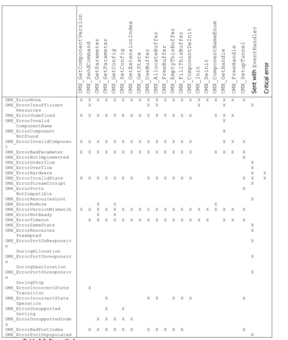
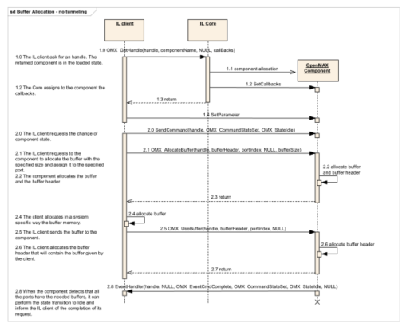
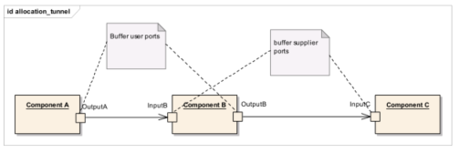
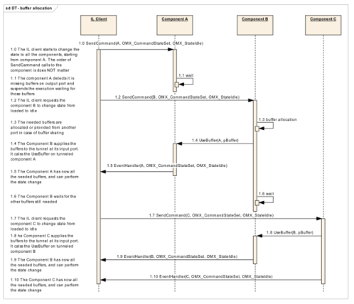
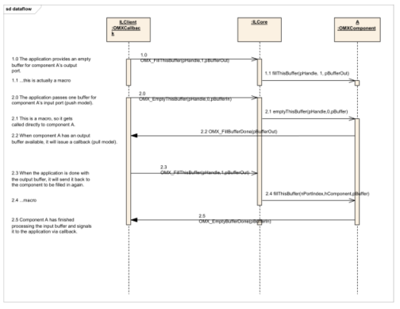
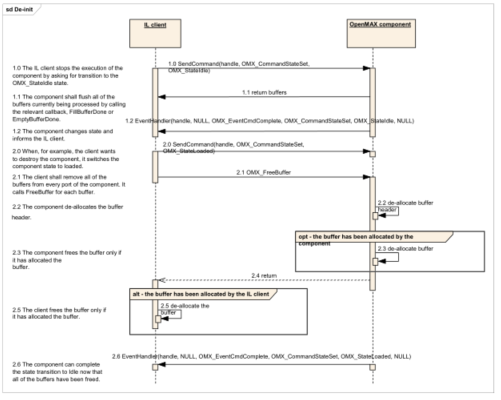
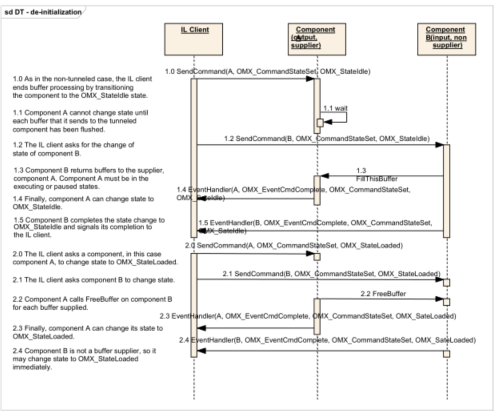
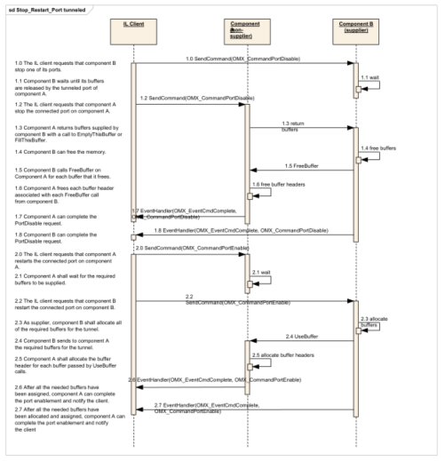
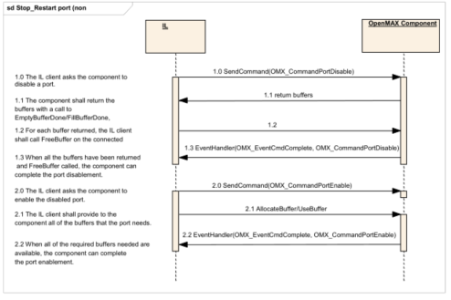
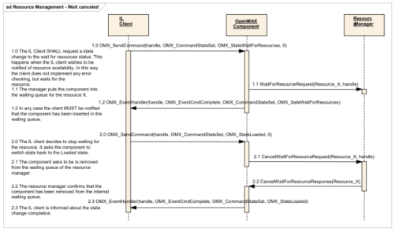

#3 OpenMAX IL控制API
OpenMAX IL API允许IL客户端控制音频、视频、图像领域上的组件。“其他”领域还包括额外的一些功能，例如音视频同步。OpenMAX IL API的使用者往往是一个多媒体框架。在本文档的其他部分，OpenMAX IL API的使用者指的就是IL客户端。

OpenMAX IL API定义了一组头文件，他们的名称是：

-  `OMX_Types.h`: OpenMAX IL使用的数据类型
-  `OMX_Core.h`: OpenMAX IL 核心 API
-  `OMX_Component.h`: OpenMAX 组件 API
-  `OMX_Audio.h`: OpenMAX 音频数据结构
-  `OMX_IVCommon.h`: OpenMAX 视频和图像通用的数据结构
-  `OMX_Video.h`: OpenMAX 视频数据结构
-  `OMX_Image.h`: OpenMAX 图像据结构
-  `OMX_Other.h`: OpenMAX 其他的数据结构 (包括音视频同步)
-  `OMX_Index.h`: OpenMAX定义的数据结构的索引

本节介绍了如果配置OpenMAX Core和OpenMAX组件的操作。

首先介绍了OpenMAX的数据类型。其次，阐述了OpenMAX Core的方法。组件的实现的方法在第3.3节中讨论。最后，第3.4节介绍了一些操作的调用顺序，包括组件的初始化，普通数据流，数据管道的建立，数据管道中数据流。这些时序图介绍了IL客户端，IL Core和OpenMAX组件之间的交互。

下面约定用于记录接口方法参数：

-  <参数名> [输入] 指定一个输入参数，由函数调用者设置并被函数读取。
-  <参数名> [输出] 指定一个输出参数，由函数本身设置并返回给调用者。当函数返回时，调用者读取通过引用传递的参数的新值。
-  <参数名> [输入输出] 指定一个输入/输出参数，由函数调用者设置。函数改变这个参数的值并返回给调用者。

参数的分类可以在OpenMAX的头文件中找到，里面定义了空的宏： `OMX_IN`, `OMX_OUT` 和 `OMX_INOUT`。`OMX_IN`对应 <参数名> [输入]， `OMX_OUT`对应<参数名> [输出]， `OMX_INOUT` 对应<参数名> [输入输出]

##3.1  OpenMAX 类型
###3.1.1 枚举
`OMX_Core.h`中定义了5个32位整型枚举数

- `OMX_ERRORTYPE` 为每一个OpenMAX IL API方法的返回值（见3.1.1.3小节）
- `OMX_COMMANDTYPE` 包含了所有IL客户端发往组件的命令（见小节3.1.1.1）
- `OMX_EVENTTYPE` 包括了OpenMAX组件产生并传递给IL客户端的消息（见3.1.1.4节）。
- `OMX_BUFFERSUPPLIERTYPE` 包括了管道端口中所有可能的buffer供应者。3.1.1.5小节可以看到这个枚举类型用法的描述。
- `OMX_STATETYPE`, 在3.1.1.2中描述。

图 3-1 显示了`OMX_Core.h`定义的枚举类型


**图 3-1. OMX_Core.h中定义的枚举类型**

####3.1.1.1  OMX_COMMANDTYPE
表3-1展示了IL客户端可以向OpenMAX组件发送的消息类型。由于消息是非阻塞的，当消息处理完毕后， OpenMAX组件会生成一个消息完成回调。
回调是在一个专门的结构中定义，见3.1.2.7小节。


| 字段名称 | 描述 |
| ------------- | ------------- |
| OMX_CommandStateSet | 切换组件状态 |
| OMX_CommandFlush | 清空组件上一个端口的buffer队列|
| OMX_CommandPortDisable | 禁用组件上一个端口 |
| OMX_CommandPortEnable | 启用组件上一个端口|
| OMX_CommandMarkBuffer | 标记一块buffer并指定接受标记时间的组件|

表 3-2 描述了每一个命令需要的参数。

| 命令代码 | 参数 | 数据 |
| ------------- | ------------- |  ------------- |
| OMX_CommandStateSet |OMX_STATETYPE – 要转移的状态 | 无 |
| OMX_CommandFlush | OMX_U32 – 目标端口ID | 无 |
| OMX_CommandPortDisable |OMX_U32 – 目标端口ID  | 无 |
| OMX_CommandPortEnable | OMX_U32 – 目标端口ID  | 无 |
| OMX_CommandMarkBuffer | OMX_U32 – 目标端口ID  | OMX_MARKTYPE* - 标记数据和目标组件 |

**表 3-2. 命令语法**
####3.1.1.2  OMX_STATETYPE
表3-2展示了IL客户端调用了一系列`OMX_SendCommand`(`OMX_StateSet`, <状态>)后的状态转移，新的状态当参数传递给组件。尖括号包围的转移名表示转换不是由IL客户端命令触发的，而是由一系列组件内部事件的结果。


**图 3-2. OpenMAX 组件状态转移**

这个小节描述了组件的状态。IL客户端通过调用`OMX_SendCommand`发送`OMX_CommandStateSet`命令来切换组件状态。

表 3-3 展示了OpenMAX组件的状态

| 字段名 | 描述 | 是否获取资源 | buffer位置 |
| ------------- |-------------| ------------- | ------------- |
| OMX_StateInvalid | 组件已损坏或遇到无法回复的错误 | 未知 | 未知 |
| OMX_StateLoaded | 组件已加载但没有获得资源 | 否 | 无 |
| OMX_StateIdle | 组件已获得资源但没有转递任何buffer或开始处理数据 | 是 | 只有供应者 |
| OMX_StateExecuting | 组件以开始转递buffer并处理数据 | 是 | 供应者和非供应者 |
| OMX_StatePause | 组件暂停处理数据但可能会从暂停点恢复 | 是 | 供应者和非供应者 |
| OMX_StateWaitForResources | 组件在等待可用资源| 否 | 无 |

**表 3-3. OpenMAX 组件状态**
######3.1.1.2.1  OMX_StateLoaded
在调用`OMX_GetHandle`创建组件之后，分配资源之前，组件处于`OMX_StateLoaded`状态。在这个状态，IL客户端可以通过`OMX_SetParameter`改变组件参数，创建组件端口上的数据通道，或者切换组件状态至`OMX_StateIdle`或`OMX_StateWaitForResources`。

IL客户端可以选择一个处于`OMX_StateLoaded`的组件转移到`OMX_StateWaitForResources`状态，例如，组件未能获得切换到`OMX_StateIdle`状态的资源。

###### 3.1.1.2.1.1  OMX_StateLoaded 到 OMX_StateIdle
如果IL客户端请求状态由`OMX_StateLoaded`切换到`OMX_StateIdle`，组件必须在完成状态切换前获得所有的资源，包换buffer。此外，在状态切换完成之前，buffer的提供者（在非管道模式时为IL客户端），必须保证非提供者拥有他所有的buffer。如果一个端口连接到IL客户端，IL客户端可以自己分配buffer并通过调用端口上的`OMX_UseBuffer`方法转递给端口，或者调用端口上`OMX_AllocateBuffer`命令让端口直接分配。

当端口出于管道状态，供应端口要么自己分配buffer，要么当端口实现了buffer共享时，复用同组件上的其他端口上的buffer。管道供应端口则通过调用非供应者的`OMX_UseBuffer` 将buffer转递给非供应者。

端口上的buffer数量由端口的定义（见`OMX_IndexParamPortDefinition`）确定，默认是最小值（见同一个数据结构）。但在提供者可以调用`OMX_UseBuffer` 和`OMX_AllocateBuffer`之前可以通过调用 `OMX_SetParameter`修改此值。

#####3.1.1.2.2  OMX_StateIdle
在`OMX_StateIdle`状态时，组件已经可以被使用，这意味着所有必要的资源已经分配。但是，提供者仍然保留着buffer，并没有发生buffer交换或处理。因此，如果这个状态由`OMX_StateExecuting`或`OMX_StatePause`转移而来，组件必须归还他正在处理的所有buffer给他的提供者。IL客户端可能会转移到除了`OMX_StateInvalid`和`OMX_StateWaitForResources`任何其他状态。

######3.1.1.2.2.1  OMX_StateIdle 到 OMX_StateLoaded
在从`OMX_StateIdle` 到 `OMX_StateLoaded`的转移过程中，每一个buffer提供者必须为非提供者端口上的每一块buffer调用`OMX_FreeBuffer`方法。如果提供者分配了buffer，他必须在调用`OMX_FreeBuffer`之前释放buffer。如果非供应端口分配了buffer，他必须收到`OMX_FreeBuffer`调用时释放内存。此外，非供应端口总是必须收到`OMX_FreeBuffer`调用时释放buffer头。当所有的buffer被移出组件时，状态转移完成。组件通过一个回调时间表示调用`OMX_SendCommand`完成。

######3.1.1.2.2.2  OMX_StateIdle 到 OMX_StateExecuting
如果IL客户端请求将状态由`OMX_StateIdle`切换至`OMX_StateExecuting`，组件应该开始转移并处理数据。和IL客户端通信的端口，IL客户端会通过`OMX_EmptyThisBuffer`和`OMX_FillThisBuffer`初始化数据传输。在管道端口中，任何输入端口也是供应端口，应该把它的空buffer通过调用`OMX_FillThisBuffer`转移给他的管道输出端口。

#####3.1.1.2.3  OMX_StateExecuting
在这个状态中，OpenMAX组件传输并处理数据。组件应该接受其输入端口的`OMX_EmptyThisBuffer` 调用和输出端口的`OMX_EmptyThisBuffer`。任何与IL端口通信的端口应该调用回调函数`EmptyBufferDone`和`FillBufferDone`返回空或满的buffer给IL客户端。管道端口应该调用`OMX_FillThisBuffer`或`OMX_EmptyThisBuffer`返回空或满的buffer给管道端口的另一段。IL客户端可以将组件从`OMX_StateIdle`或`OMX_StatePaused`转移至`OMX_StateExecuting`。

######3.1.1.2.3.1  OMX_StateExecuting 到 OMX_StateIdle
如果IL客户端请求状态由`OMX_StateExecuting`转移到`OMX_StateIdle`，组件应该在转移完成之前归换所有的buffer给他的提供者，并且接受所有自身提供者端口上的buffer。任何与IL客户端通信的端口应该通过`OMX_EmptyBufferDone`和`OMX_FillBufferDone`返回自己持有的buffer，这些buffer本来是分别给输入或输出端口使用的。任何管道端口应该通过`OMX_EmptyBufferDone`和`OMX_FillBufferDone`返回自己持有的buffer给管道另一端的端口。同理，非供应管道端口应该等待他的管道端口返回所有的buffer。

#####3.1.1.2.4  OMX_StatePause
在这个状态下，OpenMAX组件不传输或者处理数据，但buffer也不会返回给供应者。`OMX_StatePause`转移到`OMX_StateExecuting`，执行可以继续并且可能不会丢失数据。组件在自己的输入端口上可能继续接受数据，但这些buffer仅仅存放到队列中但不会进一步处理。 IL客户端可能将组将由`OMX_StatePause`转移至`OMX_StateIdle`或`OMX_StateExecuting`。在`OMX_StatePause`向`OMX_StateIdle`转移时,组件应该想他的供应者归还所有的buffer，方式描述参见3.1.1.2.3.1小节。

#####3.1.1.2.5  OMX_StateWaitForResources
在这个状态中，组件等待一个或多个需要的资源。这个状态和资源管理器有关。假设系统有一个或多个硬件特有的资源管理器来管理资源。OpenMAX组件和资源管理器之间的交互不再本标准讨论范围内。

如果处于`OMX_StateLoaded`状态的组件由于非buffer资源不足而无法切换至`OMX_StateIdle`状态是，IL客户端如果希望知道什么时候资源变得可用，那么可以将组件至于`OMX_StateWaitForResources`状态。IL客户端可以通过由`OMX_StateWaitForResources`状态转移至 `OMX_StateLoaded`命令组件停止等待资源。如果在`OMX_StateWaitForResources`状态的组件得到了所有等待的资源，它应该开始转移至`OMX_StateIdle`。

######3.1.1.2.5.1  OMX_StateWaitForResources 到 OMX_StateIdle
当组件开始从`OMX_StateWaitForResources`向`OMX_StateIdle`转移，它应该通过事件`OMX_EventResourcesAcquired`向IL客户端进行通知。当IL客户端收到`OMX_EventResourcesAcquired`时间，它应该调用`OMX_UseBuffer` 和`OMX_AllocateBuffer`，和从`OMX_StateLoaded`向 `OMX_StateIdle`一样，同理，除非组件获得了所有的资源，包括buffer，他不能完成到`OMX_StateIdle`的状态转移。

#####3.1.1.2.6  OMX_StateInvalid
在这个状态时，组件发现内部损坏或遇到无法恢复的错误。当它检测到这个情况是，组件将自己转移到`OMX_StateInvalid`并通知IL客户端产生一个值为`OMX_ErrorInvalidState`的`OMX_ErrorEvent`事件。 但客户端收到这个时间。它应该释放组件关联的所有资源并且最后调用`OMX_FreeHandle`释放组件关联的句柄。

位于`OMX_StateInvalid`状态的组件应该除了 `OMX_GetState`, `OMX_FreeBuffer`, 或`OMX_ComponentDeinit`方法调用外，其他的调用都失败并返回`OMX_ErrorStateInvalid`错误信息。IL组件应该同样明确的通过`OMX_SendCommand`将组件转移到`OMX_StateInvalid`状态。组件可以从任意状态转移到`OMX_StateInvalid`。

####3.1.1.3  OMX_ERRORTYPE
表3-4描述了枚举类型`OMX_ERRORTYPE`，它定义了每一个OpenMAX IL API返回的OpenMAX的标准错误。这些错误可以覆盖大多数的普通错误。但是硬件厂商可以根据下面的原则自由的加入额外的错误类型：

-  厂商的错误消息范围是0x90000000到0x9000FFFF。
-  厂商错误消息应该定义在和组件一起提供的头文件中。未定义的错误消息是不允许的。

|字段名称| 值 | 描述 |
|------------- |:-------------:|  ------------- |
|OMX_ErrorNone| 0 | 函数返回正确|
|OMX_ErrorInsufficientResources | 0x80001000 |执行请求操作没有足够的资源|
|OMX_ErrorUndefined | 0x80001001 | 未知原因的错误 |
|OMX_ErrorInvalidComponentName |0x80001002 | 组件名错误 |
|OMX_ErrorComponentNotFound | 0x80001003 | 没有找到指定名称的组件 |
|OMX_ErrorInvalidComponent | 0x80001004 | 指定组件没有`OMX_ComponentInit`入口，或者组件没有完成`OMX_ComponentInit`调用 |
|OMX_ErrorBadParameter | 0x80001005 | 一个或多个参数非法|
|OMX_ErrorNotImplemented | 0x80001006 | 请求功能未实现 |
|OMX_ErrorUnderflow | 0x80001007 | 下一个buffer准备好之前目前的buffer已空 |
|OMX_ErrorOverflow | 0x80001008 | 需要buffer的时候不可用|
|OMX_ErrorHardware | 0x80001009 | 硬件响应错误 |
|OMX_ErrorInvalidState | 0x8000100A | 组件处于`OMX_StateInvalid`状态 |
|OMX_ErrorStreamCorrupt | 0x8000100B | 发现流损坏 |
|OMX_ErrorPortsNotCompatible | 0x8000100C | 建立管道的端口不兼容 |
|OMX_ErrorResourcesLost | 0x8000100D | 处于`OMX_StateIdle` 状态的组件丢失了分配的资源， 导致组件回到`OMX_StateLoaded`状态 |
|OMX_ErrorNoMore | 0x8000100E | 没有更多的索引可以枚举。 |
|OMX_ErrorVersionMismatch | 0x8000100F | 组件检测到版本不匹配。 |
|OMX_ErrorNotReady | 0x80001010 |组件此时没有准备好返回数据。|
|OMX_ErrorTimeout | 0x80001011 | 发生超时. |
|OMX_ErrorSameState | 0x80001012 | 组件试图切换至当前正处于的状态|
|OMX_ErrorResourcesPreempted | 0x80001013 |处于 `OMX_StateExecuting`或 `OMX_Pause`状态的组件所分配的资源被抢占，导致组件回到`OMX_StateIdle`状态|
|OMX_ErrorPortUnresponsiveDuringAllocation |0x80001014|非供应端口认为等待供应端口调用`OMX_UseBuffer`来分配buffer时间过长。非供应端口在loaded向idle进行状态切换时或启用某一端口时通过`EventHandler`回调发送此错误给IL客户端|
|OMX_ErrorPortUnresponsiveDuringDeallocation|0x80001015|非供应端口认为等待供应端口调用`OMX_FreeBuffer`来释放buffer时间过长。非供应端口在idle向loaded进行状态切换时或禁用某一端口时通过`EventHandler`回调发送此错误给IL客户端|
|OMX_ErrorPortUnresponsiveDuringStop |0x80001016|供应端口认为等待非供应端口调用`EmptyThisBuffer`或`FillThisBuffer`返回时间过长。供应端口在idle向loaded进行状态切换时或禁用某一端口时通过`EventHandler`回调发送此错误给IL客户端|
|OMX_ErrorIncorrectStateTransition|0x80001017|试图进行不允许的状态转移|
|OMX_ErrorIncorrectStateOperation|0x80001018|试图调用的命令和方法在当前状态是不支持的|
|OMX_ErrorUnsupportedSetting| 0x80001019|一个或多个参数或配置结构不正确|
|OMX_ErrorUnsupportedIndex|  0x8000101A|给出的索引参数或配置不支持|
|OMX_ErrorBadPortIndex|  0x8000101B|给出得端口索引不正确|
|OMX_ErrorPortUnpopulated | 0x8000101C | 端口丢失了一个或多个buffer|

**Table 3-4. OpenMAX 错误代码**

####3.1.1.4  OMX_EVENTTYPE
枚举类型`OMX_EVENTTYPE`如表3-5所示，它包括了OpenMAX组件产生的事件类型。3.1.2.7小节描述了OpenMAX组件产生事件并通过回调传送给IL客户端。与事件关联的参数也一并通过回调传递。

| 字段名 | 说明 |
| ------------- | ------------- |
| OMX_EventCmdComplete | 组件完成命令执行。 |
| OMX_EventError | 组件检测到错误。|
| OMX_EventMark | 一个标记的buffer到达目标组件，IL客户端收到此带有指向私有数据指针的事件。|
| OMX_EventPortSettingsChanged | 组件改变了端口设置。例如，组件根据比特流的解析相应的改变了端口设置。|
| OMX_EventBufferFlag | 组件检测到码流结束（EOS）时发送的事件。|
| OMX_EventResourcesAcquired | 组件得到资源并将从`OMX_StateWaitForResources`切换到`OMX_StateIdle`|

**表 3-5. OpenMAX 事件类型**

#####3.1.1.4.1  OMX_EventCmdComplete
组件完成命令执行后会立刻产生`OMX_EventCmdComplete`事件传递给IL客户端。如果是组件状态改变，新状态会作为事件的参数。组件转移到`OMX_StateInvalid`不会产生此事件。

#####3.1.1.4.2  OMX_EventError
组件检测到下面的情况的错误时会产生｀OMX_EventError｀事件，错误事件类型会放在事件参数中，并使用`OMX_ERRORTYPE`中定义的值。组件应该通过`OMX_EventError`发送下面的错误：

-  组件转移到`OMX_StateInvalid`状态时会发送`OMX_ErrorInvalidState`错误。
-  组件由于资源不足时从`OMX_StateExecuting` 或 `OMX_StatePause` 切换到 `OMX_StateIdle`时会发送`OMX_ErrorResourcesPreempted`错误。
-  组件由于资源丢失而从`OMX_StateIdle` 切换到 `OMX_StateLoaded`时会发送`OMX_ErrorResourcesLost`错误。

#####3.1.1.4.3  OMX_EventMark
组件受到一块标记过的buffer时会产生`OMX_EventMark`事件。组件收到buffer时，他应该比较自身指针和buffer中`pMarkTargetComponent`字段。如果指针相等，组件处理完buffer后应该立即发送一个包含`pMarkData`参数的标记事件。IL客户端可以使用使用此标记事件来计算组件链上的传输延时，或通知组件一个快特殊的buffer已经到达目的地。

#####3.1.1.4.4  OMX_EventPortSettingsChanged
组件改变端口设置时会立刻产生`OMX_EventPortSettingsChanged`事件。例如，视频解码器可能不知道输出视频的帧大小和帧率，因为这些参数在输入比特流中编码。一旦这些组件被解析了，组件改变输出组件上的配置结构并且传递`OMX_EventPortSettingsChanged`事件给IL客户端。

#####3.1.1.4.5  OMX_EventBufferFlag
当一个输出端口发出一个在字段`nFlags`带有`OMX_BUFFERFLAG_EOS`标识的buffer时，组件产生`OMX_EventBufferFlag`事件。事件处理程序中的`nData1`字段指示了输出端口的索引， `nData2`字段指示了包含码流结束（EOS）标志的不可变的｀nFlags｀字段。如果组件不再传递流（例如，组件时一个视频或视频sink），组件处理完带有`OMX_BUFFERFLAG_EOS`的buffer后，应该为此流发送一个`OMX_EventBufferFlag`事件。事件处理程序的`nData1`字段指定了接受buffer的输入端口，｀nData2｀字段指定了含有EOS标志的不可变的`nFlags`字段。

#####3.1.1.4.6  OMX_EventResourcesAcquired
组件处于`OMX_StateWaitForResources`状态时，资源管理器检测到所需资源可用时，组件产生`OMX_EventResourcesAcquired`事件。组件收到这个事件时，它便可以转移状态到`OMX_StateIdle`，并且会所有端口上的buffer分配。

####3.1.1.5  OMX_BUFFERSUPPLIERTYPE
表3-6中的枚举类型｀OMX_BUFFERSUPPLIERTYPE｀指明了管道端口中的供应端口。一个供应端口要么自己分配buffer，要么复用同一组件下的另一个端口的buffer。

| 字段名称 | 值 | 说明 |
| ------------- | ------------- | ------------- |
| OMX_BufferSupplyUnspecified | 0x0 | 提供buffer的端口未指定，或没有优先的提供者。 |
| OMX_BufferSupplyInput | | 输入端口提供buffer。 |
| OMX_BufferSupplyOutput | | 输出端口提供buffer。|

**表 3-6. OpenMAX管道建立时Buffer提供类型**

###3.1.2 结构
本小节讨论了OpenMAX core中定义的数据结构。每个OpenMAX组件的钱两个字段指明了结构的大小和小节3.1.2.4中定义的版本号`OMX_VERSIONTYPE`。分配OpenMAX结构的实例负责填充着两个值。

####3.1.2.1  OMX_COMPONENTREGISTERTYPE
`OMX_COMPONENTREGISTERTYPE｀结构用于组件静态链接到core中时。Core使用此结构加载和运行特定的组件初始化方法。

`OMX_COMPONENTREGISTERTYPE`定义如下.

``` C
typedef struct OMX_COMPONENTREGISTERTYPE
{
  const char * pName;
  OMX_COMPONENTINITTYPE pInitialize;
} OMX_COMPONENTREGISTERTYPE;
```

####3.1.2.2  OMX_COMPONENTINITTYPE Type Definition
`OMX_COMPONENTINITTYPE`类型定义了组件初始化入口的程序指针。定义如下：

```C
typedef OMX_ERRORTYPE (* OMX_COMPONENTINITTYPE)(OMX_IN OMX_HANDLETYPE hComponent);
```
#####3.1.2.2.1  pName
`pName`包含了组件的名称，最大不超过128个字节（包括‘\0’）

#####3.1.2.2.2  pInitialize
`pInitialize`包括了组件初始化函数的指针。

####3.1.2.3  OMX_ComponentRegistered[]
任何静态链接组件的core应该在`OMX_COMPONENTREGISTERTYPE`字段中声明它所有注册的全局组件列表。

####3.1.2.4  OMX_VERSIONTYPE
`OMX_VERSIONTYPE`类型指示了组件或结构的版本。每个结构使用`OMX_VERSIONTYPE`字段指定了结构的OpenMAX版本。对OpenMAX IL 1.0版本，协议版本时1.0.0.0。组件结构也包含了一个厂商特定的组件版本号的`OMX_VERSIONTYPE`字段。


`OMX_VERSIONTYPE`定义如下：

``` C
typedef union OMX_VERSIONTYPE
{
  struct
  {
    OMX_U8 nVersionMajor;
    OMX_U8 nVersionMinor;
    OMX_U8 nRevision;
    OMX_U8 nStep;
  } ;
  OMX_U32 nVersion;
} OMX_VERSIONTYPE;
```

#####3.1.2.4.1  nVersionMajor
`nVersionMajor` 标识主要版本号.

#####3.1.2.4.2  nVersionMinor
`nVersionMinor` 标识次要版本号.

#####3.1.2.4.3  nRevision
`nRevision` 标识修订号.

#####3.1.2.4.4  nStep
`nStep` 步骤号。

####3.1.2.5  OMX_PRIORITYMGMTTYPE
`OMX_PRIORITYMGMTTYPE`类型指示了组件组的被指定的优先级。组件组指的是与一个相同的功能关联的相互依赖的一组组件。组里的所有组件使用相同的组ID和优先级。如果组里的一个组件丢失了资源并停止运行，他们所共同提供的功能也会结束。这种情况下，同一组的所有其他组件应该转移到`OMX_StateLoaded`。组件仅有一个特定的`nGroupID`的行为时原子的。

`OMX_PRIORITYMGMTTYPE`定义如下：

``` C
typedef struct OMX_PRIORITYMGMTTYPE {
  OMX_U32 nSize;
  OMX_VERSIONTYPE nVersion;
  OMX_U32 nGroupPriority;
  OMX_U32 nGroupID;
} OMX_PRIORITYMGMTTYPE;
```

#####3.1.2.5.1  nGroupPriority
｀nGroupPriority｀的值为组件组的优先级。如果组件被指定了这个类型的参数，那么组件所在的组的组件优先级也是这个值。根据定义，0代表了组件组的最高优先级。

指定组件组的具体机制不再本文档讨论范围。

#####3.1.2.5.2  nGroupID
｀nGroupID｀的值是同一个组件组里所有组件的唯一ID。

####3.1.2.6  OMX_BUFFERHEADERTYPE
在一个单一端口的上下文中，每一个数据buffer拥有一个相关联的头，包括了buffer的元信息。IL客户端与每一个与之通信的端口共享buffer头。同理，每一个管道两头的两个端口共享buffer头。另外，如果一个buffer传输到多个端口将buffer头分到每一个端口上去。buffer头的定义如下。

``` C
typedef struct OMX_BUFFERHEADERTYPE
{
  OMX_U32 nSize;
  OMX_VERSIONTYPE nVersion;
  OMX_U8* pBuffer;
  OMX_U32 nAllocLen;
  OMX_U32 nFilledLen;
  OMX_U32 nOffset;
  OMX_PTR pAppPrivate;
  OMX_PTR pPlatformPrivate;
  OMX_U32 nOutputPortPrivate;
  OMX_U32 nInputPortPrivate;
  OMX_HANDLETYPE hMarkTargetComponent;
  OMX_PTR pMarkData;
  OMX_U32 nTickCount;
  OMX_TICKS nTimeStamp;
  OMX_U32 nFlags;
  OMX_U32 nOutputPortIndex;
  OMX_U32 nInputPortIndex;
} OMX_BUFFERHEADERTYPE;
```

#####3.1.2.6.1  pBuffer
`pBuffer`为buffer中数据存储的真实指针，但并不一定时是有效数据的起始位置。更多信息参考3.1.2.6.4描述的`nOffset`。

#####3.1.2.6.2  nAllocLen
`nAllocLen`为buffer中分配的总大小，包括有效的和未用的字节。

#####3.1.2.6.3  nFilledLen
`nFilledLen`为buffer中有效数据的总大小，从`pBuffer`和`nOffset`指定的位置开始。

#####3.1.2.6.4  nOffset
`nOffset`为从buffer开始计算的有效数据的偏移位置。有效数据的指针可以从`nOffset`和`pBuffer`相加得到。

#####3.1.2.6.5  pAppPrivate
`pAppPrivate`为指向IL客户端私有结构的指针。

#####3.1.2.6.6  pPlatformPrivate
`pPlatformPrivate`为指向平台私有结构的指针。分配buffer头结构的core使用这个指针。

#####3.1.2.6.7  pOutputPortPrivate
`pOutputPortPrivate`为使用buffer的输出端口的私有指针。如果buffer头用于输入端口与IL客户端之间的通信，buffer的`pOutputPortPrivate`则不用定义。

#####3.1.2.6.8  pInputPortPrivate
`pInputPortPrivate`为使用buffer的输入端口的私有指针。如果buffer头用于输出端口与IL客户端之间的通信，buffer的`pInputPortPrivate`则不用定义。

#####3.1.2.6.9  hMarkTargetComponent
`hMarkTargetComponent`为处理buffer时需要发出｀OMX_EventMark｀消息的组件的句柄。一个空的句柄表面buffer没有携带任何标记。`OMX_CommandMarkBuffer`命令将次句柄传递给标记的组件。标记的组件，将此句柄复制到标记的buffer中。每个处理此buffer的组件应该使用这个句柄和自己向比较，如果相同，则发出标记消息。组件应该在输入buffer和相应的输出buffer中传递这个字段。

#####3.1.2.6.10  pMarkData
`pMarkData`指针指向IL客户端特定的数据，与`OMX_EventMark`发出的消息标志相关联。当收到这个标记时，IL客户端可以使用这个数据来和其他的标记相区别。命令`OMX_CommandMarkBuffer`提供此指针来标记组件。标记的组件，将此句柄复制到标记的buffer中。组件应该在输入buffer和相应的输出buffer中传递这个字段。

#####3.1.2.6.11  nTickCount
`nTickCount`为一个组件和IL客户端可以更新的计时器，为可选条目，不是所有的组件会更新它。｀nTickCount｀的值以微秒为单位。由于这个值是一个任意起始点的相对值，它不能用于确定绝对时间。


#####3.1.2.6.12  nTimeStamp
`nTimeStamp`为buffer中第一个逻辑单元的时间戳。Buffer中后续数据的时间戳可以通过buffer的持续时间和此时间戳相加得到。组件应该在输入buffer和相应的输出buffer中传递这个字段。

#####3.1.2.6.13  nFlags
`nFlags`字段包含了buffer的特定的标志，例如EOS标志。组件应该在输入buffer和相应的输出buffer中传递这个字段。标志的列表如下：


```C
#define OMX_BUFFERFLAG_EOS 0x00000001
#define OMX_BUFFERFLAG_STARTTIME 0x00000002
#define OMX_BUFFERFLAG_DECODEONLY 0x00000004
#define OMX_BUFFERFLAG_DATACORRUPT 0x00000008
#define OMX_BUFFERFLAG_ENDOFFRAME 0x00000010
```

######3.1.2.6.13.1  OMX_BUFFERFLAG_EOS
如果组件的输出端口没有更多的数据发出，则会设置EOS。因此，一个输出端口应该在最后一个发出的buffer上设置EOS，输出端口什么时候停止发送数据由具体的实现决定。

######3.1.2.6.13.2  OMX_BUFFERFLAG_STARTTIME
流的源（例如，分离器组件）设置包含流的起始时间戳的buffer`OMX_BUFFERFLAG_STARTTIME`标志。起始时间戳对应了起始或跳转操作后第一帧数据显示时间。

流的第一个时间戳不一定是起始时间。例如，在搜索一个特定视频帧的情况下，目标帧可能是一个帧间帧。因此，流的第一帧应该是在目标帧之前的帧内帧。在目标帧所依赖的帧重建完毕后，才能发生目标帧的起始时间。

`OMX_BUFFERFLAG_STARTTIME`标志直接和buffer的时间戳向关联。因此，buffer数据和`OMX_BUFFERFLAG_STARTTIME`标志的关系和传输和时间戳完全一致。

时钟组件收到一个带有`STARTTIME`标志的buffer应该在它的同步端口上使用`OMX_ConfigTimeClientStartTime`调用`OMX_SetConfig`来传递buffer的时间戳。

######3.1.2.6.13.3  OMX_BUFFERFLAG_DECODEONLY
流的源头（例如，一个分离器组件）设置一个只解码不显示的buffer`OMX_BUFFERFLAG_DECODEONLY` 标志。这个标志用于，源跳转到一个帧间帧时，需要首先解出目标所依赖的帧。在这个例子中，源需要将目标所依赖的帧发出但标记他们只能被解码。

`OMX_BUFFERFLAG_DECODEONLY`标记和buffer数据相关联，传输的行为和时间戳完全一致。显示数据的组件应该忽略所有设置了`OMX_BUFFERFLAG_DECODEONLY`标志的buffer。

######3.1.2.6.13.4  OMX_BUFFERFLAG_DATACORRUPT
当IL客户端识别buffer相关的数据损坏时设置`OMX_BUFFERFLAG_DATACORRUPT`标志位。

######3.1.2.6.13.5  OMX_BUFFERFLAG_ENDOFFRAME
`OMX_BUFFERFLAG_ENDOFFRAME`是一个可选的标志位，buffer playload中包含帧结束的最后一个字节时由输出端口设置。任何一个在输出端口上实现了设置`OMX_BUFFERFLAG_ENDOFFRAME`标志的组件应该为输出端口发出的每一个包含EOF的buffer设置这个标志。没有buffer payload可以包含两个独立的帧。

这些限制保证了从输出端口接受到数据的输入端口能够不通过额外的处理检测到EOF。也保证了如果输出端口支持这个标志的话，输入端口能轻易的通过标志位的有或无检测第一帧是否传输完。

####3.1.2.6.14  nOutputPortIndex
`nOutputPortIndex`包含了使用buffer的输出端口的索引。如果一个buffer头用于和IL端口上的输入端口通信的话，此值不用定义。

#####3.1.2.6.15  nInputPortIndex
`nInputPortIndex`包含了使用buffer的输入端口的索引。如果buffer头用于和IL客户端通信的输出端口，此值不用定义。

####3.1.2.7  OMX_PORT_PARAM_TYPE
组件用`OMX_PORT_PARAM_TYPE`结构来定义特定域上的端口数量和起始端口索引。

`OMX_PORT_PARAM_TYPE`定义如下：

``` C
typedef struct OMX_PORT_PARAM_TYPE {
  OMX_U32 nSize;
  OMX_VERSIONTYPE nVersion;
  OMX_U32 nPorts;
  OMX_U32 nStartPortNumber;
} OMX_PORT_PARAM_TYPE;
```

#####3.1.2.7.1  nPorts
`nPorts`为组件给定端口域（音频，视频，图像或其他）上的端口数。

#####3.1.2.7.2  nStartPortNumber
`nStartPortNumber`为组件给定端口域（音频，视频，图像或其他）上的端口索引。给定域的后续端口按顺序编号从`nStartNumber`开始。

#####3.1.2.8  OMX_CALLBACKTYPE
OpenMAX IL包含了一个回调机制，允许组件可以和IL客户端进行下面的通信：

-  IL客户端发出的异步命令成功，失败或产生错误。命令包括通过`OMX_SendCommand`和IL客户端发出的`EmptyThisBuffer`和`FillThisBuffer`。
-  和命令无关的错误发生。例如，组件进入了无法回复的错误并且转移到`OMX_StateInvalid`状态。

为了实现回调，OpenMAX IL定义了3个回调函数：一个通用的事件处理程序和两个和数据流相关的回调（`EmptyBufferDone`和`FillBufferDone`）

IL客户端负责用回调函数入口填充`OMX_CALLBACKTYPE`结构并在初始化的时候传递给OpenMAX core，通常在函数`OMX_GetHandle`中。


`OMX_CALLBACKTYPE`定义如下：

```C
typedef struct OMX_CALLBACKTYPE
{
  OMX_ERRORTYPE (*EventHandler)(
  	OMX_IN OMX_HANDLETYPE hComponent,
    OMX_IN OMX_PTR pAppData,
    OMX_IN OMX_EVENTTYPE eEvent,
    OMX_IN OMX_U32 nData1,
    OMX_IN OMX_U32 nData2,
    OMX_IN OMX_PTR pEventData);
  OMX_ERRORTYPE (*EmptyBufferDone)(
    OMX_IN OMX_HANDLETYPE hComponent,
    OMX_IN OMX_PTR pAppData,
    OMX_IN OMX_BUFFERHEADERTYPE* pBuffer);
  OMX_ERRORTYPE (*FillBufferDone)(
    OMX_IN OMX_HANDLETYPE hComponent,
    OMX_IN OMX_PTR pAppData,
    OMX_IN OMX_BUFFERHEADERTYPE* pBuffer);
} OMX_CALLBACKTYPE;
```

#####3.1.2.8.1  EventHandler
组件使用事件处理函数方法来通知IL客户端什么时候一个所感兴趣的事件在组件内部发生了。枚举类型`OMX_EVENTTYPE`定义了OpenMAX IL事件的集合，可以参看每中事件的定义。`nData1`携带了完成事件的`OMX_COMMANDTYPE` 值或是`OMX_ERRORTYPE`的错误类型。`nData2`携带了更多的事件参数，例如，`OMX_STATETYPE`。`pEventData`包含了事件具体的数据。`pEventData`指针可能包含了额外的与时间有关的数据（例如，标记特定数据）。事件处理函数的调用是阻塞的，所有IL客户端应该在5个毫秒内完成响应，以免长时间阻塞住组件。

方法`EventHandler`定义如下：

``` C
OMX_ERRORTYPE(* OMX_CALLBACKTYPE::EventHandler)(
  OMX_IN OMX_HANDLETYPE hComponent,
  OMX_IN OMX_PTR pAppData,
  OMX_IN OMX_EVENTTYPE eEvent,
  OMX_IN OMX_U32 nData1,
  OMX_IN OMX_U32 nData2,
  OMX_IN OMX_PTR pEventData)
```
参数定义如下：

| 参数 | 说明 |
| -------- | -------- |
| *hComponent* | 调用此函数的组件句柄。 |
| ̛*eEvent* | 组件和IL客户端通信的事件。 |
| *nData1* | 第一个事件特定的整型参数。表3-7描述了在每个事件上下文中的意义。|
| *nData2* | 第二个事件特定的整型参数。表3-7描述了在每个事件上下文中的意义。如果没有用，默认值为0.|
| *pEventData* | 指向事件特定数据的指针。表3-7描述了在每个事件上下文中的意义。|
**表 3-7 每一种事件所用的参数列表**

| eEvent | nData1 | nData2 | pEventData |
| ------- | ------- | ------- | ------- |
| OMX_EventCmdComplete | OMX_CommandStateSet | 状态切换完成 | 无 |
| | OMX_CommandFlush | 端口索引 | 无 |
| | OMX_CommandPortDisable | 端口索引 | 无 |
| | OMX_CommandPortEnable | 端口索引 | 无 |
| | OMX_CommandMarkBuffer | 端口索引 | 无 |
| OMX_EventError | 错误代码 | 0 | 无 |
| OMX_EventMark | 0 | 0 | 标记相连的数据（如果有的话） |
| OMX_EventPortSettingsChanged | 端口索引 | 0 | 无 |
| OMX_EventBufferFlag | 端口索引 |`nFlags`不可变 | 无 |
| OMX_EventResourcesAcquired | 0 | 0 | 无 |
**表 3-7. 事件参数用法**

#####3.1.2.8.2  EmptyBufferDone
组件使用回调`EmptyBufferDone`从一个输入端口返回传递一个buffer给IL客户端。组件设置buffer头中的`nOffset`和`nFilledLength`值来反应buffer中被消耗的部位。例如，如果完全被消耗，则`nFilledLength`设置为0。

为了加快执行组件和IL客户端之间的数据流动，组件在下面情况下使用`EmptyBufferDone`方法把输入buffer返回给IL客户端：

- IL客户端命令状态由`OMX_StateExecuting`或`OMX_StatePause`转移到`OMX_StateIdle` 或`OMX_StateInvalid`。
- IL客户端清空或禁用端口。

`EmptyBufferDone`为阻塞方法，应该在5毫秒以内返回。因此， IL客户端在调用期间可能不选择填充缓冲区，而在调用之外排队处理。

方法`EmptyBufferDone`定义如下：

``` C
OMX_ERRORTYPE(* OMX_CALLBACKTYPE::EmptyBufferDone)(
  OMX_OUT OMX_HANDLETYPE hComponent,
  OMX_OUT OMX_PTR pAppData,
  OMX_OUT OMX_BUFFERHEADERTYPE* pBuffer)
```

The parameters are as follows.

| 参数 | 说明 |
| ------- | ------- |
| *hComponent* | 调用此函数的组件句柄。 |
| *pAppData* | 指向IL客户端定义数据的指针。 |
| *pBuffer* | 指向消耗或返回的`OMX_BUFFERHEADERTYPE`结构类型的指针。 |

#####3.1.2.8.3  FillBufferDone
组件使用回调`FillBufferDone`从输出端口返回数据给IL客户端。组件设置buffer头中的`nOffset`和`nFilledLength`值来反应buffer中被填充的部位。例如，如果没有数据，则`nFilledLength`设置为0。

为了加快执行组件和IL客户端之间的数据流动，组件在下面情况下使用此方法把输出buffer返回给IL客户端：

- IL客户端命令状态由`OMX_StateExecuting`或`OMX_StatePause`转移到`OMX_StateIdle` 或`OMX_StateInvalid`。
- IL客户端清空或禁用端口。

`FillBufferDone`为阻塞方法，应该在5毫秒以内返回。因此， IL客户端在调用期间可能不选择填充缓冲区，而在调用之外排队处理。

`FillBufferDone`定义如下：

``` C
OMX_ERRORTYPE(* OMX_CALLBACKTYPE::FillBufferDone)(
  OMX_OUT OMX_HANDLETYPE hComponent,
  OMX_OUT OMX_PTR pAppData,
  OMX_OUT OMX_BUFFERHEADERTYPE* pBuffer)
```

参数定义如下：

| 参数 | 说明 |
| ------- | ------- |
| *hComponent* | 访问组件的句柄。此句柄为方法`GetHandle`返回的组件句柄。 |
| *pAppData* | 指向IL客户端定义数据的指针。 |
| *pBuffer* | 指向填充或返回的`OMX_BUFFERHEADERTYPE`结构类型的指针。 |

####3.1.2.9  OMX_PARAM_BUFFERSUPPLIERTYPE
`OMX_PARAM_BUFFERSUPPLIERTYPE`结构用于传输buffer提供者的设置或偏好。

`OMX_PARAM_BUFFERSUPPLIERTYPE` 定义如下.

``` C
typedef struct OMX_PARAM_BUFFERSUPPLIERTYPE {
  OMX_U32 nSize;
  OMX_VERSIONTYPE nVersion;
  OMX_U32 nPortIndex;
  OMX_BUFFERSUPPLIERTYPE eBufferSupplier;
} OMX_PARAM_BUFFERSUPPLIERTYPE;
```

#####3.1.2.9.1  nPortIndex
`nPortIndex`为结构适用的组件端口

#####3.1.2.9.2  eBufferSupplier
`eBufferSupplier`字段包括了buffer提供者的索引，如果是一个输入或输出端口。

####3.1.2.10  OMX_TUNNELSETUPTYPE
当IL客户端调用`OMX_SetupTunnel`来连接端口时，方法`ComponentTunnelRequest`使用`OMX_TUNNELSETUPTYPE`结构体来在两个端口之间传输数据。

`OMX_TUNNELSETUPTYPE` 定义如下.

``` C
typedef struct OMX_TUNNELSETUPTYPE
{
  OMX_U32 nTunnelFlags;
  OMX_BUFFERSUPPLIERTYPE eSupplier;
} OMX_TUNNELSETUPTYPE;
```

#####3.1.2.10.1  nTunnelFlags
`nTunnelFlags`整型参数包括了接受此结构的端口所适用的一个或多个比特标志，这些标志包括：

``` C
#define OMX_PORTTUNNELFLAG_READONLY 0x00000001
```

如果标志设置为只读，接受到结构体的输入端口不能改变管道上buffer的内容。

#####3.1.2.10.2  eSupplier
`eSupplier`定义了是输出还是输入端口提供buffer。3.4.1.2小节描述了建立管道的具体调用步骤。

####3.1.2.11  OMX_PARAM_PORTDEFINITIONTYPE
`OMX_PARAM_PORTDEFINITIONTYPE`结构提包含了组件中每个端口的一些通用的字段。一些字段在每个域上都是通用的而其他的字段是每个域特有的。IL客户端使用这个结构体来获取每个端口的通用信息。

`OMX_PARAM_PORTDEFINITIONTYPE` 定义如下.

``` C
typedef struct OMX_PARAM_PORTDEFINITIONTYPE {
  OMX_U32 nSize;
  OMX_VERSIONTYPE nVersion;
  OMX_U32 nPortIndex;
  OMX_DIRTYPE eDir;
  OMX_U32 nBufferCountActual;
  OMX_U32 nBufferCountMin;
  OMX_U32 nBufferSize;
  OMX_BOOL bEnabled;
  OMX_BOOL bPopulated;
  union {
    OMX_AUDIO_PORTDEFINITIONTYPE audio;
    OMX_VIDEO_PORTDEFINITIONTYPE video;
    OMX_IMAGE_PORTDEFINITIONTYPE image;
    OMX_OTHER_PORTDEFINITIONTYPE other;
  } format;
} OMX_PARAM_PORTDEFINITIONTYPE;
```

#####3.1.2.11.1  nPortIndex
`nPortIndex` 是一个标识端口的只读字段。他的值为一个组件上唯一的32比特的数。 同一个组件上的两个不同的端口不能拥有相同的端口号。而不同组件上的端口可以有相同的端口号。

#####3.1.2.11.2  eDir
`eDir`是一个指明端口方向（`OMX_DirInput`或`OMX_DirOutput`）的只读域。

#####3.1.2.11.3  nBufferCountActual
`nBufferCountActual` 表明了端口在poplated之前（如字段bPopulated所示）所需要的buffer的数量。组件应该为这个字段设置一个不小于`nBufferCountMin`的缺省值。

#####3.1.2.11.4  nBufferCountMin
`nBufferCountMin` 是一个指定了端口所需最少buffer数的只读字段。组件应定义一个非零的缺省值。

#####3.1.2.11.5  nBufferSize
`nBufferSize` 是一个指定了端口所需分配的buffer的最小buffer字节数的只读字段。

#####3.1.2.11.6  bEnabled
`bEnabled`为指定了端口是否启用的只读布尔型端口。默认值为`OMX_TRUE`，并可以通过`OMX_SendCommand`方法发送`OMX_CommandPortEnable`和`OMX_CommandPortDisable`来启用/禁用。

端口被禁用是不可以被populated。

#####3.1.2.11.7  bPopulated
`bPopulated`为一个指示端口是否populated的只读bool型字段。当端口上所有`nBufferCountActual`指明的数量`nBufferSize`指明的大小的buffer被分配的时候，端口才是populated的。一个populated的端口应该被启用。启用的端口应该通过转移到`OMX_StateIdle`状态populated和切换到`OMX_StateLoaded`来unpopulated。

#####3.1.2.11.8  eDomain
`eDomain`为指定端口域的只读字段。决定了共同体中的内容，见小节3.1.2.11.9的解释。

#####3.1.2.11.9  format
`format`字段为一个域参数的共同体。具体信息可以见第4章。

###3.1.3 OMX_PORTDOMAINTYPE
表3-8枚举了`OMX_PARAM_PORTDEFINITIONTYPE`结构体中使用的字段，用于定义端口的作用域。

| 字段名称 | 说明 |
| ------- | ------- |
| OMX_PortDomainAudio | 指定了字段格式类型为`OMX_AUDIO_PORTDEFINITIONTYPE`|
| OMX_PortDomainVideo | 指定了字段格式类型为`OMX_VIDEO_PORTDEFINITIONTYPE`|
| OMX_PortDomainImage | 指定了字段格式类型为`OMX_IMAGE_PORTDEFINITIONTYPE`|
| OMX_PortDomainOther | 指定了字段格式类型为`OMX_OTHER_PORTDEFINITIONTYPE`|

**表 3-8. 端口域名称                                  **

###3.1.4 OMX_HANDLETYPE
`OMX_HANDLETYPE`结构体定义了IL客户端可见的组件句柄。组件句柄用于访问所有组件的方法。组件句柄也包含了组件私有数据域的指针。OpenMAX core在加载组件的过程中分配并初始化组件。组件加载完毕后，IL客户端可以安全的访问所有组件的公有方法，虽然某些方法会由于状态不对而返回错误。

##3.2  OpenMAX Core 方法/宏
OpenMAX core实现了IL客户端使用组件的主要接口。为了效率，OpenMAX IL定义了一系列的宏来完成对组件方法一对一的映射。一些宏和方法建议函数在5毫秒或20号码内返回，这取决与函数。5毫秒的超时被标准认为是不需要buffer处理的命令的合理的响应事件。标准认为需要处理buffer的命令处理的合理超时时间为20号码。这里的假设是最长的buffer处理应该低于30号码，对应域每秒30帧视频。这些超时的主要目的是为了使组件集成者可以通过一致性测试很容易的得到组件的响应延时。

这些宏包含下面的内容：

- 获取组件信息（版本，能力）
- 在初始化时设置/获取组件参数。
- 在运行是设置/获取组件参数。
- 分配/释放buffer。
- 发送给OpenMAX组件端口一个充满数据的buffer。
- 发送给OpenMAX组件端口一个空的buffer。
- 发送命令给组件。
- 获得组件的实际状态。
- 获取OpenMAX组件专有参数的引用。

OpenMAX Core也实现了下面的方法：

- 初始化/析构整个OpenMAX IL core。
- 获得一个OpenMAX组件句柄
- 释放一个OpenMAX组件句柄
- 运行时探测系统上所有可用的OpenMAX组件。
- 在OpenMAX组件之间建立数据管道。

当一个方法执行的时间限制被指定时，它并不打算是组件标准一致性的硬性规定。但如果不遵守这个限制，组件文档中应该标明。


###3.2.1 方法的返回值
表3-9列举了每一个方法的所有可能的返回错误值。致命错误指的是组件无法恢复。发生致命错误时组件应该转移到`OMX_StateInvalid`状态。除了最后两列，左右的列对应着调用组件方法的错误返回。最后两列为内部错误时发出的异步错误。



###3.2.2 宏
本小节描述了OpenMAX Core中的宏

表3-10定义了在每一种状态下哪一个宏应该被调用。


表3-10. 合法的组件调用

####3.2.2.1  OMX_GetComponentVersion
宏`OMX_StateInvalid`查询组件并返回具体信息。这是一个阻塞调用。组件应该在5毫秒内返回这个调用。

The macro 定义如下.

``` C
#define OMX_GetComponentVersion (
  hComponent,
  pComponentName,
  pComponentVersion,
  pSpecVersion,
  pComponentUUID )
  ((OMX_COMPONENTTYPE*)hComponent)->GetComponentVersion( \
    hComponent, \
    pComponentName, \
    pComponentVersion, \
    pSpecVersion, \
    pComponentUUID)
```

参数定义如下：

| 参数 | 输入 |
| ------- | ------- |
| *hComponent* [输入] | 执行命令的组件句柄。|
| *pComponentName* [输出] | 组件名字符串的指针。组件名必须是小于127字节加结尾即最大长度为128字节的字符串。例如，一个合法的组件名可以是"OMX.<厂商名>.AUDIO.DSP.MIXER\0"。名字由厂商指定，但需要以"OMX."开始加上厂商指定的字符串。|
| *pComponentVersion* [输出] | 组件所填充的OpenMAX版本结构体的指针。组件会填入版本值。注意组件的版本和在所有结构中的OpenMAX协议的版本不是一样的。厂商组件自行定义组件的版本来确定这个值。|
| *pSpecVersion* [输出] | 组件所填充的OpenMAX版本结构体的执政。`SpecVersion`是组件对应的协议的版本。注意这个版本和结构体的版本可能一样也可能不一样。例如，如果组件是根据2.0版本的协议实现的，但创建IL的客户端是由1.0版本的协议建立的，两者是不同的。|
| *pComponentUUID* [输出] | 组件通用唯一识别码（UUID）的指针，由组件填入。UUID是一个唯一的识别码，由组件在运行期间设置，并且每个组件实例都是唯一的。|

#####3.2.2.1.1  先决条件2
这种方法没有先决条件。

#####3.2.2.1.2  调用顺序实例代码
下面的实例代码展示了调用顺序：

```C
/* detect mismatch between IL client's and component's spec version */
OMX_GetComponentVersion(
  hComp,
  &CompName,
  &CompVersion,
  &CompSpecVersion,
  &CompUUID);
  if (CompSpecVersion != IlClientVersion){
    printf("ERROR: version mismatch\n");
  }
```

####3.2.2.2  OMX_SendCommand
宏`OMX_SendCommand`会调用组件上的一个命令。这是一个非阻塞的调用，有效的命令参数应该在最小5毫秒内返回。通常来说，组件并不在此调用的上下文中执行命令，但如果方案中没有多线程的话可能会选择在上下文中执行。在这两种情况下，组件使用事件回调来通知IL客户端命令执行完毕的结果。如果组件成功执行命令，组件会生成`OMX_EventCmdComplete`回调。如果组件执行命令失败，则生成`OMX_EventError`并将适当的错误以参数传回。

组件可能选择将命令传入队列以便后续执行。唯一的限制就是完成的顺序应该和请求的顺序一致。

宏定义如下：

``` C
#define OMX_SendCommand (
  hComponent,
  Cmd,
  nParam,
  pCmdData)
  ((OMX_COMPONENTTYPE*)hComponent)->SendCommand( \
    hComponent, \
    Cmd, \
    nParam,
    pCmdData)
```

参数如下：

| 参数 | 说明 |
| ------- | ------- |
| *hComponent* [输入] | 执行命令的组件句柄 |
| *Cmd* [输入] | 待组件执行的命令 |
| *nParam* [输入] | 待执行命令的整型参数 |
| *pCmdData*[输入] | 一个指针，包含具体实现的无法用数值型参数来描述的数据|

3.3.6小节描述了每个组件实现的对应的方法。

####3.2.2.3  OMX_CommandStateSet
IL客户端调用此命令来请求组件切换到`nParam`指定的状态中。只有合法的状态转移并且所有先决条件都已满足，组件才可以完成老状态到新状态之间的成功切换。更多信息参见3.1.1.2小节。

如果组件成功转移到新的状态，他会通过事件`OMX_EventCmdComplete` 来通知IL客户端，`nData1`中存放`OMX_CommandStateSet`，`nData2`放入新的状态。如果转移失败，组件应该通过事件`OMX_EventError`通知IL客户端错误。相关错误包括但不限于以下内容：

- `OMX_ErrorSameState`: 组件已经在此状态
- `OMX_ErrorIncorrectStateTransition`: 转移请求非法
- `OMX_ErrorInsufficientResources`: 组件获取转移所需的资源失败

####3.2.2.4  OMX_CommandFlush
IL调用此命令来清空组件上一个或多个组件。`nParam`指定了待刷新端口的缩影。如果值为-1，则应该清空所有端口。

当IL客户端清空一个非供应端口时，端口应该返回所有拥有的buffer给供应端口。如果供应端口为IL客户端，被清空的组件使用`EmptyBufferDone` 和`FillBufferDone`（分别对应输入或输入端口）返回buffer。如果供应端口为一个管道端口，被清空的端口使用使用`EmptyThisBuffer` 和`FillThisBuffer`（分别对应输入或输入端口）返回buffer。

对于每个组件成功清空的端口，组件应该发送一个`OMX_EventCmdComplete`事件， `nData1`中放入`OMX_CommandFlush`，`nData2`中放入独立的端口索引，即使`nParam`使用的是-1。如果清空失败，组件应该使用`OMX_EventError`事件来通知IL客户端错误。

####3.2.2.5  OMX_CommandPortDisable
命令`OMX_CommandPortDisable`禁用一个端口。`nParam`指定了禁用端口的索引。如果`nParam`值为-1，组件应该禁用所有的端口。一个被禁用的端口没有buffer也不连接到IL客户端或是通过管道连接到其他端口。一个被禁用的端口从`OMX_StateLoaded`或`OMX_StateWaitForResources` 转移到`OMX_StateIdle`是不分配buffer。IL客户端可以通过`OMX_SetParameter`改变一个禁用端口的设置或是忽略状态来建立一个管道。因此命令`OMX_CommandPortDisable`配合`OMX_CommandPortEnable`，可以用于动态的改变端口配置或重新连接管道。

端口收到`OMX_CommandPortDisable`必须立刻清除端口定义结构体上的`bEnabled`字段。如过IL客户端禁用的端口是一个非供应端口，IL客户端应该通过`OMX_EmptyThisBuffer`/`OMX_FillThisBuffer`（管道） 或`EmptyBufferDone`/`FillBufferDone`（非管道）返回所有的拥有的buffer。然后，IL客户端应该等待供应端口通过`OMX_FreeBuffer`释放buffer来完成禁用命令。如果被禁用的端口是一个供应端口，分配了buffer， IL客户端应该等待非供应端口通过`OMX_EmptyThisBuffer`或`OMX_FillThisBuffer`返回buffer。然后，IL客户端应该等待供应端口通过`OMX_FreeBuffer`释放buffer来完成禁用命令。

对于每一个组件成功禁用的端口，组件应该发送`OMX_EventCmdComplete`事件，`nData1`中放入`OMX_CommandPortDisable`，`nData2`中放入独立的端口索引，`nParam`使用的是-1。如果禁用失败，组件应该使用`OMX_EventError`事件来通知IL客户端错误。

####3.2.2.6  OMX_CommandPortEnable
`OMX_CommandPortEnable`命令启用一个端口。`nParam`指定了启用端口的索引。如果`nParam`值为-1，组件应该启用所有的端口。启用端口应该遵循组件状态的所有要求。因此，端口应该：

- 组件如果在`OMX_StateLoaded`或`OMX_StateWaitForResources`应该没有buffer分配，而在其他状态应该所有buffer都已分配
- 从 `OMX_StateLoaded`或`OMX_WaitForResources`转移到`OMX_IdleState`时分配buffer。
- 在`OMX_StateExecuting`状态时传输buffer到数据流
- 除了 `OMX_StateLoaded`以外所有其他状态不允许通过`OMX_SetParameter`改变参数。

命令`OMX_CommandPortEnable`配合`OMX_CommandPortDisable`，可以用于动态的改变端口配置或重新连接管道。

端口收到`OMX_CommandPortEnable`后必须立刻设置端口定义结构体中的`bEnabled`字段。如果IL客户端在组件为除`OMX_StateLoaded`或 `OMX_WaitForResources`以外的任何状态启用端口，端口应该通过和`OMX_StateLoaded`到`OMX_StateIdle`相同的调用顺序分配buffer。如果IL客户端当组件为`OMX_Executing`时启用，那么端口应该开始传输buffer。

针对每一个组件成功启用的端口，组件应该发送`OMX_EventCmdComplete`事件，`nData1`中放入`OMX_CommandPortEnable`，`nData2`放入独立的端口索引，即使使用`nParam`为-1来启用。如果端口启用操作失败，组件应该通过`OMX_EventError`事件通知IL客户端。

####3.2.2.7  OMX_CommandMarkBuffer
命令`OMX_CommandMarkBuffer`指示给定的端口标记buffer。`nParam`持有进行标记的端口索引。`OMX_SendCommand`的`pCmdData`参数指向`OMX_MARKTYPE`结构体。结构体中`pMarkTargetComponent`字段持有目标组件的指针，当处理完标记的buffer后会发送事件给目标组件。`pMarkData`字段持有一个指针，指向与标记相关的应用程序特定的数据， 用来给应用程序在一个标记事件中唯一标识这个标记（标识数据的名称）。

当指示标记一个buffer时，组件将在接受到标记命令后标记接受的下一个buffer。源组件是一个特殊情况，它将标记加到其输出buffer队列的下一个buffer。非源组件的情况下，nParam中的端口索引值持有了标记下一个buffer的输入端口的索引。源组件的情况下，nParam中的端口索引值持有了标记下一个buffer的输出端口的索引。

在下列情况下， 多个标记可能会竞争同一个buffer：

- 组件连续收到两个或更多标记命令，两次标记之间没有buffer.
- 两个或多个输入buffer，每个都有一个标记，合并成一个输出buffer，（例如，在一个mixer中）
- 组件收到一个标记命令但下一个buffer已经被标记。

如果多个标记竞争同一个buffer，组件使用第一个收到的标记来标记buffer，并且按收到标记的顺序将剩余的标记应用到后续的buffer中。如果后面没有buffer，组件可以把剩余的标记应用到一个或多个空的buffer中去。

组件成功标记buffer的每一个端口，组件应该发送`OMX_EventCmdComplete`事件，`nData1`中放置`OMX_CommandPortMarkBuffer`，`nData2`放置独立的端口索引。如果标记操作失败，组件应该通过`OMX_EventError`事件通知IL客户端。

buffer头包含了`pMarkTargetComponent`和`pMarkData`字段，意义和`OMX_MARKTYPE`中的字段相同。组件通过从标记命令拷贝`pMarkTargetComponent`和`pMarkData`字段来标记buffer。默认情况下这两个字段是空的（例如，标记buffer之前）。一个组件根据buffer标志位和时间戳简历的元数据规则来从输入buffer向输出buffer传播标记。目标组件不传播标记，而是将两个字段清楚为NULL。

但组件收到buffer，他应该自身指针和pMarkTargetComponent。如果指针匹配，buffer离开组件或成功处理而不需要离开组件后，组件应该立马发送标记事件，包含了pMarkData作为参数。

#####3.2.2.7.1  先决条件
这种方法没有先决条件。


#####3.2.2.7.2  调用顺序实例代码
下面的实例代码展示了调用顺序：

``` C
/* disable every audio port of a component*/
OMX_GetParameter(hComp, OMX_IndexParamAudioInit, &oParam);
for (i=0;i<oParam.nPorts;i++) {
  OMX_SendCommand(
    hComp,
    OMX_CommandPortDisable,
    Param.nStartPortNumber + i,
    0);
}
```

####3.2.2.8  OMX_GetParameter
宏`OMX_GetParameter`取得组件的一个参数。参数`nParamIndex`指示了请求组件的哪一个结构体。调用者在调用此宏之前应该提供结构体的内存并填充`nSize`和`nVersion`字段。如果参数是来自一个端口，调用者也应该在调用此宏之前在`nPortIndex`字段中提供一个有效的端口号。所有组件应该支持每个参数的一组默认值，这样调用者可以得到有效值的结构体。

这个调用为一个阻塞调用。组件应该在20毫秒以内返回这个调用。

宏OMX_GetParameter定义如下：

```C
#define OMX_GetParameter (
  hComponent,
  nParamIndex,
  ComponentParameterStructure)
  ((OMX_COMPONENTTYPE*)hComponent)->GetParameter( \
    hComponent, \
    nParamIndex, \
    ComponentParameterStructure)
```

参数描述如下：

| 参数 | 说明 |
| ------- | ------- |
| *hComponent* [输入] | 执行调用的组件句柄 |
| *nParamIndex* [输入] | 填充的结构体索引。 这个值来自`OMX_INDEXTYPE`结构体 |
| *ComponentParameterStructure* [输入,输出] | 指向IL客户端分配的结构体的指针，由组件填充 |

3.3.7小节描述了每个组件实现的相应的方法。

#####3.2.2.8.1  先决条件
这个宏可以当组件在除`OMX_StateInvalid`外的任何状态时被调用。

#####3.2.2.8.2  调用顺序实例代码
下面的实例代码展示了调用顺序：

```C
/* disable every audio port of a component*/
OMX_GetParameter(hComp, OMX_IndexParamAudioInit, &oParam);
for (i=0;i<oParam.nPorts;i++) {
  OMX_SendCommand(
    hComp,
    OMX_CommandPortDisable,
    oParam.nStartPortNumber + i,
    0);
}
```

####3.2.2.9  OMX_SetParameter
宏`OMX_SetParameter`将发送一个参数结构体给组件。参数`nParamIndex`指示了传递给组件的是哪一个结构体。

调用者应该提供正确的结构体的内存，并在调用宏之前填充结构体中`nSize`和`nVersion`字段。调用者可以在调用之后可以自由的处理该结构，因为组件需要拷贝它需要保留的任何数据。

一些参数结构体包含了只读字段。`OMX_SetParameter`方法将保留只读字段，并且调用者试图改变只读字段时也不会产生错误。

此调用为阻塞调用。组件应该在20毫秒以内返回。

宏`OMX_SetParameter`定义如下：

```C
#define OMX_SetParameter (
  hComponent,
  nParamIndex,
  ComponentParameterStructure)
  ((OMX_COMPONENTTYPE*)hComponent)->SetParameter( \
    hComponent, \
    nParamIndex, \
    ComponentParameterStructure)
```

参数定义如下：

| 参数 | 说明 |
| ------- | ------- |
| *hComponent* [输入] | 执行调用的组件句柄|
| *nIndex* [输入] | 发送的结构体缩影。这个值来自`OMX_INDEXTYPE`枚举类型|
| *ComponentParameterStructure* [输入] | 指向IL客户端分配的结构体的指针，组件用于初始化|


3.3.8小节描述了每个组件实现的相应方法。

#####3.2.2.9.1  先决条件
宏`OMX_SetParameter`仅当组件在`OMX_StateLoaded`或组件被禁用时被调用。

#####3.2.2.9.2  调用顺序实例代码
下面的实例代码展示了调用顺序：

```C
/* force a port to be the supplier */
OMX_GetParameter(hComp, OMX_IndexParamPortDefinition, &oPortDef);
if (oPortDef.eDir == OMX_DirInput){
  oSupplier.eBufferSupplier = OMX_BufferSupplyInput;
} else {
  oSupplier.eBufferSupplier = OMX_BufferSupplyOutput;
}
oSupplier.nPortIndex = nPortIndex;
OMX_SetParameter(hComp, OMX_IndexParamCompBufferSupplier, &oSupplier);
```

####3.2.2.10  OMX_GetConfig
宏`OMX_GetConfig`将从一个组件获得一个配置结构体。此红可以在组件被加载后任何事件被调用。参数`nParamIndex`指示了组件的哪一个结构体被请求。调用者应该在调用这个宏之前提供此结构体的内存并填充`nSize`和`nVersion`字段。如果是配置一个端口，调用者也应该在调用之前在`nPortIndex`字段提供一个有效的端口号。所有的组件应该支持每个配置的默认值，这样调用者可以获得填充正确值的结构体。

此调用为一个阻塞调用。组件应该在5毫秒内返回。

宏`OMX_GetConfig`定义如下：

```C
#define OMX_GetConfig (
  hComponent,
  nConfigIndex,
  ComponentConfigStructure)
  ((OMX_COMPONENTTYPE*)hComponent)->GetConfig( \
    hComponent, \
    nConfigIndex, \
    ComponentConfigStructure)
```

参数定义如下：

| 参数 | 说明 |
| ------- | ------- |
| *hComponent*[输入] | 执行调用的组件句柄 |
| *nIndex*[输入] | 需要填充的结构体索引。此值来自OMX_INDEXTYPE枚举类型|
| *ComponentConfigStructure*[输入,输出] | 指向IL客户端分配的结构体指针，由组件填充 |


3.3.9小节描述了每个组件实现的相应方法。


#####3.2.2.10.1  先决条件
此宏可以当组件在除了`OMX_StateInvalid`外的任意状态被调用。

#####3.2.2.10.2  调用顺序实例代码
下面的实例代码展示了调用顺序：


```C
/* Wait until a certain playback position */
do {
  OMX_GetConfig(hClockComp, OMX_IndexConfigTimeCurrentMediaTime,
    oMediaTime);
} while (oMediaStamp.nTimestamp < nTargetTimeStamp);
```

####3.2.2.11  OMX_SetConfig
宏`OMX_SetConfig`将给组件一个配置值。组件加载完后，这个宏可以在任何时间被调用。

调用者应该在调用宏之前提供正确的结构体的内存，并填充结构体中`nSize`和`nVersion`字段。调用者可以在调用之后可以自由的处理该结构，因为组件需要拷贝它需要保留的任何数据。

一些配置结构体包含了只读字段。`OMX_SetConfig`方法将保留只读字段，并且调用者试图改变只读字段时也不会产生错误。

这个调用为一个阻塞调用。组件应该在5毫秒以内返回这个调用。

宏`OMX_SetConfig`定义如下：

```C
#define OMX_SetConfig (
  hComponent,
  nConfigIndex,
  ComponentConfigStructure )
  ((OMX_COMPONENTTYPE*)hComponent)->SetConfig( \
    hComponent, \
    nConfigIndex, \
    ComponentConfigStructure)
```

参数定义如下：

| 参数 | 说明 |
| ------- | ------- |
| *hComponent* [输入] |执行调用的组件句柄|
| *nIndex* [输入] | 发送的结构体索引。此值来自OMX_INDEXTYPE枚举类型|
| *ComponentConfigStructure* [输入] | 指向IL客户端分配的结构体的指针，组件用于初始化 |

3.3.10小节描述了每个组件实现的相应方法。

#####3.2.2.11.1  先决条件
此宏可以当组件在除了`OMX_StateInvalid`外的任意状态被调用。

#####3.2.2.11.2  调用顺序实例代码
下面的实例代码展示了调用顺序：


```C
/* Change the time scale of the clock component*/
oScale.xScale = 0x00020000; /*2x*/
OMX_SetConfig(hClockComp, OMX_IndexConfigTimeScale, (OMX_PTR)&oScale);
```

####3.2.2.12  OMX_GetExtensionIndex
宏`OMX_GetExtensionIndex`将调用组件从一个标准OpenMAX或厂商扩展的配置或参数翻译为OpenMAX结构体索引。厂商不需要在那些已经在OMX_INDEXTYPE中定义的索引支持这个命令，从而可以降低内存占用。组件可以支持`OMX_INDEXTYPE`中没有的任何标准OpenMAX或厂商扩展的索引。


这个调用为一个阻塞调用。组件应该在5毫秒以内返回这个调用。

宏`OMX_GetExtensionIndex`定义如下：

```C
#define OMX_GetExtensionIndex (
  hComponent,
  cParameterName,
  pIndexType )
  ((OMX_COMPONENTTYPE*)hComponent)->GetExtensionIndex( \
    hComponent, \
    cParameterName, \
    pIndexType)
```

参数定义如下：

| 参数 | 说明|
| ------- | ------- |
| *hComponent* [输入] |执行调用的组件句柄|
| *cParameterName*[输入] | 一个OMX_STRING值，小于128个字符（包括了结尾的null字节）。组件将把这个字符串翻译为一个配置索引|
| *pIndexType* [输出] | 指向OMX_INDEXTYPE结构体的指针，用于接受索引值|

3.3.11小节描述了每个组件实现的相应方法。

#####3.2.2.12.1  先决条件
此宏可以当组件在除了`OMX_StateInvalid`外的任意状态被调用。

#####3.2.2.12.2  调用顺序实例代码
下面的实例代码展示了调用顺序：

```C
/* Set the vendor-specific filename parameter on a reader */
OMX_GetExtensionIndex(
  hFileReaderComp,
  "OMX.CompanyXYZ.index.param.filename",
  &eIndexParamFilename);
OMX_SetParameter(hComp, eIndexParamFilename, &oFileName);
```
####3.2.2.13  OMX_GetState
宏`OMX_GetState`将调用组件来获得组件的当前状态并将组件值放入`pState`指向的地址。组件应该在5毫秒内返回。

宏`OMX_GetState`定义如下：

```C
#define OMX_GetState (
  hComponent,
  pState )
  ((OMX_COMPONENTTYPE*)hComponent)->GetState( \
    hComponent, \
    pState)
```

参数定义如下：

| 参数 | 定义 |
| ------- | ------- |
| *hComponent* [输入] | 执行调用的组件句柄 |
| *pState*[输出]| 指向接受状态的指针。返回的值应该是`OMX_STATETYPE`成员之一。|

3.3.12小节描述了每个组件实现的相应方法。

#####3.2.2.13.1  先决条件
这种方法没有先决条件。

#####3.2.2.13.2  调用顺序实例代码
下面的实例代码展示了调用顺序：


```C
OMX_SendCommand(hComp, OMX_CommandStateSet, OMX_StateIdle, 0);
do {
  OMX_GetState(hComp, &eState);
} while (OMX_StateIdle != eState);
```

####3.2.2.14  OMX_UseBuffer
宏`OMX_UseBuffer`请求组件使用IL客户端已经分配好或一个管道的组件提供的buffer。`OMX_UseBuffer`的实现应该分配buffer头，填充给定的参数，并通过输出参数ppBufferHdr传递回来。

宏`OMX_UseBuffer`应该在下面的情况下执行：

- 当组件在`OMX_StateLoaded`并已经发送了转移到`OMX_StateIdle`的请求。
- 当组件在`OMX_StateWaitForResources`状态，所需求资源可用，并组件已经准备转移到`OMX_StateIdle`状态。
- 当组件处于`OMX_StateExecuting`, `OMX_StatePause`, 或`OMX_StateIdle`在禁用的端口上

这个调用为一个阻塞调用。组件应该在20毫秒以内返回这个调用。

宏`OMX_UseBuffer`定义如下：
```C
#define OMX_UseBuffer(\
  hComponent,\
  ppBufferHdr,\
  nPortIndex,\
  pAppPrivate,\
  nSizeBytes,\
  pBuffer)\
  ((OMX_COMPONENTTYPE*)hComponent->UseBuffer(\
    hComponent,\
    ppBufferHdr,\
    nPortIndex,\
    pAppPrivate,\
    nSizeBytes,\
    pBuffer)
```

参数定义如下：

| 参数 | 说明 |
| --------| ------- |
| *hComponent* [输入] | 执行调用的组件句柄 |
| *ppBufferHdr* [输出] | 指向一个OMX_BUFFERHEADERTYPE结构体的指针的指针，用于接受buffer头的指针。|
| *nPortIndex* [输入] | 指定buffer的端口索引。这个索引与拥有端口的组件相对应。 |
| *pAppPrivate* [输入] | 指针，指向和具体实现内存空间，由buffer提供者负责。|
| *nSizeBytes* [输入] | buffer大小，由字节标识|
| *pBuffer* [输入]| 指向使用的内存buffer空间的指针|

3.3.14小节描述了每个组件实现的相应方法。

#####3.2.2.14.1  先决条件
组件应该处于`OMX_StateLoaded`或`OMX_StateWaitForResources`状态，或调用的端口被禁用。

#####3.2.2.14.2  调用顺序实例代码
下面的实例代码展示了调用顺序：


```C
/* supplier port allocates buffers and pass them to non-supplier */
for (i=0;i<pPort->nBufferCount;i++)
{
  pPort->pBuffer[i] = malloc(pPort->nBufferSize);
  OMX_UseBuffer(pPort->hTunnelComponent,
                &pPort->pBufferHdr[i],
                pPort->nTunnelPort,
                pPort,
                pPort->nBufferSize,
                pPort->pBuffer[j]);
}
```

####3.2.2.15  OMX_AllocateBuffer
宏OMX_AllocateBuffer将请求组件分配一块新的buffer和buffer头。组件将分配buffer和buffer头并返回buffer头的指针。这个调用为阻塞调用，并且应该在下列条件下进行：

- 组件处于`OMX_StateLoaded`状态并且已经发送了转移至`OMX_StateIdle`的请求。
- 组件处于`OMX_StateWaitForResources`状态，所需资源可用，并且组件已准备进入`OMX_StateIdle`状态
- 当组件处于`OMX_StateExecuting`, `OMX_StatePause`, 或`the OMX_StateIdle`状态时禁用端口。

宏`OMX_AllocateBuffer`在只和IL客户端的通信的特定端口分配buffer。这个宏不能用于管道端口上的分配buffer。在配置管道端口之前buffer分配会导致组件在端口上调用`OMX_SetupTunne`l失败。

组件应该在5毫秒以内返回这个调用。

宏`OMX_AllocateBuffer`定义如下：

```C
#define OMX_AllocateBuffer (
  hComponent,
  pBuffer,
  nPortIndex,
  pAppPrivate,
  nSizeBytes )
  ((OMX_COMPONENTTYPE*)hComponent)->AllocateBuffer( \
      hComponent, \
      pBuffer, \
      nPortIndex, \
      pAppPrivate, \
      nSizeBytes)
```

参数定义如下：

| 参数 | 说明 |
| ------- | ------- |
| *hComponent* [输入] | 执行调用的组件句柄 |
| *ppBufferHdr* [输出] | 指向`OMX_BUFFERHEADERTYPE`结构体指针的指针，用于接受指向buffer头的指针 |
| *nPortIndex* [输入] | 选择组件上使用buffer的端口。端口可以通过`nPortIndex`值在组件端口定义的数组中找到。|
| *pAppPrivate* [输入] | 初始化buffer头结构体中`pAppPrivate`成员|
| *nSizeBytes* [输入] | 分配buffer的大小 |

3.3.15小节描述了每个组件实现的相应方法。

#####3.2.2.15.1  先决条件
组件应该处于`OMX_StateLoaded`或`OMX_StateWaitForResources`状态，或调用的端口被禁用。

#####3.2.2.15.2  调用顺序实例代码
下面的实例代码展示了调用顺序：


```C
/* IL client asks component to allocate buffers */
for (i=0;i<pClient->nBufferCount;i++)
{
  OMX_AllocateBuffer(hComp,
      &pClient->pBufferHdr[i],
      pClient->nPortIndex,
      pClient,
      pClient->nBufferSize);
}
```

####3.2.2.16  OMX_FreeBuffer
宏`OMX_FreeBuffer`将从一个组件中释放一块buffer和buffer头。如果组件只分配buffer，则只释放buffer头。如果组件分配buffer和buffer头，则应该释放buffer和buffer头。因此，组件应该记录哪些buffer是自己分配的，以便执行响应的释放。

这个调用应该在下面的情况下执行：

- 当组件在`OMX_StateIdle`且IL客户端已发送了一个向OMX_StateLoaded转移的请求（例如，在组件停止时）。
- 当组件在`OMX_StateExecuting`, `OMX_StatePause`, 或`OMX_StateIdle`状态时禁用端口。


这个方法可以在任何事件被调用，但如果调用没有按上面描述的规则执行，则可能端口发送`OMX_ErrorPortUnpopulated`错误。在管道中，这个方法由供应端口调用，用于释放供应端口管道上的buffer头。


这个调用为一个阻塞调用。组件应该在20毫秒以内返回这个调用。

宏OMX_FreeBuffer定义如下。

```C
#define OMX_FreeBuffer (
    hComponent,
    nPortIndex,
    pBuffer )
    ((OMX_COMPONENTTYPE*)hComponent)->FreeBuffer( \
        hComponent, \
        nPortIndex,
        pBuffer)
```
参数定义如下：

| 参数 | 说明 |
| ------- | ------- |
| *hComponent* [输入] | 执行调用的组件句柄 |
| *nPortIndex* [输入] | 使用特定buffer的端口索引 |
| *pBuffer* [输入] | 指向OMX_BUFFERHEADERTYPE结构体的指针，用于提供或接受buffer头的指针。|

3.3.16小节描述了每个组件实现的相应方法。

#####3.2.2.16.1  先决条件
组件应处于`OMX_StateIdle`状态或端口被禁用。

#####3.2.2.16.2  调用顺序实例代码
下面的实例代码展示了调用顺序：


```C
/* supplier port frees buffers */
for (i=0;i<pPort->nBufferCount;i++)
{
  free(pPort->pBuffer[i]);
  pPort->pBuffer[i] = 0;
  OMX_FreeBuffer(pPort->hTunnelComponent,
      pPort->nTunnelPort,
      pPort->pBufferHdr[i]);
  pPort->pBufferHdr[j] = 0;
}
```

####3.2.2.17  OMX_EmptyThisBuffer
宏`OMX_EmptyThisBuffer`会发送一块满的buffer给组件的一个输入端口。当buffer含有数据，buffer头中`nFilledLength`字段的值应该不为0。如果buffer不含有数据，`nFilledLength`的值为0x0。当组件在`OMX_StateExecuting`或`OMX_StatePaused`状态，或者正在向`OMX_StateExecuting`状态转移时，调用宏`OMX_EmptyThisBuffer`来传递包含数据的buffer。

当端口没有管道时，发送给`OMX_EmptyThisBuffer`的buffer一旦被清空就通过回调`EmptyBufferDone`返回给IL客户端。

当端口有管道时，只要组件处于`OMX_StateExecuting`状态，发送给`OMX_EmptyThisBuffer`的buffer一旦被清空会发送给管道端口。buffer使用`OMX_EmptyThisBuffer`返回给提供buffer的输出端口，不管管道是否被清空或者禁用。buffer也会返回给提供的输入端口，当调用`OMX_FillThisBuffer`的组件正从`OMX_StateExecuting`或`OMX_StatePaused`状态转移到`OMX_StateIdle`状态。

这个调用为一个非阻塞调用，因为组件将buffer放入队列并立马返回。buffer会在后面合适的时间被填充。如果buffer头中的参数`nInputPortIndex`没有指定一个特定的输出端口，组件会返回`OMX_ErrorBadPortIndex`。组件应该在5毫秒以内返回这个调用。


宏`OMX_EmptyThisBuffer`定义如下：
```C
#define OMX_EmptyThisBuffer (
    hComponent,
    pBuffer )
    ((OMX_COMPONENTTYPE*)hComponent)->EmptyThisBuffer( \
        hComponent, \
        pBuffer)
```
参数定义如下：

| 参数 | 说明 |
| ------- | ------- |
| *hComponent* [输入] | 执行调用的组件句柄|
| *pBuffer* [输入] | 指向OMX_BUFFERHEADERTYPE结构体的指针，用于提供或接受buffer头的指针。buffer头应该指定接受buffer的输入端口的索引。|

3.3.17小节描述了每个组件实现的相应方法。

#####3.2.2.17.1  先决条件
组件必须处于如表3-10所示的合适状态。

#####3.2.2.17.2  调用顺序实例代码
下面的实例代码展示了调用顺序：


```C
/* deliver full buffer */
if (pPort->hTunnelComponent)
  OMX_EmptyThisBuffer(pPort->hTunnelComponent, pBuffer);
else
  pCallbacks->FillBufferDone(hComp, pBuffer,
      pPort->pCallbackAppData);
```

####3.2.2.18  OMX_FillThisBuffer
宏`OMX_FillThisBuffer`会给组件的输出端口发送一个空buffer。当组件正处于`OMX_StatePaused`或`OMX_StateExecuting`状态，或者正在向`OMX_StateExecuting`状态转移时调用宏`OMX_FillThisBuffer`用来传递一块不含数据的buffer。

当端口没有管道时，发送给`OMX_FillThisBuffer`的buffer一旦被填充通过回调`FillBufferDone`返回给IL客户端。

当端口有管道时，只要组件处于`OMX_StateExecuting`状态，发送给`OMX_FillThisBuffer`的buffer一旦被填充会发送给管道端口。buffer使用`OMX_FillThisBuffer`返回给提供buffer的输出端口，不管管道是否被清空或者禁用。buffer也会返回给提供的输出端口，当调用`OMX_FillThisBuffer`的组件正从`OMX_StateExecuting`或`OMX_StatePaused`状态转移到`OMX_StateIdle`状态。

这个调用为一个非阻塞调用，因为组件将buffer放入队列并立马返回。buffer会在后面合适的时间被填充。如果buffer头中的参数`nOutputPortIndex`没有指定一个特定的输出端口，组件会返回`OMX_ErrorBadPortIndex`。组件应该在5毫秒以内返回这个调用。

宏`OMX_FillThisBuffer`定义如下：

```C
#define OMX_FillThisBuffer (
  hComponent,
  pBuffer )
  ((OMX_COMPONENTTYPE*)hComponent)->FillThisBuffer( \
      hComponent, \
      pBuffer)
```

参数定义如下：

| 参数 | 说明 |
| ------- | ------- |
| *hComponent* [输入] | 执行调用的组件句柄|
| *pBuffer* [输入] | 指向OMX_BUFFERHEADERTYPE结构体的指针，用于提供或接受buffer头的指针。buffer头应该指定接受buffer的输入端口的索引。 |

3.3.18小节描述了每个组件实现的相应方法。

#####3.2.2.18.1  先决条件
组件必须处于如表3-10所示的合适状态。

#####3.2.2.18.2  调用顺序实例代码
下面的实例代码展示了调用顺序：


```C
/* On a port enable, if tunneling and an input and not supplier */
/* then give buffers to supplier port */
if (pPort->hTunnelComponent &&
    (pPort->oPortDef.eDir == OMX_DirInput) &&
    (pPort->eSupplierSetting == OMX_BufferSupplyInput) )
{
  for (i=0;i<pPort->nBuffers;i++){
    OMX_FillThisBuffer(pPort->hTunnelComponent,
        pPort->ppBufferHdrs[i]);
  }
}
```
###3.2.3 函数
本小节描述了OpenMAX IL API中的函数方法。

####3.2.3.1  OMX_Init
`OMX_Init`方法初始化OpenMAX Core。`OMX_Init`应该在OpenMAX中首先被调用，并且仅被调用一次（如果中间没有调用`OMX_Deinit`的话）。如果`OMX_Init`被调用两次，应该返回`OMX_ErrorNone`但初始化请求被忽略。Core都应该在20毫秒内返回这个调用。


`OMX_Init()`用法如下：

```C
OMX_API OMX_ERRORTYPE OMX_APIENTRY OMX_Init()
```

#####3.2.3.1.1  先决条件
此方法没有先决条件。

#####3.2.3.1.2  方法的结果/输出
如果命令成功执行，返回值为OMX_ErrorNone。否则，将返回合适的OpenMAX错误值。如果次函数返回成功，OpenMAX core函数则可以被使用。

#####3.2.3.1.3  调用顺序实例代码
下面的实例代码展示了调用顺序：


```C
/* Initialize OpenMax and create some components */
OMX_Init();
OMX_GetHandle(hMp3Decoder, "OMX.CompanyXYZ.mp3.decoder", pAppData, pCallbacks);
OMX_GetHandle(hAudioMixer, "OMX.CompanyXYZ.audio.mixer", pAppData, pCallbacks);
```

####3.2.3.2  OMX_Deinit
`OMX_Deinit`方法释放OpenMAX core。`OMX_Deinit`应该在OpenMAX core中当所有OpenMAX相关的资源被释放后最后被调用。core应该在20毫秒以内返回此调用。但更好的方法是让每个组件回到loaded状态再释放他们，做这些事情可能需要超过20毫秒调用时间。它进一步要求OpenMAX core来跟踪所有组件句柄，在某些平台上这可能会增加不必要的复杂性。

OMX_Deinit方法用法如下。

``` C
OMX_API OMX_ERRORTYPE OMX_APIENTRY OMX_Deinit()
```

#####3.2.3.2.1  先决条件
使用OMX_Deinit需要系统中所有组件句柄已被释放，意味着所有组件相关的资源已被释放。

####3.2.3.2.2  方法的结果/输出
`OMX_Deinit`返回`OMX_ERRORTYPE`。如果命令成功执行，返回结果为`OMX_ErrorNone`。否则返回合适的OpenMAX错误。

#####3.2.3.2.3  调用顺序实例代码
下面的实例代码展示了调用顺序：


```C
/* Determine if a component of a particular name exists. */
OMX_Init();
eError = OMX_ErrorNone;
for (i=0; OMX_ErrorNone == eError; i++)
{
  eError = OMX_ComponentNameEnum(szCompEnumName, 256, i);
  if ((OMX_ErrorNone == eError) &&
      (!strcmp(szCompEnumName, szComponentName))
  {
    OMX_Deinit();
    return OMX_TRUE;
  }
}
OMX_Deinit();
return OMX_FALSE;
```
####3.2.3.3  OMX_ComponentNameEnum
`OMX_ComponentNameEnum`方法会枚举所有组件中识别的组件来检测运行时系统中的所有组件。组件名称的列举没有严格顺序，但每个名字只能被列举一次。如果OpenMAX core支持运行期间加入新组件，当第一次列举组件名时，它仅需要检测新安装的组件（例如，当nIndex的值为0x0）。

方法`OMX_ComponentNameEnum`定义如下：

```C
OMX_API OMX_ERRORTYPE OMX_APIENTRY OMX_ComponentNameEnum(
    OMX_OUT OMX_STRING cComponentName,
    OMX_IN OMX_U32 nNameLength,
    OMX_IN OMX_U32 nIndex
)
```

参数定义如下：

| 参数 | 说明 |
| ------- | ------- |
| *cComponentName* [输出] | 指向以0结尾的组件名字符串的指针。组件名字符串大小限制为127字节加上结尾的null最大长度为128字节。例如一个合法的组件名为"OMX.<vendor_name>.AUDIO.DSP.MIXER\0"。名字应该以"OMX."开始加上厂商指定的字符串|
| *nNameLength* [输入] | cComponentName字符串中字符大小。由于组件名不得超过128个字符（不包括结尾的null），调用者应该提供一个至少128字符的输入字符串|
| *nIndex* [输入] | 包含组件列表索引的数值。增加nIndex的值来多次调用`OMX_ComponentNameEnum`来列举系统中所有的组件名直到返回`OMX_ErrorNoMore`。如果系统中有N个组件安装，则nIndex的取值范围是0到N-1。|

#####3.2.3.3.1  先决条件
`OMX_ComponentNameEnum`可以在`OMX_Init`函数后调用。

#####3.2.3.3.2  方法的结果/输出
如果OMX_ComponentNameEnum成功执行，返回值为OMX_ErrorNone。如果nIndex值超过了系统中组件个数-1，则返回OMX_ErrorNoMore。否则应返回合适的OpenMAX错误。

#####3.2.3.3.3  调用顺序实例代码
下面的实例代码展示了调用顺序：

```C
/* print a list of all components */
eError = OMX_ErrorNone;
for (i=0; OMX_ErrorNoMore != eError; i++)
{
  eError = OMX_ComponentNameEnum(szCompName, 256, i);
  if (OMX_ErrorNone == eError)
    printf("Component %i: %s\n", szCompName);
}
```

####3.2.3.4  OMX_GetHandle
`OMX_GetHandle`方法会根据指定的组件名定位组件，加载组件进入内存并验证其有效性。如果组件有效，`OMX_GetHandle`会调用组件方法来填充组件句柄并设置回调。`OMX_GetHandle`方法会分配真正的`OMX_HANDLETYPE`结构体，保证正确的填写，然后用新创建的句柄指针更新*pHandle的值。组件应该在20毫秒内返回这个调用。

每次OMX_GetHandle方法成功返回，会创建一个新的组件实例。在组件可以被使用之前，IL客户端应该配置新创建的处于OMX_StateLoaded状态的组件。

由于组件是通过名称来请求，这里定义了命名规则。OpenMAX组件的名字是null结尾的字符串，格式如下：

“OMX.<vendor_name>.<vendor_specified_convention>”.

不同厂商之间的组件名称没有标准。

`OMX_GetHandle`定义如下：

```C
OMX_API OMX_ERRORTYPE OMX_APIENTRY OMX_GetHandle(
    OMX_OUT OMX_HANDLETYPE * pHandle,
    OMX_IN OMX_STRING cComponentName,
    OMX_IN OMX_PTR pAppData,
    OMX_IN OMX_CALLBACKTYPE * pCallBacks
)
```

参数定义如下：

| 参数 |  说明 |
| ------ | ------ |
| *pHandle* [输出] | 指向OMX_HANDLETYPE的指针，由此方法填充 |
| *cComponentName* [输入] | 指向以null结果的组件名称的字符串指针。组件名字符串大小限制为127字节加上结尾的null最大长度为128字节。例如一个合法的组件名为"OMX.<vendor_name>.AUDIO.DSP.MIXER\0"。名字应该以"OMX."开始加上厂商指定的字符串|
| *pAppData* [输入] | 指向IL客户端定义的值的指针，在回调用返回。这样IL客户端可以知道回调的来源。 |
| *pCallBacks* [输入] | 指向OMX_CALLBACKTYPE结构体的指针，包含了组件使用的给此IL客户端的回调函数|

#####3.2.3.4.1  先决条件
OpenxMax core应该被初始化。

#####3.2.3.4.2  方法的结果/输出
如果成功，此方法返回一个有效的组件句柄给IL客户端。

#####3.2.3.4.3  调用顺序实例代码
下面的实例代码展示了调用顺序：

```C
/* determine maximum number of instantiations of a component */
eError = OMX_ErrorNone;
for (i=0; OMX_ErrorNone == eError; i++)
{
  eError = OMX_GetHandle(&hComp[i],
  szComponentName,
  pAppData,
  pCallbacks);
}
printf("Created %i instantiations.\n",i);
```

####3.2.3.5  OMX_FreeHandle
`OMX_FreeHandle`方法会释放一个由`OMX_GetHandle`方法分配的句柄。组件应该在20毫秒内返回此方法。 IL客户端只能当组件是`OMX_StateLoaded`或`OMX_StateInvalid`状态是调用`OMX_FreeHandle`。在其他状态调用`OMX_FreeHandle`可能导致组件花费超过推荐的20毫秒，并且用来作为一个错误恢复机制。

`OMX_FreeHandle`定义如下：

```C
OMX_API OMX_ERRORTYPE OMX_APIENTRY OMX_FreeHandle(
  OMX_IN OMX_HANDLETYPE hComponent )
```

唯一的参数定义如下。

| 参数 | 说明 |
| ------ | ------ |
| *hComponent* [输入] | 待释放的组件句柄 |

#####3.2.3.5.1  先决条件
调用此方法的时候，组件应该处于`OMX_StateLoade`d或`OMX_StateInvalid`状态。

#####3.2.3.5.2  方法的结果/输出
组件相关的资源被释放。

#####3.2.3.5.3  调用顺序实例代码
下面的实例代码展示了调用顺序：


```C
/* stop executing component and clean up component */
OMX_SendCommand(hComp, OMX_CommandStateSet, OMX_StateIdle, 0);
OMX_SendCommand(hComp, OMX_CommandStateSet, OMX_StateLoaded, 0);
do {
  OMX_GetState(hComp, &eState);
} while (OMX_StateLoaded != eState);
OMX_FreeHandle(hComp);
```

####3.2.3.6  OMX_SetupTunnel
`OMX_SetupTunnel`方法设置输入和输出端口之间的管道通信。此方法是一个实际的方法而不是一个宏。`OMX_SetupTunnel`方法会调用组件的`ComponentTunnelRequest()`方法来建立管道。

在建立输入端口的非管道通信时， 参数`hOutput`的值应该为0x0.当建立输出端口的非管道通信时，`hInput`的值应该为0x0。

在设置输出和输入端口之间的管道通信时， 此方法首先调用输出端口的组件上的ComponentTunnelRequest()。如果调用成功，会接着调用输入端口的组件上的ComponentTunnelRequest()。如果这两次调用失败一次，则此方法会将输入和输入端口都设置成非管道通信。

组件可能用专用通信来代替管道通信只要输入输出端口都支持专有通信。IL客户端无法区分管道通信和专有通信。

组件应该在20毫秒以内返回此调用。

Base profile的组件不支持这个方法，此时应该返回`OMX_ErrorNotImplemented`。具体关于设置两个组件之间的数据管道描述可见3.4.1.2小节。`OMX_SetupTunnel`定义如下。

```C
OMX_API OMX_ERRORTYPE OMX_APIENTRY OMX_SetupTunnel(
    OMX_IN OMX_HANDLETYPE hOutput,
    OMX_IN OMX_U32 nPortOutput,
    OMX_IN OMX_HANDLETYPE hInput,
    OMX_IN OMX_U32 nPortInput
)
```
参数定义如下：
| 参数 | 说明 |
| ------ | ------ |
| *hOutput* [输出] | 包含管道中输出端口的组件的句柄。输出端口在参数`nPortOutput`中定义。根据定义，输出端口的方向是`OMX_DirOutput`。如果这个参数是0x0，那么组件`hInput`上端口`hPortInput`会被设置为非管道通信。|
| *nPortOutput* [输入] | 表示组件`hOutput`上用于管道或专有通信的输出端口。|
| *hInput* [输入] |包含管道中输入端口的组件的句柄。输入端口在参数`nPortInput`中定义。根据定义，输入端口的方向是`OMX_DirInput`。如果这个参数是0x0，那么组件`hOutput`上端口`hPortOutput`会被设置为非管道通信。|
| *nPortInput* [输入] | 表示组件`hInput`上用于管道或专有通信的输入端口。 |

#####3.2.3.6.1  先决条件
每一个建立管道的组件应该处于`OMX_StateLoaded`装填，或者端口被禁用。

#####3.2.3.6.2  方法的结果/输出
如果此方法当输出和输入组件都已提供，管道或专有通信已在指定的输出和输入端口之间建立时返回成功。当只有一个输入或输出组件提供或者在处理时发生了错误，端口会被设置成非管道通信。

#####3.2.3.6.3  调用顺序实例代码
下面的实例代码展示了调用顺序：


```C
/* set up tunnel between two components then transition to idle */
OMX_SetupTunnel(hCompA, nCompAOutPort, hCompB, nCompBInPort);
OMX_SendCommand(hCompA, OMX_CommandStateSet, OMX_StateIdle, 0);
OMX_SendCommand(hCompB, OMX_CommandStateSet, OMX_StateIdle, 0);
```

##3.3  OpenMAX组件方法和结构
OpenMAX组件定义在`OMX_Component.h`头文件中。结构体OMX_COMPONENTTYPE持有了组件的数据字段和函数入口。

###3.3.1 nSize
`nSize` 为结构体大小的字节数。这个值不论结构体用作函数输入或是输出时都应该被指定。

###3.3.2 nVersion
`nVersion`为创建结构体的OpenMAX协议的版本好。结构体的创建者负责初始化这个值。每一个结构体的使用者应该验证，这样它可以知道怎么使用这个版本的结构体。

###3.3.3 pComponentPrivate
`pComponentPrivate`是一个组件私有数据空间的指针。组件在第一次加载时分配并初始化这个成员。应用不应该访问这个数据空间。

###3.3.4 pApplicationPrivate
`pApplicationPrivate`是一个指向应用私有数据空间的指针。组件在调用`OMX_SetCallbacks`时初始化这个字段，这个字段当组件回调时返回提供给IL客户端。

###3.3.5 GetComponentVersion
IL客户端通过宏`OMX_GetComponentVersion`调用组件的`GetComponentVersion`。见`OMX_GetComponentVersion`在3.2.2.1小节的定义，描述了其语义。

`GetComponentVersion`定义如下：

```C
OMX_ERRORTYPE (*GetComponentVersion)(
    OMX_IN OMX_HANDLETYPE hComponent,
    OMX_OUT OMX_STRING pComponentName,
    OMX_OUT OMX_VERSIONTYPE* pComponentVersion,
    OMX_OUT OMX_VERSIONTYPE* pSpecVersion,
    OMX_OUT OMX_UUIDTYPE* pComponentUUID);
```
###3.3.6 SendCommand
IL客户端通过`OMX_SendCommand`宏来调用组件的SendCommand方法。见小节3.2.2.2中`OMX_SendCommand`的定义，描述了其语义。

`SendCommand`定义如下：
```C
OMX_ERRORTYPE (*SendCommand)(
    OMX_IN OMX_HANDLETYPE hComponent,
    OMX_IN OMX_COMMANDTYPE Cmd,
    OMX_IN OMX_U32 nParam,
    OMX_IN OMX_PTR pCmdData);
```

###3.3.7 GetParameter
IL客户端或者一个管道组件通过`OMX_GetParameter`宏调用组件的`GetParameter`方法。见小节3.2.2.8中`OMX_GetParameter`的定义，描述了其语义。

`GetParameter`定义如下。
```C
OMX_ERRORTYPE (*GetParameter)(
    OMX_IN OMX_HANDLETYPE hComponent,
    OMX_IN OMX_INDEXTYPE nParamIndex,
    OMX_INOUT OMX_PTR ComponentParameterStructure);
```
###3.3.8 SetParameter
IL客户端或者一个管道组件通过`OMX_SetParameter`宏调用组件的`SetParameter`方法。见小节3.2.2.9中`OMX_SetParameter`的定义，描述了其语义。

`SetParameter`定义如下：
```C
OMX_ERRORTYPE (*SetParameter)(
    OMX_IN OMX_HANDLETYPE hComponent,
    OMX_IN OMX_INDEXTYPE nIndex,
    OMX_IN OMX_PTR ComponentParameterStructure);
```

###3.3.9 GetConfig
IL客户端通过`OMX_GetConfig`宏来调用组件的`GetConfig`方法。见小节3.2.2.10中`OMX_GetConfig`的定义，描述了其语义。
`GetConfig`定义如下：

```C
OMX_ERRORTYPE (*GetConfig)(
    OMX_IN OMX_HANDLETYPE hComponent,
    OMX_IN OMX_INDEXTYPE nIndex,
    OMX_INOUT OMX_PTR pComponentConfigStructure);
```

###3.3.10  SetConfig
IL客户端通过`OMX_SetConfig`宏来调用组件的`SetConfig`方法。见小节3.2.2.11中`OMX_SetConfig`的定义，描述了其语义。

`SetConfig`定义如下：

```C
OMX_ERRORTYPE (*SetConfig)(
    OMX_IN OMX_HANDLETYPE hComponent,
    OMX_IN OMX_INDEXTYPE nIndex,
    OMX_IN OMX_PTR pComponentConfigStructure);
```
###3.3.11  GetExtensionIndex
IL客户端通过`OMX_GetExtensionIndex`宏来调用组件的`GetExtenstionIndex`方法。见小节3.2.2.12中`OMX_GetExtensionIndex`的定义，描述了其语义。

`GetExtensionIndex`定义如下：

```C
OMX_ERRORTYPE (*GetExtensionIndex)(
    OMX_IN OMX_HANDLETYPE hComponent,
    OMX_IN OMX_STRING cParameterName,
    OMX_OUT OMX_INDEXTYPE* pIndexType);
```

###3.3.12  GetState
IL客户端通过`OMX_GetState`宏来调用组件的`GetState`方法。见小节3.2.2.13中`OMX_GetState`的定义，描述了其语义。

`GetState`定义如下：
```C
OMX_ERRORTYPE (*GetState)(
    OMX_IN OMX_HANDLETYPE hComponent,
    OMX_OUT OMX_STATETYPE* pState);
```

###3.3.13  ComponentTunnelRequest
`OMX_ComponentTunnelRequest`方法会和另一个OpenMAX组件交互来确定管道或简历管道是否可行。此方法的返回值可以决定管道是否可行或者专有通信或管道已经使用。

interop profile的组件应该支持通过兼容的参数和组件建立管道。组件也可以支持专有通信。如果支持管有通信，会使用厂商特定的专有通信协议。唯一的要求是返回正确的记过。专有通信设置细节留给厂商来实现。


`ComponentTunnelRequest`方法在支持管道通信的两端的组件上调用。当这个放在在提供输出端口的组件上调用时。组件应该做下面的事：

1. 在pTunnelSetup中表明提供者的参数。
2. 设置`OMX_PORTTUNNELFLAG_READONLY`标志来表明从这个输出端口出来的buffer是只读的而且buffer不可以被组件共享或修改。

当这个方法在提供输入端口的组件上调用，组件应该做下面的事：

1. 使用若干次GetParameter调用检查端口间数据的兼容性。
2. 检查输出端口的buffer提供参数，并使用OMX_SetParameter和OMX_IndexParamCompBufferSupplier索引来通知输出端口哪个端口提供这些buffer。

如果这个方法使用NULL作为pTunnelComp参数调用，端口应该设置与IL客户端的非管道通信。

组件应该在5毫秒内返回这个调用。

`ComponentTunnelRequest`定义如下：
``` C
OMX_ERRORTYPE (*ComponentTunnelRequest)(
    OMX_IN OMX_HANDLETYPE hComp,
    OMX_IN OMX_U32 nPort,
    OMX_IN OMX_HANDLETYPE hTunneledComp,
    OMX_IN OMX_U32 nTunneledPort,
    OMX_INOUT OMX_TUNNELSETUPTYPE* pTunnelSetup);
```
参数定义如下：

| 参数 | 说明 |
| ------- | ------- |
| *hComp* [输入] | 调用RequestTunnel目标和参与管道的一个组件句柄。
| *nPort* [输入] | 属于hComp，参与管道的端口索引|
| *hTunneledComp* [输入] | 管道中另一个组件的句柄。当这个参数为NULL，在nPort中指定端口应该设置为和IL客户端进行非管道通信。|
| *nTunneledPort* [输入] | hTunneledComp，参与管道的端口索引|
| *pTunnelSetup* [输入,输出] | 这个结构包含了组件间管道通信的数据。提供者字段可以被两个组件填充，回调字段被输出端口的组件填充。只读标识可以被两个组件设置。|

####3.3.13.1  先决条件
组件应该处于OMX_StateLoaded状态。

####3.3.13.2  调用顺序实例代码
下面的实例代码展示了调用顺序：


```C
/* Translate a SetupTunnel call to two ComponentTunnelRequest calls */
pCompOut = (OMX_COMPONENTTYPE *)hOutput;
pCompIn = (OMX_COMPONENTTYPE *)hInput;
pCompOut->ComponentTunnelRequest(hOutput, nPortOutput, hInput,
    nPortInput, &oTunnelSetup);
pCompIn->ComponentTunnelRequest(hInput, nPortInput, hOutput,
    nPortOutput, &oTunnelSetup);
```

###3.3.14  UseBuffer
IL客户端或一个管道组件通过`OMX_UseBuffer`宏来调用组件的`UseBuffer`方法。见小节3.2.2.14中`OMX_UseBuffer`的定义，描述了其语义。

`UseBuffer`定义如下：

```C
OMX_ERRORTYPE (*UseBuffer)(
    OMX_IN OMX_HANDLETYPE hComponent,
    OMX_INOUT OMX_BUFFERHEADERTYPE** ppBufferHdr,
    OMX_IN OMX_U32 nPortIndex,
    OMX_IN OMX_PTR pAppPrivate,
    OMX_IN OMX_U32 nSizeBytes,
    OMX_IN OMX_U8* pBuffer);
```

###3.3.15  AllocateBuffer
IL客户端通过`OMX_AllocateBuffer`宏来调用组件的`AllocateBuffer`方法。见小节3.2.2.15中`OMX_AllocateBuffer`的定义，描述了其语义。

`AllocateBuffer`定义如下：
```C
OMX_ERRORTYPE (*AllocateBuffer)(
    OMX_IN OMX_HANDLETYPE hComponent,
    OMX_INOUT OMX_BUFFERHEADERTYPE** pBuffer,
    OMX_IN OMX_U32 nPortIndex,
    OMX_IN OMX_PTR pAppPrivate,
    OMX_IN OMX_U32 nSizeBytes);
```

###3.3.16  FreeBuffer
IL客户端或一个管道组件通过`OMX_FreeBuffer`宏来调用组件的`FreeBuffer`方法。见小节3.2.2.16中`OMX_FreeBuffer`的定义，描述了其语义。

`FreeBuffer`定义如下：

```C
OMX_ERRORTYPE (*FreeBuffer)(
    OMX_IN OMX_HANDLETYPE hComponent,
    OMX_IN OMX_U32 nPortIndex,
    OMX_IN OMX_BUFFERHEADERTYPE* pBuffer);
```

###3.3.17  EmptyThisBuffer
IL客户端或一个管道组件通过`OMX_EmptyThisBuffer`宏来调用组件的`EmptyThisBuffer`方法。见小节3.2.2.17中`OMX_EmptyThisBuffer`的定义，描述了其语义。

`EmptyThisBuffer`定义如下：
```C
OMX_ERRORTYPE (*EmptyThisBuffer)(
    OMX_IN OMX_HANDLETYPE hComponent,
    OMX_IN OMX_BUFFERHEADERTYPE* pBuffer);
```
###3.3.18  FillThisBuffer
IL客户端或一个管道组件通过`OMX_FillThisBuffer`宏来调用组件的`FillThisBuffer`方法。见小节3.2.2.18中`OMX_FillThisBuffer`的定义，描述了其语义。

`FillThisBuffer`定义如下：

```C
OMX_ERRORTYPE (*FillThisBuffer)(
    OMX_IN OMX_HANDLETYPE hComponent,
    OMX_IN OMX_BUFFERHEADERTYPE* pBuffer);
```

###3.3.19  SetCallbacks
SetCallbacks方法允许core从IL客户端到组件传递回调结构体。这是一个阻塞调用。组件应该在5毫秒内返回这个调用。

`SetCallbacks`定义如下：
```C
OMX_ERRORTYPE (*SetCallbacks)(
    OMX_IN OMX_HANDLETYPE hComponent,
    OMX_IN OMX_CALLBACKTYPE* pCallbacks,
    OMX_IN OMX_PTR pAppData);
```
参数定义如下：

| 参数 | 说明 |
| ------ | ------ |
| *hComponent* [输入] |执行调用的组件句柄 |
| *pCallbacks* [输入] | 指向OMX_CALLBACKTYPE结构体的指针，用于给组件提供回调信息。|
| *pAppData* [输入] | 指向IL客户端定义的一个值的指针（例如，一个指针或一个数据结构体），允许IL客户端中的回调来确定回调的上下文|

####3.3.19.1  先决条件
组件应处于`OMX_StateLoaded`状态。

####3.3.19.2  调用顺序实例代码
下面的实例代码展示了调用顺序：


```C
/* On GetHandle (for statically linked components):
create component, initialize it, and set its callbacks */
pComp = (OMX_COMPONENTTYPE *)malloc(sizeof(OMX_COMPONENTTYPE));
hHandle = (OMX_HANDLETYPE)pComp;
pComp->nVersion = version_1_0;
pComp->nSize = sizeof(OMX_COMPONENTTYPE);
OMX_ComponentRegistered[i].pInitialize(hHandle);
pComp->SetCallbacks(hHandle, pCallBacks, pAppData);
```

###3.3.20  ComponentDeinit
当core希望处理掉组件时调用`ComponentDeinit`方法

`ComponentDeinit`定义如下：

```C
OMX_ERRORTYPE (*ComponentDeInit)(
    OMX_IN OMX_HANDLETYPE hComponent);
```

唯一的参数如下。

| 参数 | 说明 |
| ------ | ------ |
| *hComponent* [输入] | 执行调用的组件句柄 |

这个方法没有先决条件。IL客户端可以不管组件的状态来执行这个方法，这样即使组件对状态变化已经不响应仍然可以保证释放。但是，正确关闭还是推荐当组件是OMX_StateLoaded状态时执行ComponentDeinit。

####3.3.20.2  调用顺序实例代码
下面的实例代码展示了调用顺序：


```C
/* On FreeHandle: de-initialize component and destroy it */
pComp = (OMX_COMPONENTTYPE*)hComponent;
(pComp->ComponentDeInit)(hComponent);
OMX_OSAL_Free(pComp);
```

##3.4  调用顺序
本小节描述了IL客户端，OpenMAX core 和组件在一些有意义的用户场景下如何动态交互。分别为初始化，释放，数据流，数据管道建立，数据管道中的数据流，动态端口重配置。Core，组件和可能实现的资源管理器之间的交互也一并描述。

###3.4.1 初始化
本小节描述了初始化OpenMAX组件的操作。组件可以被IL客户端直接操作，可以相互建立管道，或两者兼而有之。管道和非管道清楚的被区分，但这两种情况可以在一个组件的框架中同时存在。

####3.4.1.1  非管道初始化
图 3-3 显示了IL客户端应该如何初始化一个OpenMAX组件。



**图 3-3. 组件初始化**

首先，IL客户端应该调用`OMX_GetHandle`函数，通过core激活真正的组件创建（1.1）。同样，组件所有配置的资源也应该加载到内存中。Core通过`SetCallbacks`方法（1.2）传递给IL客户端的回调函数给组件。如果上一部成功，一个有效的句柄在1.3步返回，组件会进入`OMX_StateLoaded`状态。

IL客户端应该配置组件和它的端口。为此，IL core应该调用`OMX_SetParameter`宏，如果需要的话，它可以多次调用（步骤1.4）。

当客户端完成了配置阶段，他可以请求组件切换状态至`OMX_StateIdle`。只有在这个请求之后，IL客户端才会为该组件的所有端口设置buffer。IL客户端应该使用`OMX_AllocateBuffer`或`OMX_UseBuffer`设置buffer。如果IL客户端要求组件建立管道，它不会分配buffer应该管道的组件分配其buffer。更多管道细节，见3.4.1.2小节。

这个过程可以重复多次，取决于端口数和每个端口所需的buffer数。如果使用OMX_UseBuffer， IL客户端应该分配一个buffer并传递给组件。此外，如果IL客户端可以请求组件调用`OMX_AllocateBuffer`方法来分配buffer和buffer头。在后一种情况下，组件应该分配buffer和相关的头并返回给IL客户端。

一旦这些初始化配置步骤完成，组件应该完成状态转换并返回一个SendCommand请求完成事件给客户端（步骤2.8）。

现在组件已准备完成，可以被IL客户端使用。

####3.4.1.2  管道初始化
为了避免数据buffer在IL客户端和OpenMAX组件之间来回传递，可以建立数据管道这样组件的输出buffer会直接传递给链中下一个组件的输入端口。

考虑如图3-4所示的例子，起重IL客户端生成数据给一个三个组件的管道，标识A，B，C。组件C是一个sink，不返回数据给IL客户端。


**图 3-4. OpenMAX组件之间数据管道的例子**

注意在使用专有或管道通信时，所有的回调永远指向IL客户端端并由其管理。管道的设置和初始化需要详细描述，基于下面的步骤：

- 组件由`OMX_GetHandle`调用构建。
- 管道中的组件，第一个组件的输出和第二个组件的输入端口相连。应该在这个阶段决定提供buffer的端口
- 在`OMX_SetupTunnel`完成后，设置了输入端口的提供者之后，IL客户端可以覆盖输入端口对于buffer提供者的选择。这反过来又会重新改变输出端口的提供者。

在`OMX_StateLoaded`向`OMX_StateIdle`改变的时候，每个组件在每个启用端口上的所需buffer没有被分配之前不应该转移。

仅当组件处于`OMX_StateLoaded`状态或端口被禁用时`OMX_SetupTunnel`可以被调用。图3-5描述了建立的过程：


**图 3-5. 管道建立**

当管道组件在`OMX_StateLoaded`状态时，IL客户端应该调用IL core的`OMX_SetupTunnel`函数启动数据设置过程（步骤1.0）。

作为结果，IL core应该顺序调用组件A和B的`ComponentTunnelRequest`方法。小节3.1.2.9中定义的结构体`OMX_TUNNELSETUPTYPE`应该由IL core传递首先传递给拥有输出端口的组件。组件收到这个的调用，应该填写这个结构体并返回给core。如果`ComponentTunnelRequest`调用返回成功，IL core应该在第二个组件上调用同样的函数（1.3），传递由第一个组件填充的结构体`OMX_TUNNELSETUPTYPE`。组件也应该检查peer组件上的输出端口是否和自己的输入端口兼容（例如，数据类型是否一致）（1.4）。如果第二个组件兼容管道设置参数，`ComponentTunnelRequest`调用应该将返回给第一个组件协商的结果（1.5）并返回成功（1.6）。IL core应该检查是否两次调用`ComponentTunnelRequest`均没有返回错误。如果是这样，最初的`OMX_SetupTunnel`将返回成功。

如果在组件B上调用`ComponentTunnelRequest`失败，组件A将被设置为非管道模式。会再一次调用`ComponentTunnelRequest`，这次组件B的句柄和参数`pTunnelSetup`设置为NULL

管道建立成功之后，如图3-6所示， IL客户端可以覆盖buffer提供者的协商。


**图 3-6. IL客户端覆盖buffer提供者**

如果IL客户端想覆盖管道组件之间的指定哪个组件为buffer提供者的协商，它应该在提供输入端口组件上调用SetParameter方法。这个组件负责通过同样的调用SetParameter来通知管道上另一个组件新的buffer提供者。

管道初始化阶段的最后一个步骤就是将状态由OMX_StateLoaded转到OMX_StateLoaded，并调用buffer分配。图3-7描述了管道已创建并配置时状态切换的行为。




**图3-7. 管道举例**

组件A通过管道连接组件B，组件B为buffer提供者。

组件B通过管道连接组件C，组件C为buffer提供者。

图3-8描述了在状态转换时每个管道上组件的行为。



**图 3-8. 管道组件时状态转换到idle**

每一个组件上的供应端口应该通过`OMX_UseBuffer`传递他的buffer给它管道另一端的非供应端口。所有的提供端口传递buffer之后，组件会等待所有非供应端口接收到通过`OMX_UseBuffer`传递过来的buffer。

在图3-8中，组件A接受到IL客户端的状态切换请求。组件A和组件B通过管道连接。B的输入端口是管道上的buffer提供者。在这种情况下，组件A应该等他的所有输出组件收到所学的buffer。

同时，IL客户端请求组件B改变他的状态。这种情况下，组件B有一个buffer提供端口，即输入端口，它应该在组件A的输出端口上调用`UseBuffer`。然后，组件B等待它输出端口上所有所需的buffer。

现在组件A有了所有所学的buffer，因此他可以开始执行到`OMX_StateIdle`状态的切换。转换的确切顺序可以是不同的，因为它依赖平台，操作系统和具体实现。唯一的规则是等到所有的资源可用。

IL客户端请求组件C切换状态。组件C的行为和B一样：组件C把所有所学的buffer给组件B，然后可以切换他的状态，因为他不需要其他任何的buffer。

最后，组件B可以切换状态到`OMX_StateIdle`因为它已获得所有所学的buffer。

###3.4.2 数据流
OpenMAX定义了数据通信的两种方法：

- 管道通信，端口直接和另一个组件上的端口交换数据。
- 非管道通信，端口仅和IL客户端交换数据。

端口可以通过专有通信来实现数据管道，可以利用平台特定的功能。下面消极描述了每种通信方式所固有的数据流程。

####3.4.2.1  非管道数据流
一个需要传递数据buffer给输入端口的IL客户端应该调用`OMX_EmptyThisBuffer`。

相反，对于组件的输出端口，IL客户端应首选给可写入输出数据的组件提供一个或多个空buffer，调用`OMX_FillThisBuffer`可以完成这个任务。但一个buffer在组件输出端口上可用是，组件应该发送`OMX_FillBufferDone`回调。之前调用SetBacks可以让组件知道回调函数的入口。

注意，如果不适用数据管道，IL客户端完全负责组件间的数据buffer移动。

图3-9描绘了数据流相关的动态行为。



**图 3-9. 非管道组件之间的数据流**

####3.4.2.2  管道数据流
在数据管道中，OpenMAX组件之间直接传递数据buffer而不是返回给IL客户端。此数据流使用的约定和所有buffer和IL客户端交换的情况不同。

如果buffer提供者是输出组件，它应该在管道上的另外的管道调用`OMX_EmptyThisBuffer`传递待清空的buffer。当输入组件结束这个操作，它应该通过调用`OMX_FillThisBuffer`返回buffer给输出组件。

如果buffer提供者是输入组件，通信机制是一样的，但是由在输出组件上调用OMX_FillThisBuffer发起的，图3-10描述了这一过程。


**图 3-10. 管道组件之间的数据流**

####3.4.2.3  专有通信
在一些平台上，组件之间数据管道可以通过专有通信机制进行优化，它可以基于一些特定的硬件例如DMA或共享内存。在标准数据管道设置阶段，这些自检以专有的方式进行设置。虽然IL客户端使用标准的OMX_SetupTunnel调用，平台特定的优化可以优化组件之间的传递通道。

假设一个链组件A，B，C支持专有通信，数据流如图3-11所示。


**图 3-11. 组件之间专有通信的数据流**


假设所有组件处于OMX_StateExecuting状态，IL客户端调用OMX_EmptyThisBuffer发送两个buffer给组件A（步骤1.0和1.1）。给定数据管道设置，组件A的输出被发送到组件B的输入端口。组件B的输出被发送到组件C的输入端口，这是接收器。

没有回调会被调用，因为组件使用他们的专有机制类转移数据。

组件A完成处理buffer后，仅发送OMX_EmptyBufferDone回调给IL客户端。

尽管在这种情况下不使用buffer相关的回调，注意组件可能仍然使用OMX_EventHandler的回调入口产生事件给IL客户端。

###3.4.3 反初始化
本节介绍了管道和非管道组件的反初始化。

####3.4.3.1  非管道的反初始化
当IL客户端决定停止执行和处理组件，它应该首先切换组件到OMX_StateIdle，这样所有的buffer会回到他们的提供者。

当切换到OMX_StateIdle完成后，IL客户端可以请求组件切换到OMX_StateLoaded组件。IL客户端应该通过调用OMX_FreeBuffer释放所有组件的buffer。OMX_FreeBuffer方法需要组件从指定的端口删除指定的buffer。如果组件通过调用OMX_AllocateBuffer分配buffer，组件也应该释放buffer内存。如果IL客户端分配内存并通过OMX_UseBuffer调用分配给组件，IL客户但应该在调用OMX_FreeBuffer后释放buffer内存。

当所有的buffer被释放后，组件将完成状态转换。最后，IL客户端调用OMX_FreeHandle函数来处理组件。

每一个非管道端口都会执行此程序。图3-12描述了非管道的反初始化。



**图 3-12. 非管道组件的反初始化**

管道端口应该遵守组件反初始化程序，如3.4.3.2小节所述。

####3.4.3.2  管道反初始化
图3-13描述了组件上管道端口的反初始化



**图 3-13. 管道组件的反初始化**

###3.4.4 端口禁用和启用
Disabling a port causes it to behave as if its component transitioned to the OMX_StateLoaded state. Thus, all of the port’s buffers are returned to their suppliers, and any buffers the disabled port allocated are freed. The act of enabling a port inverts this process, putting a port that is effectively in the OMX_StateLoaded state into the
component’s state. Thus, if the component is in a state where its ports have buffers, then an enabled port will acquire buffers. Likewise, if the component is exchanging buffers, an enabled port will begin exchanging buffers.

Note that if a port is disabled when the component is in the OMX_StateLoaded state, the port’s effective state is still made disjoint from the component’s state. Thus, when a component transitions from OMX_StateLoaded to OMX_StateIdle, any disabled port will not acquire buffers but, instead, will effectively remain in OMX_StateLoaded. The description of port disablement and enablement is divided into tunneling and non-tunneling cases.

####3.4.4.1  Tunneled Ports Disablement and Enablement
Figure 3-14 illustrates the behavior of enabling and disabling tunneled ports.



**Figure 3-14. Disablement and Enablement of Tunneled Ports**

####3.4.4.2  Non-tunneled Port Disablement and Enablement
Figure 3-15 illustrates the case of the disablement and enablement procedure for a non-tunneled port. A detailed discussion of OMX_AllocateBuffer, OMX_UseBuffer, and OMX_FreeBuffer is omitted here; for more detailed descriptions of the use of these functions, see sections 3.3.15, 3.3.14, and 3.3.16, respectively.



Figure 3-15. Disablement and Enablement of Non-tunneled Ports

###3.4.5 Dynamic Port Reconfiguration
This section describes how a component may change its port settings dynamically.

The following examples show where this functionality is typically needed:

- A video decoder parses a sequence header and discovers the frame size of the output pictures, so buffers associated with its output ports shall be rearranged.
- The parameters of an audio stream vary dynamically, and a decoder should change its port settings.

Figure 3-16 shows how a video decoder and a video renderer, both of which exchange data through the IL client, should dynamically change their port settings.


**Figure 3-16. Dynamic Port Reconfiguration**

The sequence starts with the IL client putting a video renderer and a video decoder in the OMX_StateExecuting state (1.0 through 1.3). At this stage, the output port of the video decoder and the input port of the renderer are not yet configured, since the dimension of the output frame is unknown a priori. The decoder needs to start parsing the input bit stream to derive such information.

In fact, the IL client sends the first buffer to the decoder in step 1.4. Assuming that the video sequence header is included in that first buffer, the OpenMAX decoder component will parse it and change its output port settings accordingly. The OpenMAX decoder component shall then notify the IL client by generating the OMX_PortSettingsChanged event (step 1.5). As soon as the IL client receives this callback, it shall disable the output port of the video decoder and the input port of the video renderer (steps 1.6 through 1.11).

The IL client shall then read the new port settings with OMX_GetConfig and allocate one or more buffers with the right dimensions for the output port. Once the buffers are allocated, they will be also communicated to the video renderer using OMX_UseBuffer (1.17). The input port of the video renderer shall also be set up with OMX_SetConfig (1.18).

Finally, ports can be enabled and normal processing resumes.

###3.4.6 Resource Management
This section describes the entry points for resource management. The interface between components and the resource manager are presented only as an example. Only the interface between the IL client and the components is part of the OpenMAX standard definition. An IL client may use the resource manager entry points.

Figure 3-17 proposes the behavior of an IL client that ignores the resource manager. The resource manager handles the component internally only, and the IL client has to take no special action.


**Figure 3-17. Transition from Loaded to Idle with Resource Management**

In Figure 3-17, the IL client is unaware of the existence of a resource manager. In the implementation of the OpenMAX component, an asynchronous call to the resource manager is implemented.


The OpenMAX component provides a callback to the resource manager, which receives the signal for the completion of the request.

Figure 3-17 represents a possible implementation of a resource manager, and shows how it can be transparent to the client. The functions AcquireResourceRequest and AcquireResourceResponse are examples. This specification is concerned only about the interface between the IL client and the components. Details of the interactions between the components and the vendor/specific manager(s) are outside the scope of this specification.

Figure 3-18 presents a more complex use case.


**Figure 3-18. Busy Resource Management**

In Figure 3-18, two different OpenMAX components, A and B, need the same resource to work, and they have different priorities. Here, as in the preceding example, the IL clients use the standard transition from Loaded to Idle to set up the component and allocate all of the required resources.

The first component, component A, takes ownership of the resource, requesting it from the resource manager. Component A switches to the idle state and is ready to execute.

The second component, component B, asks for the same resource, but in this case the resource manager denies it since a higher priority component, component A, has that resource. This event is reported to the IL client with an error message including the value OMX_ErrorInsufficientResources. If IL client Y decides that it needs to be notified when this resource becomes available again, it may direct component B to change state to OMX_StateWaitForResources. This action puts component B in a waiting queue until the resource X will become available. Alternatively, IL client Y may request component B to switch back to the Loaded state.

Figure 3-18 also shows the behavior of components when resource X becomes available. Component A changes state to Loaded and releases all of the resources. The resource manager becomes aware of the available resource and calls Component B, which is already in the waiting queue.

When the resource manager provides the component with all the resources it is waiting on, the component informs the IL client that all resources needed are available with an OMX_EventResourcesAcquired event. The IL client shall now provide all of the needed buffers to the component. Then, the component can change state by itself to OMX_StateIdle and alert the client about the state change. This waiting queue represents a unique case of automatic state change.

In Figure 3-18, the priorities of components A and B are not compared within the IL layer, and no preemption mechanism is implemented or proposed; an external policy manager, which should communicate with the resource manager, should have this responsibility. The description of such a policy manager is outside the scope of this document and the OpenMAX standard in general.

Figure 3-19 presents an example of a client that actively uses the resource management API.


**Figure 3-19. State Change from Loaded to WaitForResources**

The IL client may request a state change from OMX_StateLoaded to OMX_StateWaitForResources in case the IL client wants to be notified when the resource becomes available again. For an explanation of OMX_StateWaitForResources, see section 3.1.1.2.5.

In this case, the client puts the component into a waiting queue, handled by the resource manager; the change to the idle state happens effectively when the resource will become available or if it is available immediately. In any case, the client receives two different OMX_EventHandler callbacks that correspond to two different state changes.

The two functions WaitForResourceRequest and WaitForResourceResponse in Figure 3-19 are not defined in this specification but are examples of an interaction between components and the resource manager.

The IL client may decide to stop waiting at a certain time. In this case, it shall request the component to change state back to Loaded, as shown in Figure 3-20.


Figure 3-20. Remove Component from Waiting Status		
