#3 OpenMAX Integration Layer Control API
The OpenMAX Integration Layer API allows integration layer clients to control multimedia components in the audio, video and image domains. An “other” domain is also included to provide for extra functionality, such as audio-video (A/V) synchronization. The user of the OpenMAX Integration Layer API is usually a multimedia framework. In the rest of this document, the user of the OpenMAX Integration Layer API will be referred to as the IL client.

The OpenMAX Integration Layer API is defined in a set of header files, namely:

-  OMX_Types.h: Data types used in the OpenMAX IL
-  OMX_Core.h: OpenMAX IL core API
-  OMX_Component.h: OpenMAX component API
-  OMX_Audio.h: OpenMAX audio domain data structures
-  OMX_IVCommon.h: OpenMAX structures common to image and video domains
-  OMX_Video.h: OpenMAX video domain data structures
-  OMX_Image.h: OpenMAX image domain data structures
-  OMX_Other.h: OpenMAX other domain data structures (includes A/V synchronization)
-  OMX_Index.h: Index of all OpenMAX-defined data structures

This section describes how the OpenMAX core and OpenMAX components are configured for operation.

First, the OpenMAX data types are introduced. Next, the methods of the OpenMAX core are described. The methods that components implement are discussed in section 3.3. Finally, section 3.4 shows calling sequences for a few meaningful operations, including component initialization, normal data flow, data tunnel setup, and data flow in the presence of data tunneling. Such sequence diagrams aim at describing the dynamic interactions between the IL client, the IL core, and the OpenMAX components.

When documenting functions, the following convention is used for function parameters:

-  <param_name> [in] specifies an input parameter, which is set by the function caller and read by the function implementation.
-  <param_name> [out] specifies an output parameter, which is set by the function implementation and passed back to the caller. When the function returns, the caller can read the new value of the parameter, which is passed as a reference.
-  <param_name> [inout] specifies an input/output parameter, which the function caller can set. The function implementation can modify the parameter before returning it back to the function caller.

This parameter classification can also be found in the OpenMAX header files, where the null macros OMX_IN, OMX_OUT and OMX_INOUT are defined. OMX_IN corresponds to the function parameter <param_name> [in]. OMX_OUT corresponds to the function parameter <param_name> [out], and OMX_INOUT corresponds to the function parameter <param_name> [inout].

##3.1  OpenMAX Types
###3.1.1 Enumerations
Five 32-bit integer enumerations are defined in OMX_Core.h:

- `OMX_ERRORTYPE` is returned by each function defined in the OpenMAX Integration Layer API (see section 3.1.1.3).
- `OMX_COMMANDTYPE` includes the possible commands that an IL client can send to an OpenMAX component (see section 3.1.1.1).
- `OMX_EVENTTYPE` includes events that can be generated inside an OpenMAX component and that are passed to the IL client through a callback function (see section 3.1.1.4).
- `OMX_BUFFERSUPPLIERTYPE` includes all the possibilities for the buffer supplier in the case of tunneled ports. A description of the use of this enumerative type can be found in section 3.1.1.5.
- `OMX_STATETYPE`, which is described in section 3.1.1.2.Figure 3-1 shows the enumerations defined in `OMX_Core.h`.

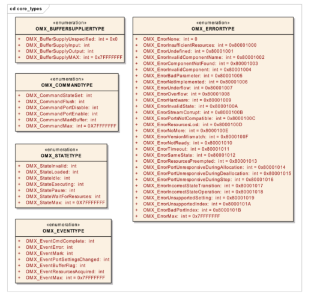


**Figure 3-1. Enumerations Defined in OMX_Core.h**
####3.1.1.1  OMX_COMMANDTYPE
Table 3-1 represents the possible commands that an IL client can send to an OpenMAX component. Since commands are non-blocking, the OpenMAX component generates a command completion event via a callback function when the command has completed.
Callbacks are defined in a dedicated structure; see section 3.1.2.7.

| Field Name | Description |
| ------------- | ------------- |
| OMX_CommandStateSet | Change the component state OMX_CommandFlush  Flush the queue(s) of buffers on a port of a component|
| OMX_CommandPortDisable | Disable a port on a component |
| OMX_CommandPortEnable | Enable a port on a component |
| OMX_CommandMarkBuffer | Mark a buffer and specify which other component will raise the event mark received|

Table 3-2 describes the parameters to be used for each command.

| Command code | nParam | pCmdData |
| ------------- | ------------- |  ------------- |
| OMX_CommandStateSet |OMX_STATETYPE – state to transition to | NULL |
| OMX_CommandFlush | OMX_U32 – target port ID | NULL |
| OMX_CommandPortDisable |OMX_U32 – target port ID | NULL |
| OMX_CommandPortEnable | OMX_U32 – target port ID | NULL |
| OMX_CommandMarkBuffer | OMX_U32 – target port ID |OMX_MARKTYPE* - mark data and target component |

**Table 3-2. Command Syntax**
####3.1.1.2  OMX_STATETYPE
Figure 3-2 illustrates the transitions among states that occur as a consequence of the IL client calling `OMX_SendCommand`(`OMX_StateSet`, <state>), where the new state for the component is passed as a parameter. A transition name surrounded by curly braces indicates that the transition is not triggered by a command sent by the IL client but is a consequence of internal component events

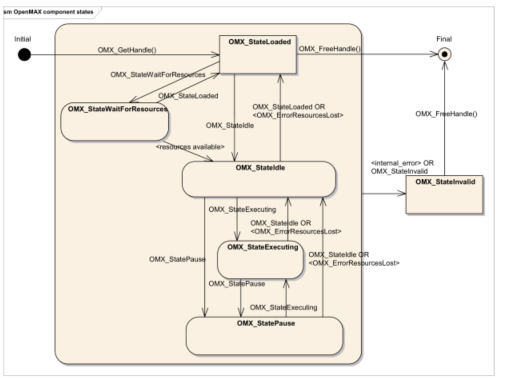

**Figure 3-2. OpenMAX Component State Transitions**

This section describes component states. An IL client commands a component to change states via the `OMX_SendCommand` function using the `OMX_CommandStateSet` command.

Table 3-3 represents the states of an OpenMAX component.

| Field Name | Description | Resources Allocated |Location of buffer |
| ------------- |-------------| ------------- | ------------- |
| OMX_StateInvalid | Component is corrupt or has encountered an error from which it cannot recover. | Unknown | Unknown |
| OMX_StateLoaded | Component has been loaded but has no resources allocated. | No | Not available |
| OMX_StateIdle | Component has all resources but has not transferred any buffers or begun processing data. | Yes | Supplier only |
| OMX_StateExecuting | Component is transferring buffers and is processing data (if data is available). | Yes | Supplier or non-supplier |
| OMX_StatePause | Component data processing has been paused but may be resumed from the point it was paused. | Yes |Supplier or non-supplier |
| OMX_StateWaitFor | Resources Component is waiting for aresource to become available.| No | Not available |

**Table 3-3. OpenMAX Component States**
######3.1.1.2.1  OMX_StateLoaded
A component is in the OMX_StateLoaded state after it has been created via an `OMX_GetHandle` call and before allocation of its resources. In this state, the IL client may modify the component’s parameters via `OMX_SetParameter`, set up data tunnels on the component’s ports with `OMX_SetupTunnel`, or transition the component to either the `OMX_StateIdle` state or the OMX_StateWaitForResources state.

The IL client may elect to transition a component that is currently in the OMX_StateLoaded state into the OMX_StateWaitForResources state if, for example, the component failed to acquire all of its resources on an attempted transition to the `OMX_StateIdle` state.

###### 3.1.1.2.1.1  OMX_StateLoaded to OMX_StateIdle
If the IL client requests a state transition from `OMX_StateLoaded` to `OMX_StateIdle`, the component must acquire all of its resources, including buffers, before completing the transition. Furthermore, before the transition can complete, the buffer supplier, which is always the IL client when not tunneling, must ensure that the non-supplier possesses all of its buffers. For a port connected to the IL client, the IL client may allocate the buffers itself and then pass them to the port via an `OMX_UseBuffer` call on the port, or it may direct the port to perform the allocation via an `OMX_AllocateBuffer` call on the port.

When a port is tunneling, the supplier port either allocates buffers itself or, if the port implements buffer sharing, re-uses buffers from a port on the same component. A tunneling supplier port then passes the buffers to the non-supplier port via an `OMX_UseBuffer` call on the non-supplier.

The number of buffers used on a port is specified in its port definition (see `OMX_IndexParamPortDefinition`), which defaults to the minimum (specified in the same structure) but which may be modified by the supplier before the sequence of `OMX_UseBuffer` and `OMX_AllocateBuffer` calls via a call to `OMX_SetParameter`.

#####3.1.1.2.2  OMX_StateIdle
In the `OMX_StateIdle` state, the component is ready to be used, meaning that all necessary resources have been properly allocated. However, the suppliers retain all their buffers, and no buffer exchange or processing is taking place. Thus, if this state is entered from an `OMX_StateExecuting` or `OMX_StatePause` state, the component shall have returned all buffers it was processing to their respective suppliers. The IL client may transition the component to any states other than the `OMX_StateInvalid` and `OMX_StateWaitForResources` states.

######3.1.1.2.2.1  OMX_StateIdle to OMX_StateLoaded
On a transition from OMX_StateIdle to OMX_StateLoaded, each buffer supplier must call `OMX_FreeBuffer` on the non-supplier port for each buffer residing at the non-supplier port. If the supplier allocated the buffer, it must free the buffer before calling `OMX_FreeBuffer`. If the non-supplier port allocated the buffer, it must free the buffer upon receipt of an `OMX_FreeBuffer` call. Furthermore, a non-supplier port must always free the buffer header upon receipt of an OMX_FreeBuffer call. When all of the buffers have been removed from the component, the state transition is complete; the component communicates that the initiating `OMX_SendCommand` call has completed via a callback event.

######3.1.1.2.2.2  OMX_StateIdle to OMX_StateExecuting
If the IL client requests a state transition from OMX_StateIdle to `OMX_StateExecuting`, the component shall begin transferring and processing data. For ports that communicate with the IL client, the IL client will initiate buffer transfers via `OMX_EmptyThisBuffer` and `OMX_FillThisBuffer`. Among tunneling ports, any input port that is also a supplier shall transfer its empty buffers to the tunneled output port via `OMX_FillThisBuffer`.

#####3.1.1.2.3  OMX_StateExecuting
In this state, an OpenMAX component is transferring and processing data buffers. The component shall accept calls to `OMX_EmptyThisBuffer` on its input ports and `OMX_FillThisBuffer` on its output ports. Any port that communicates with the IL client shall call the `EmptyBufferDone` and `FillBufferDone` callbacks to return an empty or full buffer, respectively, back to the IL client. Any tunneling port shall call `OMX_FillThisBuffer` or `OMX_EmptyThisBuffer` on its corresponding tunneled port to return an empty or full buffer, respectively, back to its tunneled port. An IL client may transition a component in the `OMX_StateExecuting` state to either the `OMX_StateIdle` state or the `OMX_StatePaused` state.

######3.1.1.2.3.1  OMX_StateExecuting to OMX_StateIdle
If the IL client requests a state transition from `OMX_StateExecuting` to `OMX_StateIdle`,the component shall return all buffers to their respective suppliers and receive all buffers belonging to its supplier ports before completing the transition. Any port communicating with the IL client shall return any buffers it is holding via `OMX_EmptyBufferDone`
and OMX_FillBufferDone callbacks, which are used by input and output ports, respectively. Any non-supplier port shall return all buffers it is holding to the input port or output port it is tunneling with using `OMX_EmptyThisBuffer` or `OMX_FillThisBuffer`, respectively. Likewise, any supplier tunneling port shall wait for all of its buffers to be returned from its tunneled port.

#####3.1.1.2.4  OMX_StatePause
In this state, an OpenMAX component is not transferring or processing data but buffers are not necessarily returned to their suppliers. From the `OMX_StatePause` state, execution may be resumed via a transition to `OMX_StateExecuting`, preferably without dropping data. The component may still accept data buffers at its input, but such buffers will be queued only and not processed further. The IL client may transition a component in the `OMX_StatePause` state to `OMX_StateIdle` or `OMX_StateExecuting`. On a transition from `OMX_StatePause` to `OMX_StateIdle`, the component shall return all buffers to their respective suppliers in a manner identical to the `OMX_StateExecuting` to `OMX_StateIdle` transition described in section 3.1.1.2.3.1.

#####3.1.1.2.5  OMX_StateWaitForResources
In this state, the component is waiting for one or more of its required resources to become available. This state is related to resource management. The assumption is that one or more hardware-specific resource managers exist on the platform to handle available resources. The interaction among OpenMAX components and resource managers is outside the scope of this specification.

If a component in the `OMX_StateLoaded` state fails to enter the `OMX_StateIdle` state because resources other than buffers are insufficient, the IL client may put the component in the `OMX_StateWaitForResources` state if the IL client wants to be notified when the needed resources become available. The IL client may command the component to discontinue waiting for resources by transitioning it from the `OMX_StateWaitForResources` state to the `OMX_StateLoaded` state. If a component in the `OMX_StateWaitForResources` state acquires all the resources upon which it is waiting, it shall initiate a transition to the `OMX_StateIdle` state.

######3.1.1.2.5.1  OMX_StateWaitForResources to OMX_StateIdle
When a component initiates a transition from the OMX_StateWaitForResources state to the `OMX_StateIdle` state, it shall communicate the initiation of this transition to the IL client via an `OMX_EventResourcesAcquired` event. When the IL client receives the `OMX_EventResourcesAcquired` event, it shall call `OMX_UseBuffer` and `OMX_AllocateBuffer` in the manner of a transition from `OMX_StateLoaded` to `OMX_StateIdle`. Likewise, the component cannot complete its transition to
`OMX_StateIdle` until it acquires all of its resources, including buffers.

#####3.1.1.2.6  OMX_StateInvalid
In this state, the component has suffered internal corruption or an error from which it cannot recover. When it detects such a condition, the component transitions itself to `OMX_StateInvalid` and informs the IL client by generating an `OMX_ErrorEvent` event with the value `OMX_ErrorInvalidState`. When the IL client receives `OMX_EventError` indicating a transition to `OMX_StateInvalid`, it shall free all resources associated with that component and eventually call `OMX_FreeHandle` to release the handle associated with the component.

A component in the `OMX_StateInvalid` state shall fail every call made upon it and return an `OMX_ErrorStateInvalid` error message except for `OMX_GetState`, `OMX_FreeBuffer`, or `OMX_ComponentDeinit`. The IL client may also command a transition to the `OMX_StateInvalid` state explicitly via `OMX_SendCommand`. A component may transition between any state and the `OMX_StateInvalid` state.

####3.1.1.3  OMX_ERRORTYPE
The OMX_ERRORTYPE enumeration shown in Table 3-4 defines the standard
OpenMAX errors that all functions defined in the OpenMAX IL API return. These errors
should cover most of the common failure cases. However, vendors are free to add
additional error messages of their own as long as they follow these rules:

-  Vendor error messages shall be in the range of 0x90000000 to 0x9000FFFF.
-  Vendor error messages shall be defined in a header file provided with the component. No error messages are allowed that are not defined.

|Field Name| Value | Description |
|------------- |:-------------:|  ------------- |
|OMX_ErrorNone| 0 | The function returned successfully. |
|OMX_ErrorInsufficientResources | 0x80001000 |There were insufficient resources toperform the requested operation. |
|OMX_ErrorUndefined | 0x80001001 | There was an error but the cause of the error could not be determined. |
|OMX_ErrorInvalidComponentName |0x80001002 | The component name string wasinvalid. |
|OMX_ErrorComponentNotFound | 0x80001003 | No component with the specified name string was found. |
|OMX_ErrorInvalidComponent | 0x80001004 | The component specified did not have a OMX_ComponentInit entry point, or the component did not correctly complete the OMX_ComponentInit call. |
|OMX_ErrorBadParameter | 0x80001005 | One or more parameters were invalid.|
|OMX_ErrorNotImplemented | 0x80001006 | The requested function is notimplemented. |
|OMX_ErrorUnderflow | 0x80001007 | The buffer was emptied before the next buffer was ready. |
|OMX_ErrorOverflow | 0x80001008 | The buffer was not available when it was needed.|
|OMX_ErrorHardware | 0x80001009 | The hardware failed to respond as expected. |
|OMX_ErrorInvalidState | 0x8000100A | The component is in the OMX_StateInvalid state. |
|OMX_ErrorStreamCorrupt | 0x8000100B |The stream is found to be corrupt. |
|OMX_ErrorPortsNotCompatible | 0x8000100C | Ports being set up for tunneled communication are incompatible. |
|OMX_ErrorResourcesLost | 0x8000100D | Resources allocated to a component inthe OMX_StateIdle state have been lost, which has resulted in the component returning to the OMX_StateLoaded state. |
|OMX_ErrorNoMore | 0x8000100E | No more indices can be enumerated. |
|OMX_ErrorVersionMismatch | 0x8000100F |The component detected a versionmismatch. |
|OMX_ErrorNotReady | 0x80001010 |The component is not ready to returndata at this time. |
|OMX_ErrorTimeout | 0x80001011 | A timeout occurred. |
|OMX_ErrorSameState | 0x80001012 |The component tried to transition into the state that it is currently in. |
|OMX_ErrorResourcesPreempted | 0x80001013 |Resources allocated to a component in the OMX_StateExecuting or OMX_Pause states have been pre- empted, causing the component to return to the OMX_StateIdle state. |
|OMX_ErrorPortUnresponsiveDuringAllocation |0x80001014|The non-supplier port deemed that it had waited an unusually long time for the supplier port to send it an allocated buffer via an OMX_UseBuffer call. A non-supplier port sends this error to the IL client via the EventHandler callback during the allocation of buffers on a transition from the LOADED to the IDLE state or on a port enable.|
|OMX_ErrorPortUnresponsiveDuringDeallocation|0x80001015|The non-supplier port deemed that it had waited an unusually long time for the supplier port to request the de-allocation of a buffer header via a OMX_FreeBuffer call. A non-supplier port sends this error to the IL client via the EventHandler callback during the de-allocation of buffers on a transition from the IDLE to LOADED state or on a port disablement.|
|OMX_ErrorPortUnresponsiveDuringStop |0x80001016|The supplier port deemed that it had waited an unusually long time for the non-supplier port to return a buffer via an EmptyThisBuffer or FillThisBuffer call. A supplier port sent this error to the IL client via the EventHandler callback during the disabling of a port, either on a transition from the IDLE to LOADED state or on a port disablement.|
|OMX_ErrorIncorrectStateTransition|0x80001017|A state transition was attempted that is not allowed.|
|OMX_ErrorIncorrectStateOperation|0x80001018|A command or method was attempted that is not allowed during the present state. |
|OMX_ErrorUnsupportedSetting| 0x80001019|One or more values encapsulated in the parameter or configuration structure are unsupported.|
|OMX_ErrorUnsupportedIndex|  0x8000101A|The parameter or configuration indicated by the given index is unsupported.|
|OMX_ErrorBadPortIndex|  0x8000101B|The port index that was supplied is incorrect.|
|OMX_ErrorPortUnpopulated | 0x8000101C | The port has lost one or more of its buffers and is thus unpopulated.|

**Table 3-4. OpenMAX Error Codes**
####3.1.1.4  OMX_EVENTTYPE
The OMX_EVENTTYPE enumeration shown in Table 3-5 includes the event types that
an OpenMAX component can generate. Section 3.1.2.7 describes events that the
OpenMAX component generates and passes to the IL client by means of the callback
mechanism. Events have associated parameters that are also passed in the callback.

| Field Name | Description |
| ------------- | ------------- |
| OMX_EventCmdComplete | Component has completed the execution of a command. |
| OMX_EventError | Component has detected an error condition. |
| OMX_EventMark | A buffer mark has reached the target component, and the IL client has received this event with the private data pointer of the mark. |
| OMX_EventPortSettingsChanged | Component has changed port settings. For example, the component has changed port settings resulting from bit stream parsing. |
| OMX_EventBufferFlag | The event that a component sends when it detects the end of a stream. |
| OMX_EventResourcesAcquired | The component has been granted resources and is transitioning from the OMX_StateWaitForResources state to the OMX_StateIdle state. |
**Table 3-5. OpenMAX Event Types**

#####3.1.1.4.1  OMX_EventCmdComplete
A component generates an OMX_EventCmdComplete event as soon as a command sent by the IL client has completed its execution. In case of a component state change, the new state that the component has entered is returned as an event parameter. A component that transitions to the OMX_StateInvalid state does not generate this event.

#####3.1.1.4.2  OMX_EventError
A component generates the OMX_EventError event when the component detects an error condition; the type of error detected is returned as an event parameter and will use values defined in `OMX_ERRORTYPE`. A component shall send the following errors via `OMX_EventError`:

-  A component sends the `OMX_ErrorInvalidState` error if the component transitions to the `OMX_StateInvalid` state.
-  A component sends the `OMX_ErrorResourcesPreempted` error if the component transitions from `OMX_StateExecuting` or `OMX_StatePause` to `OMX_StateIdle` due to the loss of a resource.
-  A component sends the `OMX_ErrorResourcesLost` error if the component transitions from `OMX_StateIdle` to `OMX_StateLoaded` due to the loss of a resource.]

#####3.1.1.4.3  OMX_EventMark
A component generates the `OMX_EventMark` event when it receives a marked buffer. When a component receives a buffer, it shall compare its own pointer to the pMarkTargetComponent field contained in the buffer. If the pointers match, then the
component shall send a mark event including pMarkData as a parameter, immediately after the component has finished processing the buffer. The IL client can use the mark event to measure the propagation delay of a data buffer through a chain of components, or to notify a component that a particular buffer has reached the given destination.

#####3.1.1.4.4  OMX_EventPortSettingsChanged
A component generates the `OMX_EventPortSettingsChanged` event as soon as component port settings change. For example, a video decoder may not know a priori the output frame size and frame rate, as these parameters are coded in the input bit stream. As soon as such parameters are parsed, the component changes the values of the configuration structures of its output port and sends the `OMX_EventPortSettingsChanged` event to the IL client.

#####3.1.1.4.5  OMX_EventBufferFlag
A component generates the `OMX_EventBufferFlag` event when an output port emits a buffer with the `OMX_BUFFERFLAG_EOS` flag set in the `nFlags` field. The `nData1` field of EventHandler specifies the value of the output port’s portindex field. The nData2 field of `EventHandler` specifies the unaltered nFlags field containing the end-of-stream (EOS) flag. If a component does not propagate a stream further (e.g., the component is an audio or video sink), then the component shall send an OMX_EventBufferFlag event for that stream when it has finished processing a buffer with OMX_BUFFERFLAG_EOS set. The nData1 field of EventHandler specifies the input port that received the buffer. The nData2 field of EventHandler specifies the unaltered nFlags field containing the EOS flag.

#####3.1.1.4.6  OMX_EventResourcesAcquired
A component generates the `OMX_EventResourcesAcquired` event when it is in the `OMX_StateWaitForResources` state, and the resource manager detects that the needed resources are available. When the component receives this event, it is ready to change state into the `OMX_StateIdle`, and it waits for all the buffers to be allocated and assigned to its ports.

####3.1.1.5  OMX_BUFFERSUPPLIERTYPE
The OMX_BUFFERSUPPLIERTYPE enumerative type shown in Table 3-6 specifies the port in the tunnel that is the supplier port. A buffer supplier port either may allocate its buffers or reuse buffers provided by another port within the same component.

| Field Name | Value | Description |
| ------------- | ------------- | ------------- |
| OMX_BufferSupplyUnspecified | 0x0 | The port supplying the buffers is unspecified, or no supplier is preferred. |
| OMX_BufferSupplyInput | | The input port supplies the buffers. |
| OMX_BufferSupplyOutput | | The output port supplies the buffer.|
**Table 3-6. OpenMAX Buffer Supplier Type Used in Tunnel Setup**

###3.1.2 Structures
This section discusses the data structures defined in the OpenMAX core. The first two fields of each OpenMAX data structure denote the size of the structure and the version of type `OMX_VERSIONTYPE`, which is defined in section 3.1.2.4. The entity that allocates an OpenMAX structure is responsible for filling in these two values.

####3.1.2.1  OMX_COMPONENTREGISTERTYPE
The `OMX_COMPONENTREGISTERTYPE` structure is used in the case of static linking of components to the core. The core optionally uses it to load the component and run the specific component initialization functions.

`OMX_COMPONENTREGISTERTYPE` is defined as follows.

``` C
typedef struct OMX_COMPONENTREGISTERTYPE
{
  const char * pName;
  OMX_COMPONENTINITTYPE pInitialize;
} OMX_COMPONENTREGISTERTYPE;
```

####3.1.2.2  OMX_COMPONENTINITTYPE Type Definition
The `OMX_COMPONENTINITTYPE` type definition is the type of function pointer for the
component initialization entry point. The definition is as follows:

```C
typedef OMX_ERRORTYPE (* OMX_COMPONENTINITTYPE)(OMX_IN OMX_HANDLETYPE hComponent);
```
#####3.1.2.2.1  pName
`pName` contains the string name of the component and has limit of 128 bytes (including‘\0’).

#####3.1.2.2.2  pInitialize
`pInitialize` contains the pointer to the initialization function of the component.

####3.1.2.3  OMX_ComponentRegistered[]
Any core that statically links its components shall define this global array containing the list of all registered components in the form of `OMX_COMPONENTREGISTERTYPE` fields.

####3.1.2.4  OMX_VERSIONTYPE
The `OMX_VERSIONTYPE` type indicates the version of a component or structure. Each structure uses an `OMX_VERSIONTYPE` field to indicate the OpenMAX specification version under which the structure is defined. For OpenMAX IL version 1.0, the specification version is 1.0.0.0. The component structure also includes an `OMX_VERSIONTYPE` field to indicate a vendor-specific component version.

OMX_VERSIONTYPE is defined as follows.

``` C
typedef union OMX_VERSIONTYPE
{
  struct
  {
    OMX_U8 nVersionMajor;
    OMX_U8 nVersionMinor;
    OMX_U8 nRevision;
    OMX_U8 nStep;
  } s;
  OMX_U32 nVersion;
} OMX_VERSIONTYPE;
```

#####3.1.2.4.1  nVersionMajor
`nVersionMajor` identifies the major version number.

#####3.1.2.4.2  nVersionMinor
`nVersionMinor` identifies the minor version number.

#####3.1.2.4.3  nRevision
`nRevision` identifies the revision number.

#####3.1.2.4.4  nStep
`nStep` identifies the step number.]

####3.1.2.5  OMX_PRIORITYMGMTTYPE
The `OMX_PRIORITYMGMTTYPE` type describes the priority assigned to a set of components. A component group identifies a set of co-dependent components associated with the same feature. All components in the same group share the same group ID and
priority. If one component in a group loses resources and stops running, the entire feature they collectively contribute to is lost. In this case, all of the other components in the same group shall transition to `OMX_StateLoaded`. A component that is the only one with a certain `nGroupID` acts atomically.

`OMX_PRIORITYMGMTTYPE` is defined as follows.

``` C
typedef struct OMX_PRIORITYMGMTTYPE {
OMX_U32 nSize;
OMX_VERSIONTYPE nVersion;
OMX_U32 nGroupPriority;
OMX_U32 nGroupID;
} OMX_PRIORITYMGMTTYPE;
```

#####3.1.2.5.1  nGroupPriority
The value of nGroupPriority is the priority value associated with a group of components. If a parameter of this type is assigned to a component, that component belongs to the group identified with nGroupID and has a priority equal to
nGroupPriority. By definition, the value 0 represents the highest priority for a group of components.

The exact mechanism to assign priorities to groups of components is outside the scope of this document.

#####3.1.2.5.2  nGroupID
The value for nGroupID is a unique ID for all components in the same component group.

####3.1.2.6  OMX_BUFFERHEADERTYPE
In the context of a single port, each data buffer has a header associated with it that contains meta-information about the buffer. The IL client shares buffer headers with each port with which it is communicating. Likewise, each pair of tunneling ports share buffer headers; otherwise, the same buffer transferred over multiple ports will have distinct buffer headers associated with it for each port. The definition of the buffer header is shown as follows.

``` C
typedef struct OMX_BUFFERHEADERTYPE
{
OMX_U32 nSize;
OMX_VERSIONTYPE nVersion;
OMX_U8* pBuffer;
OMX_U32 nAllocLen;
OMX_U32 nFilledLen;
OMX_U32 nOffset;
OMX_PTR pAppPrivate;
OMX_PTR pPlatformPrivate;
OMX_U32 nOutputPortPrivate;
OMX_U32 nInputPortPrivate;
OMX_HANDLETYPE hMarkTargetComponent;
OMX_PTR pMarkData;
OMX_U32 nTickCount;
OMX_TICKS nTimeStamp;
OMX_U32 nFlags;
OMX_U32 nOutputPortIndex;
OMX_U32 nInputPortIndex;
} OMX_BUFFERHEADERTYPE;
```

#####3.1.2.6.1  pBuffer
pBuffer is a pointer to the actual buffer where data is stored but not necessarily the start of valid data; for more information, see the description of nOffset in section 3.1.2.6.4.

#####3.1.2.6.2  nAllocLen
nAllocLen is the total size of the allocated buffer in bytes, including valid and unused byte.

#####3.1.2.6.3  nFilledLen
nFilledLen is the total size of valid bytes currently in the buffer starting from the location specified by pBuffer and nOffset.

#####3.1.2.6.4  nOffset
nOffset is the start offset of valid data in bytes from the start of the buffer. A pointer to the valid data may be obtained by adding nOffset to pBuffer.

#####3.1.2.6.5  pAppPrivate
pAppPrivate is a pointer to an IL client private structure.

#####3.1.2.6.6  pPlatformPrivate
pPlatformPrivate is a pointer to a platform private structure. The core that allocated this buffer header structure uses this pointer.

#####3.1.2.6.7  pOutputPortPrivate
pOutputPortPrivate is a private pointer of the output port that uses the buffer. If a buffer header is used on an input port communicating with the IL client, the value of the buffer’s pOutputPortPrivate is undefined.

#####3.1.2.6.8  pInputPortPrivate
pInputPortPrivate is a private pointer of the input port that uses the buffer. If a buffer header is used on an output port communicating with the IL client, the value of the buffer’s pInputPortPrivate is undefined.

#####3.1.2.6.9  hMarkTargetComponent
hMarkTargetComponent is the handle of the component that should emit an `OMX_EventMark` event upon processing this buffer. A NULL handle indicates that the buffer carries no mark. The `OMX_CommandMarkBuffer` command provides this handle to the marking component. The marking component, in turn, copies this handle to the marked buffer. Each component that is processing a buffer should compare its own handle to this handle and emit the mark if the handles match. A component should
propagate this field from an input buffer to its associated output buffer.

#####3.1.2.6.10  pMarkData
The pMarkData pointer refers to IL client-specific data associated with the mark that is sent on `OMX_EventMark` when emitted. Upon receipt of a mark, the IL client may use this data to disambiguate this mark from others. The `OMX_CommandMarkBuffer` command provides this pointer to the marking component. The marking component, in turn, copies this pointer to the marked buffer. A component should propagate this field from an input buffer to its associated output buffer.

#####3.1.2.6.11  nTickCount
nTickCount is an optional entry that the component and IL client can update with a tick count when they access the component; not all components will update it. The value of nTickCount is in microseconds. Since this is a value relative to an arbitrary starting point, nTickCount cannot be used to determine absolute time.

#####3.1.2.6.12  nTimeStamp
nTimeStamp is a timestamp corresponding to the sample starting at the first logical sample boundary in the buffer. Timestamps of successive samples within the buffer may be inferred by adding the duration of the preceding buffer to the timestamp of the preceding buffer. A component should propagate this field from an input buffer to its associated output buffer.

#####3.1.2.6.13  nFlags
The nFlags field contains buffer specific flags, such as the EOS flag. A component should propagate this field from an input buffer to its associated output buffer. The list of flags is as follows:

```C
#define OMX_BUFFERFLAG_EOS 0x00000001
#define OMX_BUFFERFLAG_STARTTIME 0x00000002
#define OMX_BUFFERFLAG_DECODEONLY 0x00000004
#define OMX_BUFFERFLAG_DATACORRUPT 0x00000008
#define OMX_BUFFERFLAG_ENDOFFRAME 0x00000010
```

######3.1.2.6.13.1  OMX_BUFFERFLAG_EOS
A component sets EOS when it has no more data to emit on a particular output port. Thus, an output port shall set EOS on the last buffer it emits. The determination by a component of when an output port should cease sending data is implementation specific.

######3.1.2.6.13.2  OMX_BUFFERFLAG_STARTTIME
The source of a stream (e.g., a de-multiplexing component) sets the `OMX_BUFFERFLAG_STARTTIME` flag on the buffer that contains the starting timestamp for the stream. The starting timestamp corresponds to the first data that should be displayed at startup or after a seek operation.

The first timestamp of the stream is not necessarily the start time. For instance, in the case of a seek to a particular video frame, the target frame may be an interframe. Thus the first buffer of the stream will be the intraframe preceding the target frame, and the start time will occur with the target frame along with any other required frames required to reconstruct the target intervening.

The `OMX_BUFFERFLAG_STARTTIME` flag is directly associated with the buffer timestamp. Thus, the association of the OMX_BUFFERFLAG_STARTTIME flag to buffer data and its propagation is identical to that of the timestamp.


A clock component client that receives a buffer with the STARTTIME flag shall perform an OMX_SetConfig call on its sync port using `OMX_ConfigTimeClientStartTime` and pass the timestamp for the buffer.

######3.1.2.6.13.3  OMX_BUFFERFLAG_DECODEONLY
The source of a stream (e.g., a de-multiplexing component) sets the `OMX_BUFFERFLAG_DECODEONLY` flag on any buffer that should be decoded but not rendered. This flag is used, for instance, when a source seeks to a target interframe that requires decoding of frames preceding the target to facilitate reconstruction of the target. In this case, the source would emit the frames preceding the target downstream but mark them as decode only.

The `OMX_BUFFERFLAG_DECODEONLY` flag is associated with buffer data and propagated in a manner identical to that of the buffer timestamp. A component that renders data should ignore all buffers with the `OMX_BUFFERFLAG_DECODEONLY` flag set.

######3.1.2.6.13.4  OMX_BUFFERFLAG_DATACORRUPT
The `OMX_BUFFERFLAG_DATACORRUPT` flag is set when the IL client identifies the data in the associated buffer as corrupt.

######3.1.2.6.13.5  OMX_BUFFERFLAG_ENDOFFRAME
`OMX_BUFFERFLAG_ENDOFFRAME` is an optional flag that is set by an output port when the last byte that a buffer payload contains is an end-of-frame. Any component that implements setting the `OMX_BUFFERFLAG_ENDOFFRAME` flag on an output port
shall set this flag for every buffer sent from the output port containing an end-of-frame.No buffer payload can contain data from two separate frames.

These restrictions enable input ports that receive data from the output port to detect an end-of-frame without requiring additional processing. These restrictions also enable an input port to easily detect if an output port supports this flag by its presence or absence on completion of the first frame.

####3.1.2.6.14  nOutputPortIndex
nOutputPortIndex contains the port index of the output port that uses the buffer. If a buffer header is used on an input port that is communicating with the IL client, the value of nOutputPortIndex is undefined.

#####3.1.2.6.15  nInputPortIndex
nInputPortIndex contains the port index of the input port that uses the buffer. If a buffer header is used on an input port that is communicating with the IL client, the value of nInputPortIndex is undefined.

####3.1.2.7  OMX_PORT_PARAM_TYPE
A component uses the OMX_PORT_PARAM_TYPE structure to identify the number and starting index of ports of a particular domain.

`OMX_PORT_PARAM_TYPE` is defined as follows.

``` C
typedef struct OMX_PORT_PARAM_TYPE {
OMX_U32 nSize;
OMX_VERSIONTYPE nVersion;
OMX_U32 nPorts;
OMX_U32 nStartPortNumber;
} OMX_PORT_PARAM_TYPE;
```

#####3.1.2.7.1  nPorts
nPorts is the number of ports of a given port domain (audio, video, image, or other) for the component.

#####3.1.2.7.2  nStartPortNumber
nStartPortNumber is the index of the first port of a given port domain (audio, video, image, or other) for the component . Subsequent ports of the given domain are numbered sequentially from nStartNumber.

#####3.1.2.8  OMX_CALLBACKTYPE
The OpenMAX IL includes a callback mechanism that allows a component to communicate the following with the IL client:

-  An asynchronous command triggered by the IL client has completed successfully or failed and generated an error. Commands include those sent by OMX_SendCommand and those implied by IL client calls to EmptyThisBuffer or FillThisBuffer.
-  An error unassociated with a command triggered by the IL client has occurred. For example, the component has suffered an unrecoverable error and is transitioning to the `OMX_StateInvalid` state.

To accomplish a callback, the OpenMAX IL has three callback functions defined: a generic event handler and two callbacks related to the dataflow (`EmptyBufferDone` and `FillBufferDone`).

The IL client is responsible for filling in an `OMX_CALLBACKTYPE` structure with itscallback entry points and passing the structure to the OpenMAX core at initialization(init) time, usually in the `OMX_GetHandle` function.

`OMX_CALLBACKTYPE` is defined as follows.

```C
typedef struct OMX_CALLBACKTYPE
{
OMX_ERRORTYPE (*EventHandler)(
OMX_IN OMX_HANDLETYPE hComponent,
OMX_IN OMX_PTR pAppData,
OMX_IN OMX_EVENTTYPE eEvent,
OMX_IN OMX_U32 nData1,
OMX_IN OMX_U32 nData2,
OMX_IN OMX_PTR pEventData);
OMX_ERRORTYPE (*EmptyBufferDone)(
OMX_IN OMX_HANDLETYPE hComponent,
OMX_IN OMX_PTR pAppData,
OMX_IN OMX_BUFFERHEADERTYPE* pBuffer);
OMX_ERRORTYPE (*FillBufferDone)(
OMX_IN OMX_HANDLETYPE hComponent,
OMX_IN OMX_PTR pAppData,
OMX_IN OMX_BUFFERHEADERTYPE* pBuffer);
} OMX_CALLBACKTYPE;
```

#####3.1.2.8.1  EventHandler
A component uses the EventHandler method to notify the IL client when an event of interest occurs within the component. The OMX_EVENTTYPE enumeration defines the set of OpenMAX IL events; refer to the definition of this enumeration for the meaning of each event. nData1 carries the value of `OMX_COMMANDTYPE` that has been completed or `OMX_ERRORTYPE`. nData2 carries further event parameters, e.g., `OMX_STATETYPE`. pEventData contains event specific data. The pEventData pointer may contain additional data associated with the event (e.g., mark-specific data). A call to EventHandler is a blocking call, so the IL client should respond within five msec to avoid blocking the component for an excessively long time period.

The `EventHandler` method is defined as follows.
``` C
OMX_ERRORTYPE(* OMX_CALLBACKTYPE::EventHandler)(
OMX_IN OMX_HANDLETYPE hComponent,
OMX_IN OMX_PTR pAppData,
OMX_IN OMX_EVENTTYPE eEvent,
OMX_IN OMX_U32 nData1,
OMX_IN OMX_U32 nData2,
OMX_IN OMX_PTR pEventData)
```
The parameters are as follows.

| Parameter | Description |
| -------- |
| hComponent | The handle of the component that calls this function. |
| eEvent | The event that the component is communicating to the IL client. |
| nData1 | The first integer event-specific parameter. See Table 3-7 for the meaning in the context of each event. |
| nData2 | The second integer event-specific parameter. See Table 3-7 for the meaning in the context of each event. The default value is 0 if not used. |
| pEventData | A pointer to additional event-specific data. See Table 3-7 for the meaning in the context of each event. |
**Table 3-7 lists the parameters used in each event.**

| eEvent | nData1 | nData2 | pEventData |
| ------- |
| OMX_EventCmdComplete | OMX_CommandStateSet | State reached | Null |
| | OMX_CommandFlush | Portindex | Null |
| | OMX_CommandPortDisable | Portindex | Null |
| | OMX_CommandPortEnable | Portindex | Null |
| | OMX_CommandMarkBuffer | Portindex | Null |
| OMX_EventError | Error code | 0 | Null |
| OMX_EventMark | 0 | 0 | Data linked to the mark, if any |
| OMX_EventPortSettings | Changed | port index | 0 | Null |
| OMX_EventBufferFlag | port index |nFlags unaltered | Null |
| OMX_EventResourcesAcquired | 0 | 0 | Null |
**Table 3-7. Event Parameter Usage**

#####3.1.2.8.2  EmptyBufferDone
A component uses the EmptyBufferDone callback to pass a buffer from an input port back to the IL client. A component sets the nOffset and nFilledLength values of the buffer header to reflect the portion of the buffer it consumed; for example,
nFilledLength is set equal to 0x0 if completely consumed.

In addition to facilitating normal data flow between an executing component and the ILclient, a component uses the EmptyBufferDone function to return input buffers to the IL client in the following cases:

- The IL client commands a transition from `OMX_StateExecuting` or `OMX_StatePause` to `OMX_StateIdle` or to `OMX_StateInvalid`.
- The IL client flushes or disables a port.

The `EmptyBufferDone` call is a blocking call that should return from within five msec.Therefore, the IL client may elect not to fill the buffers during this call but queue them for processing outside this call.

The `EmptyBufferDone` call is defined as follows.

``` C
OMX_ERRORTYPE(* OMX_CALLBACKTYPE::EmptyBufferDone)(
OMX_OUT OMX_HANDLETYPE hComponent,
OMX_OUT OMX_PTR pAppData,
OMX_OUT OMX_BUFFERHEADERTYPE* pBuffer)
```

The parameters are as follows.

| Parameter | Description |
| ------- |
| hComponent | The handle of the component that is calling this function. |
| pAppData | A pointer to IL client-defined data. |
| pBuffer | A pointer to an OMX_BUFFERHEADERTYPE structure that was consumed or returned. |

#####3.1.2.8.3  FillBufferDone
A component uses the FillBufferDone callback to pass a buffer from an output port back to the IL client. A component sets the nOffset and nFilledLength of the buffer header to reflect the portion of the buffer it filled; for example, nFilledLength is equal to 0x0 if it contains no data).

In addition to facilitating normal dataflow between an executing component and the IL client, a component uses this function to return output buffers to the IL client in the following cases:

- The IL client commands a transition from `OMX_StateExecuting` or `OMX_StatePause` to `OMX_StateIdle` or to `OMX_StateInvalid`.
- The IL client flushes or disables a port.

The `FillBufferDone` call is a blocking call that should return from within five msec. The IL client may elect not to empty the buffers during this call but queue them for consumption outside this call.

`FillBufferDone` is defined as follows.

``` C
OMX_ERRORTYPE(* OMX_CALLBACKTYPE::FillBufferDone)(
OMX_OUT OMX_HANDLETYPE hComponent,
OMX_OUT OMX_PTR pAppData,
OMX_OUT OMX_BUFFERHEADERTYPE* pBuffer)
```

The parameters are as follows.

| Parameter | Description |
| ------- |
| hComponent | The handle of the component to access. This handle is the component handle returned by the call to the GetHandle function. |
| pAppData | A pointer to IL client-defined data |
| pBuffer | A pointer to an OMX_BUFFERHEADERTYPE structure that was filled or returned. |

####3.1.2.9  OMX_PARAM_BUFFERSUPPLIERTYPE
The `OMX_PARAM_BUFFERSUPPLIERTYPE` structure is used to communicate buffer supplier settings or buffer supplier preferences.

`OMX_PARAM_BUFFERSUPPLIERTYPE` is defined as follows.

``` C
typedef struct OMX_PARAM_BUFFERSUPPLIERTYPE {
OMX_U32 nSize;
OMX_VERSIONTYPE nVersion;
OMX_U32 nPortIndex;
OMX_BUFFERSUPPLIERTYPE eBufferSupplier;
} OMX_PARAM_BUFFERSUPPLIERTYPE;
```

#####3.1.2.9.1  nPortIndex
`nPortIndex` represents the port that this structure applies to.

#####3.1.2.9.2  eBufferSupplier
`eBufferSupplier` is a field that contains the index of the buffer supplier, if input or
output.

####3.1.2.10  OMX_TUNNELSETUPTYPE
The ComponentTunnelRequest function uses the `OMX_TUNNELSETUPTYPE` structure to pass data between two ports when an IL client connects these ports via an `OMX_SetupTunnel` call.

`OMX_TUNNELSETUPTYPE` is defined as follows.

``` C
typedef struct OMX_TUNNELSETUPTYPE
{
OMX_U32 nTunnelFlags;
OMX_BUFFERSUPPLIERTYPE eSupplier;
} OMX_TUNNELSETUPTYPE;
```

#####3.1.2.10.1  nTunnelFlags
The nTunnelFlags integer parameter contains one or more bit flags applied to the port that receives this structure. Flags include:
``` C
#define OMX_PORTTUNNELFLAG_READONLY 0x00000001
```

If the flag is set as read only, the input port that receives this structure cannot alter the contents of buffers supplied on the tunnel.

#####3.1.2.10.2  eSupplier
The `eSupplier` field defines whether the input port or the output port provides the buffers. The exact sequence of calls to set up a tunnel is specified in section 3.4.1.2.

####3.1.2.11  OMX_PARAM_PORTDEFINITIONTYPE
The `OMX_PARAM_PORTDEFINITIONTYPE` structure contains a set of generic fields that characterize each port of the component. Some of these fields are common to all domains while other fields are specific to their respective domains. The IL client uses this structure to retrieve general information from each port.

`OMX_PARAM_PORTDEFINITIONTYPE` is defined as follows.

``` C
typedef struct OMX_PARAM_PORTDEFINITIONTYPE {
OMX_U32 nSize;
OMX_VERSIONTYPE nVersion;
OMX_U32 nPortIndex;
OMX_DIRTYPE eDir;
OMX_U32 nBufferCountActual;
OMX_U32 nBufferCountMin;
OMX_U32 nBufferSize;
OMX_BOOL bEnabled;
OMX_BOOL bPopulated;
union {
OMX_AUDIO_PORTDEFINITIONTYPE audio;
OMX_VIDEO_PORTDEFINITIONTYPE video;
OMX_IMAGE_PORTDEFINITIONTYPE image;
OMX_OTHER_PORTDEFINITIONTYPE other;
} format;
} OMX_PARAM_PORTDEFINITIONTYPE;
```

#####3.1.2.11.1  nPortIndex
`nPortIndex` is a read-only field the identifies the port. The value of nPortIndex is a unique 32-bit number for the component. No two ports on a single component may share the same port number, but ports on different components may have the same port number.

#####3.1.2.11.2  eDir
eDir is a read-only field that indicates the direction (`OMX_DirInput` or `OMX_DirOutput`) for the port.

#####3.1.2.11.3  nBufferCountActual
`nBufferCountActual` represents the number of buffers that are required on this port before it is populated, as indicated by the bPopulated field of this structure. The component shall set a default value no less than nBufferCountMin for this field.

#####3.1.2.11.4  nBufferCountMin
`nBufferCountMin` is a read-only field that specifies the minimum number of buffers that the port requires. The component shall define this non-zero default value.

#####3.1.2.11.5  nBufferSize
`nBufferSize` is a read-only field that specifies the minimum size in bytes for buffers that are allocated for this port. .

#####3.1.2.11.6  bEnabled
`bEnabled` is a read-only Boolean field that indicates if the port is enabled. Ports default to bEnabled = `OMX_TRUE` and are enabled/disabled by sending the `OMX_CommandPortEnable` and `OMX_CommandPortDisable` commands with the `OMX_SendCommand` method.

A port shall not be populated when it is not enabled.

#####3.1.2.11.7  bPopulated
`bPopulated` is a read-only Boolean field that indicates if a port is populated. A port is populated when all of the buffers indicated by nBufferCountActual with a size of at least nBufferSize have been allocated on the port. A populated port shall be enabled. Enabled ports shall be populated on a transition to `OMX_StateIdle` and unpopulated on a transition to `OMX_StateLoaded`.

#####3.1.2.11.8  eDomain
`eDomain` is a read-only field that indicates the domain of the port. This field determines the contents of the format union explained in section 3.1.2.11.9.

#####3.1.2.11.9  format
The `format` fields are a union of domain-specific parameters. For more information on parameters for audio, video, image, and other domains, see section 4.

###3.1.3 OMX_PORTDOMAINTYPE
Table 3-8 enumerates the fields used in the `OMX_PARAM_PORTDEFINITIONTYPE` structure to define the domain of the port.
| Field Name | Description |
| ------- |
| OMX_PortDomainAudio | Specifies that the field format is a structure of the OMX_AUDIO_PORTDEFINITIONTYPE type. |
| OMX_PortDomainVideo | Specifies that the field format is a structure of the OMX_VIDEO_PORTDEFINITIONTYPE type. |
| OMX_PortDomainImage | Specifies that the field format is a structure of the OMX_IMAGE_PORTDEFINITIONTYPE type. |
| OMX_PortDomainOther | Specifies that the field format is a structure of the OMX_OTHER_PORTDEFINITIONTYPE type. |

**Table 3-8. Port Domain Names**

###3.1.4 OMX_HANDLETYPE
The `OMX_HANDLETYPE` structure defines the component handle as seen by the IL client. The component handle is used to access all of the public methods of the component. The component handle also contains pointers to the private data area of the component. The OpenMAX core allocates and initializes the component handle with help from the component during the process of loading the component. After the component is successfully loaded, the IL client can safely access any of the public functions of the component, although some may return an error because the state is inappropriate for the access.

##3.2  OpenMAX Core Methods/Macros
The OpenMAX core implements the main interface for an IL client that wants to use OpenMAX components. For efficiency, OpenMAX IL defines a set of OpenMAX core macros that map on one-to-one basis to most OpenMAX component methods. Some macros and methods recommend that the function return within either five milliseconds or 20 milliseconds, depending on the function. The 5-millisecond timeout was deemed by the standards body to be a reasonable response time for commands that
may not require buffer processing. The standards body identified the 20-millisecond timeout to be a reasonable response time for commands that may require buffer processing to be completed; the assumption here is that the longest buffer processing would be less than 30 milliseconds, which corresponds to 30-frames per second video. These timeouts are intended primarily to enable component integrators to get a good idea of component response latency via conformance testing.

The macros include the following:

- Get component information (version, capabilities).
- Set/Get component parameters at init time.
- Set/Get component parameters at run time.
- Allocate/De-allocate buffers.
- Send a buffer full of data to an OpenMAX component port.
- Send an empty buffer to an OpenMAX component port.
- Send commands to a component.
- Get the actual state of the component.
- Get references to OpenMAX component-proprietary parameters.

The OpenMAX Core also implements methods for the following:

- Initializing/de-initializing the whole OpenMAX IL Core
- Getting an OpenMAX component handle
- Releasing an OpenMAX component handle
- Detecting all OpenMAX components available on the platform at run time
- Setting up data tunnels among OpenMAX components

When a time limit for the execution of a method is specified, it is not intended as a hard restriction for the conformance of the component to the standard, but if the limit is not respected, a note shall appear in the description document related to the component.

###3.2.1 Return Codes for the Functions
Table 3-9 lists all of the possible return error codes for each function. A critical error denotes an error from which the component cannot recover. The component should transition to the `OMX_StateInvalid` state when a critical error occurs. All columns but the last two correspond to errors returned from a call to the component. The rightmost two columns denote errors sent asynchronously as the result of an internal error.


###3.2.2 Macros
This section describes the OpenMAX core macros.

Table 3-10 defines which macros may be called on a component in each component state.

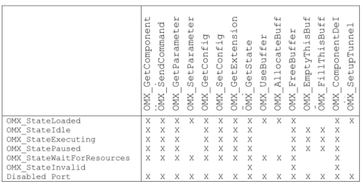

Table 3-10. Valid Component Calls
####3.2.2.1  OMX_GetComponentVersion
The GetComponentVersion macro will query the component and returns information about it. This is a blocking call. The component should return from this call within five msec.

The macro is defined as follows.
``` C
#define OMX_GetComponentVersion (
hComponent,
pComponentName,
pComponentVersion,
pSpecVersion,
pComponentUUID )
((OMX_COMPONENTTYPE*)hComponent)->GetComponentVersion( \
hComponent, \
pComponentName, \
pComponentVersion, \
pSpecVersion, \
pComponentUUID)
```

The parameters are as follows.

| Parameter | Description |
| ------- |
| *hComponent* [in] | The handle of the component that executes the command. |
| *pComponentName* [out] |A pointer to a component name string. Component names are strings limited to a length of less than 127 bytes plus the trailing null for a maximum length of 128 bytes. An example of a valid component name is "OMX.<vendor_name>.AUDIO.DSP.MIXER\0". Names are assigned by the vendor, but shall start with "OMX." concatenated to the vendor specified string. |
| *pComponentVersion* [out] | A pointer to an OpenMAX version structure that the component will populate. The component will fill in a value that indicates the component version. Note that the component version is not the same as the OpenMAX specification version, which is found in all structures. The vendor of the component defines the component version and establishes its value.|
| *pSpecVersion* [out] | A pointer to an OpenMAX version structure that the component will populate. SpecVersion is the version of the specification that the component was built against. Note that this value may or may not match the version of the structure. For example, if the component was built against the version 2.0 specification but the IL client, which creates the structure, was built against the version 1.0 specification, the versions would be different. |
| *pComponentUUID* [out] |A pointer to the universal unique identifier (UUID) of the component, which the component will fill in. The UUID is a unique identifier that is set at run time for the component and is unique to each instance of the component.|

#####3.2.2.1.1  Prerequisites for This Method
This method has no prerequisites.

#####3.2.2.1.2  Sample Code Showing Calling Sequence
The following sample code shows a calling sequence.

```C
/* detect mismatch between IL client's and component's spec version */
OMX_GetComponentVersion(
hComp,
&CompName,
&CompVersion,
&CompSpecVersion,
&CompUUID);
if (CompSpecVersion != IlClientVersion){
printf("ERROR: version mismatch\n");
}
```

####3.2.2.2  OMX_SendCommand
The `OMX_SendCommand` macro will invoke a command on the component. This is a non-blocking call that should, at a minimum, validate command parameters but return within five msec. The component normally executes the command outside the context of the call, though a solution without threading may elect to execute it in context. In either case, the component uses an event callback to notify the IL client of the results of the command once completed. If the component executes the command successfully, the component generates an OMX_EventCmdComplete callback. If the component fails to
execute the command, the component generates an OMX_EventError and passes the
appropriate error as a parameter.

The component may elect to queue commands for later execution. The only restriction is that the completion shall be done in the same order as the requests arrived.

The macro is defined as follows.

``` C
#define OMX_SendCommand (
hComponent,
Cmd,
nParam,
pCmdData)
((OMX_COMPONENTTYPE*)hComponent)->SendCommand( \
hComponent, \
Cmd, \
nParam,
pCmdData)
```

The parameters are as follows.

| Parameter | Description |
| ------- |
| *hComponent* [in] | The handle of the component that executes the command |
| *Cmd* [in] | Command for the component to execute |
| *nParam* [in] | Integer parameter for the command that is to be executed |
| *pCmdData*[in] |A pointer that contains implementation-specific data that cannot be represented with the numeric parameter nParam |

Section 3.3.6.describes the corresponding function that each component implements.

####3.2.2.3  OMX_CommandStateSet
The IL client calls this command to request that the component transition into the state given in nParam. The component shall make the transition between the old state and the new state successfully only if it is a legal transition and all prerequisites for this transition are met. For more information on component states, see section 3.1.1.2.

If the component successfully transitions to the new state, it notifies the IL client of the new state via the `OMX_EventCmdComplete` event, indicating `OMX_CommandStateSet` for nData1 and the new state for `nData2`. If a state transition fails, the component shallnotify the IL client of the error that prevented it via `OMX_EventError` event. Relevant errors include but are not limited to the following:

- `OMX_ErrorSameState`: The component is already in the state requested.
- `OMX_ErrorIncorrectStateTransition`: The transition requested is not legal.
- `OMX_ErrorInsufficientResources`: The transition required the allocation of resources and the component failed to acquire the resources.

####3.2.2.4  OMX_CommandFlush
This IL client calls this command to flush one or more component ports. nParam specifies the index of the port to flush. If the value of nParam is -1, the component shall flush all ports.

When the IL client flushes a non-supplier port, that port shall return all buffers it is holding to the supplier port. If the supplier port is the IL client, the flushed port uses `EmptyBufferDone` and `FillBufferDone` (appropriate for an input port or an output port, respectively) to return the buffers. If the supplier port is a tunneled port, the flushed port uses `EmptyThisBuffer` or `FillThisBuffer` (appropriate for an input port or an output port, respectively) to return the buffers.


For each port that the component successfully flushes, the component shall send an `OMX_EventCmdComplete` event, indicating `OMX_CommandFlush` for nData1 and the individual port index for nData2, even if the flush resulted from using a value of -1 for nParam. If a flush fails, the component shall notify the IL client of the error via an `OMX_EventError` event.

####3.2.2.5  OMX_CommandPortDisable
The `OMX_CommandPortDisable` command disables a port. nParam specifies the index of the port to disable. If the value of nParam is -1, the component shall disable all ports. A disabled port has no buffers and is not connected to either the IL client or another port via a tunnel. A disabled port does not allocate buffers on a transition from `OMX_StateLoaded` or `OMX_StateWaitForResources` to `OMX_StateIdle`. An IL client can change the parameters via `OMX_SetParameter` of a disabled port or set up a tunnel on it regardless of the component state. Thus the `OMX_CommandPortDisable` command, in co-operation with `OMX_CommandPortEnable`, is useful for the dynamic reconfiguration or re-tunneling of a port.

The port must immediately clear bEnabled in its port definition structure when it receives `OMX_CommandPortDisable`. If the port that the IL client is disabling is a non-supplier port, the IL client shall return any buffers it is holding to the supplier port via `OMX_EmptyThisBuffer`/`OMX_FillThisBuffer` if tunneling or `EmptyBufferDone`/`FillBufferDone` if not tunneling. Then, the IL client shall wait for the supplier port to free the buffers via `OMX_FreeBuffer` before completing
the disable command. If the port that the IL client is disabling is a supplier port with buffers allocated, the IL client shall wait for the non-supplier port to return all buffers via `OMX_EmptyThisBuffer` or `OMX_FillThisBuffer`. Then, the IL client shall free the buffers via OMX_FreeBuffer before completing the disable command.

For each port that the component successfully disables, the component shall send an `OMX_EventCmdComplete` event indicating `OMX_CommandPortDisable` for nData1 and the individual port index for nData2, even if using a value of -1 for nParam caused
the port to be disabled. If the disable operation fails, the component shall notify the IL client of the error via the `OMX_EventError` event.

####3.2.2.6  OMX_CommandPortEnable
The `OMX_CommandPortEnable` command enables a port. nParam specifies the index of the port to be enabled. If the value of nParam is -1, the component shall enable all ports. An enabled port shall abide by all the requirements of the component’s state. Thus, the port shall:

- Have no buffers allocated if the component is in the `OMX_StateLoaded` state or the `OMX_StateWaitForResources` state and all buffers are allocated otherwise.
- Allocate buffers on a transition from either the `OMX_StateLoaded` state or the `OMX_WaitForResources` state to the `OMX_IdleState`.
- Transfer a buffer to facilitate data flow in the `OMX_StateExecuting` state.
- Disallow modification of its parameters via OMX_SetParameter in all states but `OMX_StateLoaded`.

The `OMX_CommandPortEnable` command, in co-operation with `OMX_CommandPortDisable`, is useful for the dynamic reconfiguration or re-tunneling of a port.

The port must immediately set bEnabled in its port definition structure when the port receives OMX_CommandPortEnable. If the IL client enables a port while the component is in any state other than OMX_StateLoaded or OMX_WaitForResources, then that port shall allocate its buffers via the same call sequence used on a transition from OMX_StateLoaded to OMX_StateIdle. If the IL client enables while the component is in the OMX_Executing state, then that port shall begin transferring buffers.

For each port that the component successfully enables, the component shall send an OMX_EventCmdComplete event, indicating OMX_CommandPortEnable for nData1 and the individual port index for nData2, even if using the value of -1 for nParam caused the enable operation. If a port enablement operation fails, the component shall notify the IL client of the error via OMX_EventError event.

####3.2.2.7  OMX_CommandMarkBuffer
The OMX_CommandMarkBuffer command instructs the given port to mark a buffer. nParam holds the index of the port that will perform the mark. The pCmdData parameter of OMX_SendCommand points to an OMX_MARKTYPE structure. The pMarkTargetComponent field of this structure holds a pointer to the component that will send an event after processing the marked buffer. The pMarkData field of this structure holds a pointer to application-specific data associated with the mark to uniquely identify the mark to the application upon a mark event (denoted the mark data).

When instructed to mark a buffer, the component will mark the next buffer that it receives as input after it receives the mark command. The exception is a source component, which will mark the next buffer it adds to its output buffer queue. For components other than source components, the port index value in nParam holds the index of the input port that will mark its next buffer. For source components, the port index value in nParam holds the index of the output port that will mark its next buffer.

In the following cases, multiple marks may compete for a single buffer:

- A component receives two or more mark commands with no intervening buffer(s).
- Two or more input buffers, each with a mark, contribute to an output buffer (e.g., in a mixer).
- A component receives a mark command and the next buffer is already marked.

If multiple marks compete for application to the same buffer, the component uses the first mark received to mark the buffer and applies the remaining marks to subsequent buffers in the order that the component received them. If there are no subsequent buffers, the component may send the remaining marks on one or more empty buffers.

For each port that the component successfully marks a buffer, the component shall send an OMX_EventCmdComplete event indicating OMX_CommandPortMarkBuffer for nData1 and the individual port index for nData2. If a mark operation fails, the component shall notify the IL client of the error via OMX_EventError event.

A buffer header includes pMarkTargetComponent and the pMarkData fields, whose meaning is identical to those in OMX_MARKTYPE. A component marks a buffer by copying pMarkTargetComponent and the pMarkData fields from the mark command to the buffer headers. Both fields are NULL by default (i.e., before the buffer being marked). A component propagates the mark fields from an input buffer to an output buffer according to the buffer metadata rules established for buffer flags and timestamps. The target component does not propagate the mark but instead clears both fields to NULL.

When a component receives a buffer, it shall compare its own pointer to the pMarkTargetComponent. If the pointers match, the component shall send a mark event, including pMarkData as a parameter, immediately after the buffer exits the component or has been completely processed in the case where it does not exit the component.

#####3.2.2.7.1  Prerequisites for This Method
This method has no prerequisites.

#####3.2.2.7.2  Sample Code Showing Calling Sequence
The following sample code shows the calling sequence.

``` C
/* disable every audio port of a component*/
OMX_GetParameter(hComp, OMX_IndexParamAudioInit, &oParam);
for (i=0;i<oParam.nPorts;i++) {
OMX_SendCommand(
hComp,
OMX_CommandPortDisable,
oParam.nStartPortNumber + i,
0);
}
```

####3.2.2.8  OMX_GetParameter
The OMX_GetParameter macro will get a parameter setting from a component. The nParamIndex parameter indicates which structure is requested from the component. The caller shall provide memory for the structure and populate the nSize and
nVersion fields before invoking this macro. If the parameter settings are for a port, the caller shall also provide a valid port number in the nPortIndex field before invoking this macro. All components shall support a set of defaults for each parameter so that the caller can obtain the structure populated with valid values.

This call is a blocking call. The component should return from this call within 20 msec.

The OMX_GetParameter macro is defined as follows.

```C
#define OMX_GetParameter (
hComponent,
nParamIndex,
ComponentParameterStructure)
((OMX_COMPONENTTYPE*)hComponent)->GetParameter( \
hComponent, \
nParamIndex, \
ComponentParameterStructure)
```

The parameters are described as follows.

| Parameter | Description |
| ------- |
| hComponent [in] |The handle of the component that executes the call |
| nParamIndex [in] | The index of the structure to be filled. This value is from the OMX_INDEXTYPE enumeration. |
| ComponentParameterStructure [in,out] |A pointer to the IL client-allocated structure that the component fills|

Section 3.3.7 describes the corresponding function that each component implements.
#####3.2.2.8.1  Prerequisites for This Method
The macro can be invoked when the component is in any state except the OMX_StateInvalid state.

#####3.2.2.8.2  Sample Code Showing Calling Sequence
The following sample code shows the calling sequence.

```C
/* disable every audio port of a component*/
OMX_GetParameter(hComp, OMX_IndexParamAudioInit, &oParam);
for (i=0;i<oParam.nPorts;i++) {
OMX_SendCommand(
hComp,
OMX_CommandPortDisable,
oParam.nStartPortNumber + i,
0);
}
```

####3.2.2.9  OMX_SetParameter
The OMX_SetParameter macro will send a parameter structure to a component. ThenParamIndex parameter indicates which structure is passed to the component.

The caller shall provide the memory for the correct structure and shall fill in the structure nSize and nVersion fields in addition to all other fields before invoking this macro. The caller is free to dispose of this structure after the call, as the component is required to copy any data it shall retain.

Some parameter structures contain read-only fields. The OMX_SetParameter method will preserve read-only fields, and shall not generate an error when the caller attempts to change the value of a read-only field.

This call is a blocking call. The component should return from this call within 20 msec.

The OMX_SetParameter macro is defined as follows.

```C
#define OMX_SetParameter (
hComponent,
nParamIndex,
ComponentParameterStructure)
((OMX_COMPONENTTYPE*)hComponent)->SetParameter( \
hComponent, \
nParamIndex, \
ComponentParameterStructure)
```

The parameters are as follows.

| Parameter | Description |
| ------- |
| hComponent[in] | The handle of the component that executes the call.|
| nIndex [in] |The index of the structure that is to be sent. This value isfrom the OMX_INDEXTYPE enumeration. |
| ComponentParameterStructure [in] |A pointer to the IL client-allocated structure that the component uses for initialization.|


Section 3.3.8 describes the corresponding function that each component implements.

#####3.2.2.9.1  Prerequisites for This Method
The OMX_SetParameter macro can be invoked only when the component is in the OMX_StateLoaded state or on a port that is disabled.

#####3.2.2.9.2  Sample Code Showing Calling Sequence
The following sample code shows the calling sequence.

```C
/* force a port to be the supplier */
OMX_GetParameter(hComp, OMX_IndexParamPortDefinition, &oPortDef);
if (oPortDef.eDir == OMX_DirInput){
oSupplier.eBufferSupplier = OMX_BufferSupplyInput;
} else {
oSupplier.eBufferSupplier = OMX_BufferSupplyOutput;
}
oSupplier.nPortIndex = nPortIndex;
OMX_SetParameter(hComp, OMX_IndexParamCompBufferSupplier, &oSupplier);
```
####3.2.2.10  OMX_GetConfig
The OMX_GetConfig macro will get a configuration structure from a component. This macro can be invoked at any time after the component has been loaded. The nParamIndex parameter indicates which structure is being requested from the component. The caller shall provide the memory for the structure and populate the nSize and nVersion fields before invoking this macro. If the configuration settings are for a port, the caller shall also provide a valid port number in the nPortIndex field before invoking this macro. All components shall support a set of defaults for each configuration so that the caller can obtain the structure populated with valid values.

This call is a blocking call. The component should return from this call within five msec.

The OMX_GetConfig macro is defined as follows.

```C
#define OMX_GetConfig (
hComponent,
nConfigIndex,
ComponentConfigStructure)
((OMX_COMPONENTTYPE*)hComponent)->GetConfig( \
hComponent, \
nConfigIndex, \
ComponentConfigStructure)
```

The parameters are as follows.

| Parameters | Description |
| ------- |
| hComponent[in] | he handle of the component that executes the call. |
| nIndex[in] | The index of the structure to be filled. This value is from the OMX_INDEXTYPE enumeration. |
| ComponentConfigStructure[in,out] |A pointer to the IL client-allocated structure that the component fills.|

Section 3.3.9 describes the corresponding function that each component implements.


#####3.2.2.10.1  Prerequisites for This Method
The macro can be invoked when the component is in any state except the OMX_StateInvalid state.

#####3.2.2.10.2  Sample Code Showing Calling Sequence
The following sample code shows the calling sequence.

```C
/* Wait until a certain playback position */
do {
OMX_GetConfig(hClockComp, OMX_IndexConfigTimeCurrentMediaTime,
oMediaTime);
} while (oMediaStamp.nTimestamp < nTargetTimeStamp);
```
####3.2.2.11  OMX_SetConfig
The OMX_SetConfig macro will set a component configuration value. This macro can be invoked anytime after the component has been loaded.

The caller shall provide the memory for the correct structure and fill in the structure nSize and nVersion fields in addition to all other fields before invoking this macro. The caller can dispose of this structure after the call, as the component is required to copy any data it shall retain.

Some configuration structures contain read-only fields. The OMX_SetConfig method will preserve read-only fields in configuration structures that contain them, and shall not generate an error when the caller attempts to change the value of a read-only field.

This call is a blocking call. The component should return from this call within five msec.

The OMX_SetConfig macro is defined as follows.

```C
#define OMX_SetConfig (
hComponent,
nConfigIndex,
ComponentConfigStructure )
((OMX_COMPONENTTYPE*)hComponent)->SetConfig( \
hComponent, \
nConfigIndex, \
ComponentConfigStructure)
```

The parameters are as follows.

| Parameter | Description |
|
| hComponent [in] |The handle of the component that executes the call.|
| nIndex[in] | The index of the structure that is to be sent. This value is from the OMX_INDEXTYPE enumeration.|
| ComponentConfigStructure[in] |A pointer to the IL client-allocated structure that the component uses for initialization.|

Section 3.3.10 describes of the corresponding function that each component implements.

#####3.2.2.11.1  Prerequisites for This Method
The macro can be invoked when the component is in any state except the OMX_StateInvalid state.

#####3.2.2.11.2  Sample Code Showing Calling Sequence
The following sample code shows the calling sequence.

```C
/* Change the time scale of the clock component*/
oScale.xScale = 0x00020000; /*2x*/
OMX_SetConfig(hClockComp, OMX_IndexConfigTimeScale, (OMX_PTR)&oScale);
```

####3.2.2.12  OMX_GetExtensionIndex
The OMX_GetExtensionIndex macro will invoke a component to translate from a standardized OpenMAX or vendor-specific extension string for a configuration or a parameter into an OpenMAX structure index. The vendor is not required to support this command for the indexes already found in the OMX_INDEXTYPE enumeration, which reduces the memory footprint. The component may support any standardized OpenMAX or vendor-specific extension indexes that are not found in the master OMX_INDEXTYPE enumeration.

This call is a blocking call. The component should return from this call within five msec. The OMX_GetExtensionIndex macro is defined as follows.

```C
#define OMX_GetExtensionIndex (
hComponent,
cParameterName,
pIndexType )
((OMX_COMPONENTTYPE*)hComponent)->GetExtensionIndex( \
hComponent, \
cParameterName, \
pIndexType)
```

The parameters are as follows.

| Parameter | Description|
|
| hComponent [in] |The handle of the component that executes the call.|
| cParameterName[in] |An OMX_STRING value that shall be less than 128 characters long including the trailing null byte. The component will translate this string into a configuration index.|
| pIndexType [out] | A pointer to the OMX_INDEXTYPE structure that is to receive the index value.|

Section 3.3.11 describes the corresponding function that each component implements.
#####3.2.2.12.1  Prerequisites for This Method
The macro can be invoked when the component is in any state except the OMX_StateInvalid state.

#####3.2.2.12.2  Sample Code Showing Calling Sequence
The following sample code shows the calling sequence.
```C
/* Set the vendor-specific filename parameter on a reader */
OMX_GetExtensionIndex(
hFileReaderComp,
"OMX.CompanyXYZ.index.param.filename",
&eIndexParamFilename);
OMX_SetParameter(hComp, eIndexParamFilename, &oFileName);
```
####3.2.2.13  OMX_GetState
The OMX_GetState macro will invoke the component to get the current state of the component and place the state value into the location pointed to by pState. The component should return from this call within five msec.

The OMX_GetState macro is defined as follows.

```C
#define OMX_GetState (
hComponent,
pState )
((OMX_COMPONENTTYPE*)hComponent)->GetState( \
hComponent, \
pState)
```
The parameters are as follows.

| Parameter | Definition |
|
| hComponent [in] | The handle of the component that executes the call.|
| pState[out]|A pointer to the location that receives the state. The value returned is one of the OMX_STATETYPE members.|

Section 3.3.12 describes the corresponding function that each component implements.

#####3.2.2.13.1  Prerequisites for This Method
This method has no prerequisites.

#####3.2.2.13.2  Sample Code Showing Calling Sequence
The following sample code shows the calling sequence.

```C
OMX_SendCommand(hComp, OMX_CommandStateSet, OMX_StateIdle, 0);
do {
OMX_GetState(hComp, &eState);
} while (OMX_StateIdle != eState);
```

####3.2.2.14  OMX_UseBuffer
The OMX_UseBuffer macro requests the component to use a buffer already allocated by the IL client or a buffer already supplied by a tunneled component. The OMX_UseBuffer implementation shall allocate the buffer header, populate it with the
given input parameters, and pass it back via the ppBufferHdr output parameter.

The OMX_UseBuffer macro shall be executed under the following conditions:

- While the component is in the OMX_StateLoaded state and has already sent a request for the state transition to OMX_StateIdle
- While the component is in the OMX_StateWaitForResources state, the resources needed are available, and the component is ready to go to the OMX_StateIdle state
- On a disabled port when the component is in the OMX_StateExecuting, the OMX_StatePause, or the OMX_StateIdle state

This is a blocking call. The component should return from this call within 20 msec.

The OMX_UseBuffer macro is defined as follows.
```C
#define OMX_UseBuffer(\
hComponent,\
ppBufferHdr,\
nPortIndex,\
pAppPrivate,\
nSizeBytes,\
pBuffer)\
((OMX_COMPONENTTYPE*)hComponent->UseBuffer(\
hComponent,\
ppBufferHdr,\
nPortIndex,\
pAppPrivate,\
nSizeBytes,\
pBuffer)
```
The parameters are as follows.

| Parameter | Description |
|--------| ------- |
| hComponent [in] |The handle of that component that executes the call.|
| ppBufferHdr[out] |A pointer to a pointer of an OMX_BUFFERHEADERTYPE structure that receives the pointer to the buffer header.|
| nPortIndex [in] | The index of the port that will use the specified buffer. This index is relative to the component that owns the port. |
| pAppPrivate [in] |A pointer that refers to an implementation-specific memory area that is under responsibility of the supplier of the buffer.|
| nSizeBytes [in] |The buffer size in bytes.|
|pBuffer [in]| A pointer to the memory buffer area to be used.|

Section 3.3.14 describes the corresponding function that each component implements.

#####3.2.2.14.1  Prerequisites for This Method
The component shall be in the OMX_StateLoaded or the OMX_StateWaitForResources state, or the port to which the call applies shall be disabled.

#####3.2.2.14.2  Sample Code Showing Calling Sequence
The following sample code shows the calling sequence.

```C
/* supplier port allocates buffers and pass them to non-supplier */
for (i=0;i<pPort->nBufferCount;i++)
{
pPort->pBuffer[i] = malloc(pPort->nBufferSize);
OMX_UseBuffer(pPort->hTunnelComponent,
&pPort->pBufferHdr[i],
pPort->nTunnelPort,
pPort,
pPort->nBufferSize,
pPort->pBuffer[j]);
}
```

####3.2.2.15  OMX_AllocateBuffer
The OMX_AllocateBuffer macro will request that the component allocate a new buffer and buffer header. The component will allocate the buffer and the buffer header and return a pointer to the buffer header. This call is a blocking call that shall be performed under the following conditions:

- While the component is in the OMX_StateLoaded state and has already sent a request for the state transition to OMX_StateIdle
- While the component it is in the OMX_StateWaitForResources state, the resources needed are available, and the component is ready to go to the OMX_StateIdle state
- On a disabled port when the component is the OMX_StateExecuting, the OMX_StatePause, or the OMX_StateIdle states.

The OMX_AllocateBuffer macro allocates buffers on a specific port for communication with the IL client only. This macro cannot be used to allocate buffers for tunneled ports. Buffers allocated before a port was configured for tunneling will result in the component failing OMX_SetupTunnel calls to the port.

The component should return from this call within five msec.

The OMX_AllocateBuffer macro is defined as follows.

```C
#define OMX_AllocateBuffer (
hComponent,
pBuffer,
nPortIndex,
pAppPrivate,
nSizeBytes )
((OMX_COMPONENTTYPE*)hComponent)->AllocateBuffer( \
hComponent, \
pBuffer, \
nPortIndex, \
pAppPrivate, \
nSizeBytes)
```

The parameter are as follows.

| Paramter | Description |
| ------- | ------- |
| hComponent [in] | The handle of the component that executes the call. |
| ppBufferHdr [out] | A pointer to a pointer of an OMX_BUFFERHEADERTYPE structure that receives the pointer to the buffer header.|
| nPortIndex [in] | Selects the port on the component that the buffer will be used with. The port can be found by using the nPortIndex value as an index into the port definition array of the component. |
| pAppPrivate [in] | Initializes the pAppPrivate member of the buffer header structure. |
| nSizeBytes [in] |The size of the buffer to allocate. |

Section 3.3.15 describes the corresponding function that each component implements.

#####3.2.2.15.1  Prerequisites for This Method
The component shall be in the OMX_StateLoaded or the OMX_StateWaitForResources state, or the port to which the call applies shall be disabled.

#####3.2.2.15.2  Sample Code Showing Calling Sequence
The following sample code shows the calling sequence.

```C
/* IL client asks component to allocate buffers */
for (i=0;i<pClient->nBufferCount;i++)
{
OMX_AllocateBuffer(hComp,
&pClient->pBufferHdr[i],
pClient->nPortIndex,
pClient,
pClient->nBufferSize);
}
```

####3.2.2.16  OMX_FreeBuffer
he OMX_FreeBuffer macro will release a buffer and buffer header from the component. The component shall free only the buffer header if it allocated only the buffer. The component shall free both the buffer and the buffer header if it allocated both the buffer and the buffer header. Thus, the component shall track which buffers it allocated so it can perform the corresponding de-allocation.

The call should be performed under the following conditions:

- While the component is in the OMX_StateIdle state and the IL client has already sent a request for the state transition to OMX_StateLoaded (e.g., during the stopping of the component)
- On a disabled port when the component is in the OMX_StateExecuting, the OMX_StatePause, or the OMX_StateIdle state.

The call can be made at any time, but may result in the port sending an OMX_ErrorPortUnpopulated error if the call is not performed as described. The call is made from buffer supplier ports when tunneling to release buffer headers from the port
that the supplier port is tunneling with.

This call is a blocking call. The component should return from the call within 20 msec.

The OMX_FreeBuffer macro is defined as follows.
```C
#define OMX_FreeBuffer (
hComponent,
nPortIndex,
pBuffer )
((OMX_COMPONENTTYPE*)hComponent)->FreeBuffer( \
hComponent, \
nPortIndex,
pBuffer)
```
The parameters are as follows.

| Parameter | Description |
| ------- | ------- |
| hComponent [in] | The handle of the component that executes the call |
| nPortIndex [in] | The index of the port that is using the specified buffer |
| pBuffer [in] | A pointer to an OMX_BUFFERHEADERTYPE structure used to provide or receive the pointer to the buffer header.|

Section 3.3.16 describes the corresponding function that each component implements.

#####3.2.2.16.1  Prerequisites for This Method
The component should be in the OMX_StateIdle state or the port should be disabled.

#####3.2.2.16.2  Sample Code Showing Calling Sequence
The following sample code shows the calling sequence.

```C
/* supplier port frees buffers */
for (i=0;i<pPort->nBufferCount;i++)
{
free(pPort->pBuffer[i]);
pPort->pBuffer[i] = 0;
OMX_FreeBuffer(pPort->hTunnelComponent,
pPort->nTunnelPort,
pPort->pBufferHdr[i]);
pPort->pBufferHdr[j] = 0;
}
```

####3.2.2.17  OMX_EmptyThisBuffer
The OMX_EmptyThisBuffer macro will send a filled buffer to an input port of a component. When the buffer contains data, the value of the nFilledLength field of the buffer header will not be zero. If the buffer contains no data, the value of nFilledLength is 0x0. The OMX_EmptyThisBuffer macro is invoked to pass buffers containing data when the component is in or making a transition to the OMX_StateExecuting or in the OMX_StatePaused state.

When a port is non-tunneled, buffers sent to OMX_EmptyThisBuffer are returned to the IL client with the EmptyBufferDone callback once they have been emptied.

When a port is tunneled, buffers sent to OMX_EmptyThisBuffer are sent to the tunneled port once they are emptied so long as the component is in the OMX_StateExecuting state. Buffers are returned to the input port that supplied them using OMX_EmptyThisBuffer whenever the tunneled port is flushed or disabled. Buffers are also returned to the input port that supplied them when the component calling OMX_FillThisBuffer is transitioning from the OMX_StateExecuting state or the
OMX_StatePaused state to the OMX_StateIdle state.

This call is a non-blocking call since the component will queue the buffer and return immediately. The buffer will be emptied later at the proper time. If the parameter nInputPortIndex in the buffer header does not specify a valid input port, the component returns OMX_ErrorBadPortIndex. The component should return from this call within five msec.

The OMX_EmptyThisBuffer macro is defined as follows.
```C
#define OMX_EmptyThisBuffer (
hComponent,
pBuffer )
((OMX_COMPONENTTYPE*)hComponent)->EmptyThisBuffer( \
hComponent, \
pBuffer)
```
The parameters are as follows.

| Parameter | Description |
| ------- | ------- |
| hComponent [in] | The handle of the component that executes the call.|
| pBuffer [in] | A pointer to an OMX_BUFFERHEADERTYPE structure that is used to provide or receive the pointer to the buffer header. The buffer header shall specify the index of the input port that receives the buffer |

Section 3.3.17 describes the corresponding function that each component implements.

#####3.2.2.17.1  Prerequisites for This Method
The component must be in the appropriate state as shown in Table 3-10.

#####3.2.2.17.2  Sample Code Showing Calling Sequence
The following sample code shows the calling sequence.

```C
/* deliver full buffer */
if (pPort->hTunnelComponent)
OMX_EmptyThisBuffer(pPort->hTunnelComponent, pBuffer);
else
pCallbacks->FillBufferDone(hComp, pBuffer,
pPort->pCallbackAppData);
```

####3.2.2.18  OMX_FillThisBuffer
The OMX_FillThisBuffer macro will send an empty buffer to an output port of a component. The OMX_FillThisBuffer macro is invoked to pass buffers containing no data when the component is in or making a transition to the OMX_StateExecuting
state or is in the OMX_StatePaused state.

When a port is non-tunneled, buffers sent to OMX_FillThisBuffer return to the IL client with the FillBufferDone callback once they have been filled.

When a port is tunneled, buffers sent to OMX_FillThisBuffer are sent to the tunneled port once they are filled so long as the component is in the OMX_StateExecuting state. Buffers are returned to the output port that supplied them using OMX_FillThisBuffer whenever the tunneled port is flushed or disabled. Buffers are also returned to the output port that supplied them when the component that calls OMX_FillThisBuffer is transitioning from the OMX_StateExecuting state or OMX_StatePaused state to the OMX_StateIdle state.

This call is a non-blocking call since the component will queue the buffer and return immediately. The buffer will be filled later at the proper time. If the parameter nOutputPortIndex in the buffer header does not specify a valid output port, the component returns OMX_ErrorBadPortIndex. The component should return from this call within five msec.

The OMX_FillThisBuffer macro is defined as follows.

```C
#define OMX_FillThisBuffer (
hComponent,
pBuffer )
((OMX_COMPONENTTYPE*)hComponent)->FillThisBuffer( \
hComponent, \
pBuffer)
```

The parameters are as follows.

| Parameter | Description |
| ------- | ------- |
| hComponent [in] | The handle of the component that executes the call.|
| pBuffer [in] | A pointer to an OMX_BUFFERHEADERTYPE structure used to provide or receive the pointer to the buffer header. The buffer header shall specify the index of the input port that receives the buffer. |

Section 3.3.18 describes the corresponding function that each component implements.

#####3.2.2.18.1  Prerequisites for This Method
The component must be in the appropriate state as shown in Table 3-10.

#####3.2.2.18.2  Sample Code Showing Calling Sequence
The following sample code shows the calling sequence.

```C
/* On a port enable, if tunneling and an input and not supplier */
/* then give buffers to supplier port */
if (pPort->hTunnelComponent &&
(pPort->oPortDef.eDir == OMX_DirInput) &&
(pPort->eSupplierSetting == OMX_BufferSupplyInput) )
{
for (i=0;i<pPort->nBuffers;i++){
OMX_FillThisBuffer(pPort->hTunnelComponent,
pPort->ppBufferHdrs[i]);
}
}
```
###3.2.3 Functions
This section describes the functions in the OpenMAX IL API.

####3.2.3.1  OMX_Init
The OMX_Init method initializes the OpenMAX core. OMX_Init shall be the first call made into OpenMAX and should be executed only one time without an intervening OMX_Deinit call. If OMX_Init is called twice, OMX_ErrorNone is returned but the
init request is ignored. The core should return from this call within 20 msec.

The usage of OMX_Init() is as follows.

OMX_API OMX_ERRORTYPE OMX_APIENTRY OMX_Init()

#####3.2.3.1.1  Prerequisites for This Method
This method has no prerequisites.

#####3.2.3.1.2  Results/Outputs for This Method
If the command successfully executes, the return code will be OMX_ErrorNone. Otherwise, the appropriate OpenMAX error will be returned. The OpenMAX core functions are ready to be used when this function returns successfully.

#####3.2.3.1.3  Sample Code Showing Calling Sequence
The following sample code shows the calling sequence.

```C
/* Initialize OpenMax and create some components */
OMX_Init();
OMX_GetHandle(hMp3Decoder, "OMX.CompanyXYZ.mp3.decoder", pAppData, pCallbacks);
OMX_GetHandle(hAudioMixer, "OMX.CompanyXYZ.audio.mixer", pAppData, pCallbacks);
```

####3.2.3.2  OMX_Deinit
The OMX_Deinit method de-initializes the OpenMAX core. OMX_Deinit should be the last call made into the OpenMAX core after all OpenMAX-related resources have been released. The core should return from this call within 20 msec. While it may be
preferable to have the core command each of the components back to the loaded state and then de-initialize them, doing so may require more than the recommended 20 msec call time. It further requires the OpenMAX core to track all component handles, which may add unnecessary complexity for some platforms.

The OMX_Deinit method usage is as follows.

OMX_API OMX_ERRORTYPE OMX_APIENTRY OMX_Deinit()

#####3.2.3.2.1  Prerequisites for This Method
The use of OMX_Deinit requires that all component handles in the system have been released, implying that all resources associated with components have been freed.

####3.2.3.2.2  Results/Outputs for This Method
The use of OMX_Deinit returns OMX_ERRORTYPE. If the command successfully executes, the return code will be OMX_ErrorNone. Otherwise, the appropriate OpenMAX error will return.

#####3.2.3.2.3  Sample Code Showing Calling Sequence
The following sample code shows the calling sequence.

```C
/* Determine if a component of a particular name exists. */
OMX_Init();
eError = OMX_ErrorNone;
for (i=0; OMX_ErrorNone == eError; i++)
{
eError = OMX_ComponentNameEnum(szCompEnumName, 256, i);
if ((OMX_ErrorNone == eError) &&
(!strcmp(szCompEnumName, szComponentName))
{
OMX_Deinit();
return OMX_TRUE;
}
}
OMX_Deinit();
return OMX_FALSE;
```
####3.2.3.3  OMX_ComponentNameEnum
The OMX_ComponentNameEnum method will enumerate through all the names of recognized components in the system to detect all the components in the system run-time. There is no strict ordering to the enumeration of component names, although each name shall be enumerated only once. If the OpenMAX core supports run-time installation of new components, it is required to detect newly installed components only when the first call to enumerate component names occurs (i.e., when the value of nIndex is 0x0).

The OMX_ComponentNameEnum method is defined as follows.

```C
OMX_API OMX_ERRORTYPE OMX_APIENTRY OMX_ComponentNameEnum(
OMX_OUT OMX_STRING cComponentName,
OMX_IN OMX_U32 nNameLength,
OMX_IN OMX_U32 nIndex
)
```

The parameters are as follows.

| Parameter | Description |
| ------- | ------- |
| cComponentName [out] | A pointer to a null-terminated string with the component name. Component names are strings limited to less than 127 bytes in length plus the trailing null for a maximum length of 128 bytes. An example of a valid component name is "OMX.<vendor_name>.AUDIO.DSP.MIXER\0". The name shall start with "OMX." concatenated to a vendor-specified string. |
| nNameLength [in] | The number of characters in the cComponentName string. Since all component name strings are restricted to less than 128 characters, not including the trailing null, the caller should provide an input string of at least 128 characters.|
| nIndex [in] | A number containing the enumeration index for the component. Multiple calls to OMX_ComponentNameEnum with increasing values of nIndex will enumerate through the component names in the system until OMX_ErrorNoMore returns. The value of nIndex is 0 to N-1, where N is the number of installed components in the system. |

#####3.2.3.3.1  Prerequisites for This Method
OMX_ComponentNameEnum can be called after the OMX_Init function.

#####3.2.3.3.2  Results/Outputs for This Method
If OMX_ComponentNameEnum successfully executes, the return code will be OMX_ErrorNone. When the value of nIndex exceeds the number of components in the system minus 1, OMX_ErrorNoMore will be returned. Otherwise, the appropriate OpenMAX error will be returned.

#####3.2.3.3.3  Sample Code Showing Calling Sequence
The following sample code shows the calling sequence.
```C
/* print a list of all components */
eError = OMX_ErrorNone;
for (i=0; OMX_ErrorNoMore != eError; i++)
{
eError = OMX_ComponentNameEnum(szCompName, 256, i);
if (OMX_ErrorNone == eError)
printf("Component %i: %s\n", szCompName);
}
```

####3.2.3.4  OMX_GetHandle
The OMX_GetHandle method will locate the component specified by the component name given, load that component into memory, and validate it. If the component is valid, OMX_GetHandle will invoke the component's methods to fill the component handle
and set up the callbacks. The OMX_GetHandle method will allocate the actual OMX_HANDLETYPE structure, ensures it is populated correctly, and then updates the value of *pHandle with a pointer to the newly created handle. The component should return from this call within 20 msec.

Each time the OMX_GetHandle function returns successfully, a new component instance is created. The IL client shall configure the newly created component, which is in the OMX_StateLoaded state, before the component can be used.
 
Since components are requested by name, a naming convention is defined. OpenMAX component names are NULL terminated strings with the following format:

“OMX.<vendor_name>.<vendor_specified_convention>”.

No standardization among component names is dictated across different vendors.

OMX_GetHandle is defined as follows.

```C
OMX_API OMX_ERRORTYPE OMX_APIENTRY OMX_GetHandle(
OMX_OUT OMX_HANDLETYPE * pHandle,
OMX_IN OMX_STRING cComponentName,
OMX_IN OMX_PTR pAppData,
OMX_IN OMX_CALLBACKTYPE * pCallBacks
)
```

The parameters are as follows.

| Parameter |  Description |
| ------ | ------ |
| pHandle [out] | A pointer to OMX_HANDLETYPE to be filled in by this method. |
| cComponentName [in] | A pointer to a null-terminated string with the component name. Component names are strings limited to less than 128 bytes in length plus the trailing null for a maximum length of 128 bytes. An example of a valid component name is "OMX.<vendor_name>.AUDIO.DSP.MIXER\0". The name shall start with "OMX." concatenated to a vendor-specified string. |
| pAppData [in] | A pointer to an IL client-defined value that will be returned during callbacks so that the IL client can identify the source of the callback. | 
| pCallBacks [in] |A pointer to an OMX_CALLBACKTYPE structure containing the  callbacks that the component will use for this IL client.|

#####3.2.3.4.1  Prerequisites for This Method
The OpenMAX core shall be initialized.

#####3.2.3.4.2  Results/Outputs for This Method
If successful, the function returns a valid component handle to the IL client.

#####3.2.3.4.3  Sample Code Showing Calling Sequence
The following sample code shows the calling sequence.
```C
/* determine maximum number of instantiations of a component */
eError = OMX_ErrorNone;
for (i=0; OMX_ErrorNone == eError; i++)
{
eError = OMX_GetHandle(&hComp[i],
szComponentName,
pAppData,
pCallbacks);
}
printf("Created %i instantiations.\n",i);
```

####3.2.3.5  OMX_FreeHandle
The OMX_FreeHandle method will free a handle allocated by the OMX_GetHandle method. The component should return from this call within 20 msec. The IL client should call OMX_FreeHandle only when the component is in the OMX_StateLoaded or the OMX_StateInvalid state; calling OMX_FreeHandle from any other state may result in the component taking longer than the recommended 20 msec execution time, and is provided only as a failure recovery mechanism.

OMX_FreeHandle is defined as follows.

```C
OMX_API OMX_ERRORTYPE OMX_APIENTRY OMX_FreeHandle(
OMX_IN OMX_HANDLETYPE hComponent )
```

The single parameter is as follows.

| Parameter | Description |
| ------ | ------ |
| hComponent [in] | The handle of the component to freed. |

#####3.2.3.5.1  Prerequisites for This Method
The component should be in the OMX_StateLoaded or the OMX_StateInvalid state when this method is called.

#####3.2.3.5.2  Results/Outputs for This Method
All resources associated with the components are freed.

#####3.2.3.5.3  Sample Code Showing Calling Sequence
The following sample code shows the calling sequence.

```C
/* stop executing component and clean up component */
OMX_SendCommand(hComp, OMX_CommandStateSet, OMX_StateIdle, 0);
OMX_SendCommand(hComp, OMX_CommandStateSet, OMX_StateLoaded, 0);
do {
OMX_GetState(hComp, &eState);
} while (OMX_StateLoaded != eState);
OMX_FreeHandle(hComp);
```

####3.2.3.6  OMX_SetupTunnel
The OMX_SetupTunnel method sets up tunneled communication between an output port and an input port. This method is an actual method and not a defined macro. The OMX_SetupTunnel method will make calls to the component’s
ComponentTunnelRequest() method to set up the tunnel.

When setting up non-tunneled communication for an input port, the value of the hOutput parameter shall be 0x0. When setting up non-tunneled communication for an output port, the value of hInput shall be 0x0.

When setting up tunneled communication between an output port and an input port, the method first issues a call to ComponentTunnelRequest() on the component with the output port. If the call is successful, a second call to ComponentTunnelRequest() on the component with the input port is made. Should either call to ComponentTunnelRequest() fail, the method will set up both the output and input ports for non-tunneled communication.

The components may negotiate proprietary communication in place of tunneled communication so long as both the output and input ports can support proprietary communication. An IL client cannot disambiguate between tunneled and proprietary
communication.

The component should return from this call within 20 msec.

This method is unsupported by base profile components, which shall return OMX_ErrorNotImplemented .
For a detailed description of the process to set up a data tunnel between two components, see section 3.4.1.2.
OMX_SetupTunnel is defined as follows.

```C
OMX_API OMX_ERRORTYPE OMX_APIENTRY OMX_SetupTunnel(
OMX_IN OMX_HANDLETYPE hOutput,
OMX_IN OMX_U32 nPortOutput,
OMX_IN OMX_HANDLETYPE hInput,
OMX_IN OMX_U32 nPortInput
)
```
The parameters are as follows.
| Parameter | Description |
| ------ | ------ |
| hOutput [in] | The handle of the component containing the output port used in the tunnel, where the output port is identified by the nPortOutput parameter. By definition, an output port has the direction OMX_DirOutput. If the value of this parameter is 0x0, the hPortInput port on the hInput component will be set up for non-tunneled communication.|
| nPortOutput [in] | Indicates the output port of the component specified by hOutput that is to be used for tunneled or proprietary communication.|
| hInput [in] |The handle of the component containing the input port used in the tunnel, where the input port is identified by the nPortInput parameter. By definition, an input port has the direction OMX_DirInput. If the value of this parameter is 0x0, the hPortOutput port on the hOutput component will be set up for non-tunneled communication. |
| nPortInput [in] | Indicates the input port of the component specified by hInput that is to be used for tunneled or proprietary communication. |

#####3.2.3.6.1  Prerequisites for This Method
Each component that is being tunneled shall be in the OMX_StateLoaded state, or its port shall be disabled.

#####3.2.3.6.2  Results/Outputs for This Method
If the method returns successfully when both an output and input component are supplied, tunneled or proprietary communication has been set up between the specified output and input ports. When only an output or an input component is supplied or if an error occurs during processing, the ports are set up for non-tunneled communication.

#####3.2.3.6.3  Sample Code Showing Calling Sequence
The following sample code shows the calling sequence.

```C
/* set up tunnel between two components then transition to idle */
OMX_SetupTunnel(hCompA, nCompAOutPort, hCompB, nCompBInPort);
OMX_SendCommand(hCompA, OMX_CommandStateSet, OMX_StateIdle, 0);
OMX_SendCommand(hCompB, OMX_CommandStateSet, OMX_StateIdle, 0);
```

##3.3  OpenMAX Component Methods and Structures
OpenMAX components are defined in the OMX_Component.h header file. The structure OMX_COMPONENTTYPE holds the data fields and function entry points for a component.

###3.3.1 nSize
nSize is the size of the structure in bytes. This value shall be specified when this structure is used as either an input to or an output from a function.

###3.3.2 nVersion
nVersion is the version of the OpenMAX specification that the structure is built against. The creator of this structure is responsible for initializing this value. Every user of this structure should verify that it knows how to use the exact version of this structure. 

###3.3.3 pComponentPrivate
pComponentPrivate is a pointer to the component private data area. The component allocates and initializes this member when the component is first loaded. The application should not access this data area.

###3.3.4 pApplicationPrivate
pApplicationPrivate is a pointer to the application private data area. The component initializes this field during the call to OMX_SetCallbacks, as this field is provided back to the IL client when the component issues callbacks..

###3.3.5 GetComponentVersion
The IL client calls the GetComponentVersion component method via the OMX_GetComponentVersion core macro. See the definition of OMX_GetComponentVersion in section 3.2.2.1 for a description of its semantics.

GetComponentVersion is defined as follows.

```C
OMX_ERRORTYPE (*GetComponentVersion)(
OMX_IN OMX_HANDLETYPE hComponent,
OMX_OUT OMX_STRING pComponentName,
OMX_OUT OMX_VERSIONTYPE* pComponentVersion,
OMX_OUT OMX_VERSIONTYPE* pSpecVersion,
OMX_OUT OMX_UUIDTYPE* pComponentUUID);
```
###3.3.6 SendCommand
The IL client calls the SendCommand component method via the OMX_SendCommand core macro. See the definition of OMX_SendCommand in section 3.2.2.2 for a description of its semantics.

SendCommand is defined as follows.
```C
OMX_ERRORTYPE (*SendCommand)(
OMX_IN OMX_HANDLETYPE hComponent,
OMX_IN OMX_COMMANDTYPE Cmd,
OMX_IN OMX_U32 nParam,
OMX_IN OMX_PTR pCmdData);
```

###3.3.7 GetParameter
The IL client or a tunneled component calls the GetParameter component method via the OMX_GetParameter core macro. See the definition of OMX_GetParameter in section 3.2.2.8 for a description of its semantics.

GetParameter is defined as follows.
```C
OMX_ERRORTYPE (*GetParameter)(
OMX_IN OMX_HANDLETYPE hComponent,
OMX_IN OMX_INDEXTYPE nParamIndex,
OMX_INOUT OMX_PTR ComponentParameterStructure);
```
###3.3.8 SetParameter
The IL client or a tunneled component calls the SetParameter component method via the OMX_SetParameter core macro. See the definition of OMX_SetParameter in section 3.2.2.9 for a description of its semantics.

SetParameter is defined as follows.
```C
OMX_ERRORTYPE (*SetParameter)(
OMX_IN OMX_HANDLETYPE hComponent,
OMX_IN OMX_INDEXTYPE nIndex,
OMX_IN OMX_PTR ComponentParameterStructure);
```

###3.3.9 GetConfig
The IL client calls the GetConfig component method via the OMX_GetConfig core macro. See the definition of OMX_GetConfig in section 3.2.2.10 for a description of its semantics.
GetConfig is defined as follows.

```C
OMX_ERRORTYPE (*GetConfig)(
OMX_IN OMX_HANDLETYPE hComponent,
OMX_IN OMX_INDEXTYPE nIndex,
OMX_INOUT OMX_PTR pComponentConfigStructure);
```

###3.3.10  SetConfig
The IL client calls the SetConfig component method via the OMX_SetConfig core macro. See the definition of OMX_SetConfig in section 3.2.2.11 for a description of its semantics.

SetConfig is defined as follows.

```C
OMX_ERRORTYPE (*SetConfig)(
OMX_IN OMX_HANDLETYPE hComponent,
OMX_IN OMX_INDEXTYPE nIndex,
OMX_IN OMX_PTR pComponentConfigStructure);
```
###3.3.11  GetExtensionIndex
The IL client calls the GetExtenstionIndex component method via the OMX_GetExtensionIndex core macro. See the definition of
OMX_GetExtensionIndex in section 3.2.2.12 for a description of its semantics.

GetExtensionIndex is defined as follows.

```C
OMX_ERRORTYPE (*GetExtensionIndex)(
OMX_IN OMX_HANDLETYPE hComponent,
OMX_IN OMX_STRING cParameterName,
OMX_OUT OMX_INDEXTYPE* pIndexType);
```

###3.3.12  GetState
The IL client calls the GetState component method via the OMX_GetState core macro. See the definition of OMX_GetState in section 3.2.2.13 for a description of its semantics.

GetState is defined as follows.
```C
OMX_ERRORTYPE (*GetState)(
OMX_IN OMX_HANDLETYPE hComponent,
OMX_OUT OMX_STATETYPE* pState);
```
###3.3.13  ComponentTunnelRequest
The OMX_ComponentTunnelRequest method will interact with another OpenMAX component to determine if tunneling is possible and to set up the tunneling if it is possible. The return codes for this method can determine if tunneling is not possible or if proprietary communication or tunneling is used. 

The interop profile-conformant component shall support tunneling to a component with compatible parameters. The component may also support proprietary communication. If proprietary communication is supported, the negotiation of proprietary communication is performed in a vendor-specific way. The only requirement is that the proper result be returned. The details of the proprietary communication setup are left to the vendor’s component implementer.


The ComponentTunnelRequest method is invoked on both components that support the tunneling communication. When this method is invoked on the component that provides the output port, the component will do the following:

1. Indicate its supplier preference in pTunnelSetup.
2. Set the OMX_PORTTUNNELFLAG_READONLY flag to indicate that buffers from this output port are read-only and that the buffers cannot be shared through components or modified. 

When this method is invoked on the component that provides the input port, the component will do the following:

1. Check the data compatibility between the ports using one or more GetParameter calls.
2. Review the buffer supplier preferences of the output port and use OMX_SetParameter with index OMX_IndexParamCompBufferSupplier to inform the output port of which port supplies the buffers.

If this method is invoked with a NULL parameter for the pTunnelComp parameter, the port should be set up for non-tunneled communication with the IL client.

The component should return from this call within five msec. 

ComponentTunnelRequest is defined as follows.
``` C
OMX_ERRORTYPE (*ComponentTunnelRequest)(
OMX_IN OMX_HANDLETYPE hComp,
OMX_IN OMX_U32 nPort,
OMX_IN OMX_HANDLETYPE hTunneledComp,
OMX_IN OMX_U32 nTunneledPort,
OMX_INOUT OMX_TUNNELSETUPTYPE* pTunnelSetup);
```
The parameters are as follows.

| Parameter | Description |
| ------- | ------- |
| hComp [in] | The handle of the target component of the RequestTunnel call and one of the components that will participate in the tunnel. |
| nPort [in] | The index of the port belonging to hComp that will participate in the tunnel. |
| hTunneledComp [in] | The handle of the other component that participates in the tunnel. When this parameter is NULL, the port specified in nPort should be configured for non-tunneled communication with the IL client. |
| nTunneledPort [in] | The index of the port belonging to hTunneledComp that participates in the tunnel.|
| pTunnelSetup [in,out] | The structure that contains data for the tunneling negotiation between components. The supplier field can be filled by both components; the callbacks field is filled by the output port component. The read-only flag can be applied by both components.|

####3.3.13.1  Prerequisites for This Method
The component shall be in the OMX_StateLoaded state.

####3.3.13.2  Sample Code Showing Calling Sequence
The following sample code shows the calling sequence.

```C
/* Translate a SetupTunnel call to two ComponentTunnelRequest calls */
pCompOut = (OMX_COMPONENTTYPE *)hOutput;
pCompIn = (OMX_COMPONENTTYPE *)hInput;
pCompOut->ComponentTunnelRequest(hOutput, nPortOutput, hInput,
nPortInput, &oTunnelSetup);
pCompIn->ComponentTunnelRequest(hInput, nPortInput, hOutput,
nPortOutput, &oTunnelSetup);
```

###3.3.14  UseBuffer
The IL client or a tunneled component calls the UseBuffer component method via the OMX_UseBuffer core macro. See the definition of OMX_UseBuffer in section 3.2.2.14 for a description of its semantics.

UseBuffer is defined as follows.

```C
OMX_ERRORTYPE (*UseBuffer)(
OMX_IN OMX_HANDLETYPE hComponent,
OMX_INOUT OMX_BUFFERHEADERTYPE** ppBufferHdr,
OMX_IN OMX_U32 nPortIndex,
OMX_IN OMX_PTR pAppPrivate,
OMX_IN OMX_U32 nSizeBytes,
OMX_IN OMX_U8* pBuffer);
```

###3.3.15  AllocateBuffer
The IL client calls the AllocateBuffer component method via the OMX_AllocateBuffer core macro. See the definition of OMX_AllocateBuffer in section 3.2.2.15 for a description of its semantics.

AllocateBuffer is defined as follows.
```C
OMX_ERRORTYPE (*AllocateBuffer)(
OMX_IN OMX_HANDLETYPE hComponent,
OMX_INOUT OMX_BUFFERHEADERTYPE** pBuffer,
OMX_IN OMX_U32 nPortIndex,
OMX_IN OMX_PTR pAppPrivate,
OMX_IN OMX_U32 nSizeBytes);
```

###3.3.16  FreeBuffer
The IL client or a tunneled component calls the FreeBuffer component method via the OMX_FreeBuffer core macro. See the definition of OMX_FreeBuffer in section 3.2.2.16 for a description of its semantics.

FreeBuffer is defined as follows.

```C
OMX_ERRORTYPE (*FreeBuffer)(
OMX_IN OMX_HANDLETYPE hComponent,
OMX_IN OMX_U32 nPortIndex,
OMX_IN OMX_BUFFERHEADERTYPE* pBuffer);
```

###3.3.17  EmptyThisBuffer
The IL client or a tunneled component calls the EmptyThisBuffer component method via the OMX_EmptyThisBuffer core macro. See the definition of OMX_EmptyThisBuffer in section 3.2.2.17 for a description of its semantics.

EmptyThisBuffer is defined as follows.
```C
OMX_ERRORTYPE (*EmptyThisBuffer)(
OMX_IN OMX_HANDLETYPE hComponent,
OMX_IN OMX_BUFFERHEADERTYPE* pBuffer);
```
###3.3.18  FillThisBuffer
The IL client or a tunneled component calls the FillThisBuffer component method via the OMX_FillThisBuffer core macro. See the definition of OMX_FillThisBuffer in section 3.2.2.18 for a description of its semantics.

FillThisBuffer is defined as follows.

```C
OMX_ERRORTYPE (*FillThisBuffer)(
OMX_IN OMX_HANDLETYPE hComponent,
OMX_IN OMX_BUFFERHEADERTYPE* pBuffer);
```

###3.3.19  SetCallbacks
The SetCallbacks method will allow the core to transfer the callback structure from the IL client to the component. This is a blocking call. The component should return from this call within five msec.

SetCallbacks is defined as follows.
```C
OMX_ERRORTYPE (*SetCallbacks)(
OMX_IN OMX_HANDLETYPE hComponent,
OMX_IN OMX_CALLBACKTYPE* pCallbacks,
OMX_IN OMX_PTR pAppData);
```
The parameters are as follows.

| Parameter | Description |
| ------ | ------ |
| hComponent [in] |The handle of the component that executes the call. |
| pCallbacks [in] | A pointer to an OMX_CALLBACKTYPE structure that is used to provide the callback information to the component. |
| pAppData [in] | A pointer to a value that the IL client has defined (for example, a pointer to a data structure) that allows the callback in the IL client to determine the context of the call. |

####3.3.19.1  Prerequisites for This Method
The component shall be in the OMX_StateLoaded state.

####3.3.19.2  Sample Code Showing Calling Sequence
The following sample code shows the calling sequence.

```C
/* On GetHandle (for statically linked components):
create component, initialize it, and set its callbacks */
pComp = (OMX_COMPONENTTYPE *)malloc(sizeof(OMX_COMPONENTTYPE));
hHandle = (OMX_HANDLETYPE)pComp;
pComp->nVersion = version_1_0;
pComp->nSize = sizeof(OMX_COMPONENTTYPE);
OMX_ComponentRegistered[i].pInitialize(hHandle);
pComp->SetCallbacks(hHandle, pCallBacks, pAppData);
```

###3.3.20  ComponentDeinit
The core calls the ComponentDeinit function when the core needs to dispose of a component. 

ComponentDeinit is defined as follows.

```C
OMX_ERRORTYPE (*ComponentDeInit)(
OMX_IN OMX_HANDLETYPE hComponent);
```

The single parameter is as follows.

| Parameter | Description |
| ------ | ------ |
| hComponent [in] | The handle of the component that executes the call. |

####3.3.20.1  Prerequisites for This Method
There are no prerequisites for this method. The IL client may execute this function regardless of component state so that de-initialization is guaranteed even on components that are unresponsive to state changes. However, executing ComponentDeinit when the component is in the OMX_StateLoaded state is recommended for proper shutdown.

####3.3.20.2  Sample Code Showing Calling Sequence
The following sample code shows the calling sequence.

```C
/* On FreeHandle: de-initialize component and destroy it */
pComp = (OMX_COMPONENTTYPE*)hComponent;
(pComp->ComponentDeInit)(hComponent);
OMX_OSAL_Free(pComp);
```

##3.4  Calling Sequences
This section describes how the IL client, the OpenMAX core, and the components dynamically interact in a few meaningful use cases, namely initialization, de-initialization, data flow, data tunneling setup, and data flow in the case of data tunneling and dynamic port reconfiguration. The interaction between the core, the components, and the possible implementation of a resource manager is also described.

###3.4.1 Initialization
This section describes the operations for initializing the OpenMAX components. The components can be handled directly by the IL client, can be tunneled to each other, or both. The tunneled and non-tunneled cases are distinguished for clarity, but the two cases can be both present in the component framework.

####3.4.1.1  Non-tunneled Initialization
Figure 3-3 shows how an IL client should initialize an OpenMAX component.


**Figure 3-3. Component Initialization**

First, the IL client shall call the OMX_GetHandle function, which activates the actual component creation (1.1) by the core. Also, all of the configuration resources of the component are loaded into memory. The core passes IL client callback functions to the component by means of the SetCallbacks method (1.2). If previous steps are
successful, a valid handle is returned in step 1.3 and the component will be in the
OMX_StateLoaded state.

The IL client shall configure the component and its ports. For this purpose, the IL core macro OMX_SetParameter shall be used; it may be called multiple times (step 1.4) if needed.

When the client has completed the configuration phase, it can request the component to make the state transition to OMX_StateIdle. Only after this request shall the IL client set up buffers for the component to use for all of its ports. The IL client shall use either OMX_AllocateBuffer or OMX_UseBuffer to set up buffers. If the IL client asks components for a tunnel, it does not allocate setup buffers because the tunneled components allocate any buffers. See section 3.4.1.2 for more details on tunneling.

This process may be repeated multiple times, depending on the number of ports and the total number of buffers needed on each port. If OMX_UseBuffer is used, the IL client shall have allocated a buffer and passed it to the component. Alternatively, the IL client may ask the component to allocate a buffer and a buffer header using the OMX_AllocateBuffer method. In the latter case, the component will allocate both a buffer and its related header and return it to the IL client by reference. 

As soon as these initial configuration steps are completed, the component shall complete the state transition and return an event to the client for the SendCommand request completion (step 2.8).

The component is now ready to be used by the IL client.

####3.4.1.2  Tunneled Initialization
To avoid moving data buffers back and forth among the IL client and OpenMAX components, data tunnels can be set up so that the output buffer of one component is passed directly to the input port of the next component in the chain. 

Consider the example shown in Figure 3-4, where an IL client generates data for a chain of three tunneled components identified as A, B, and C. Component C is a sink and does not return data to the IL client.

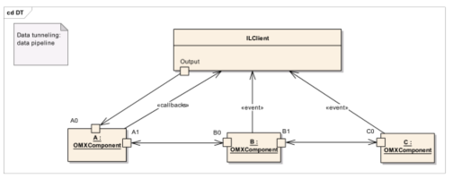

**Figure 3-4. Example of Data Tunneling Among OpenMAX Components**

Note that all callbacks are always directed to and managed by the IL client when ports communicate using proprietary or tunneled communication. The tunneling setup and initialization require a detailed description, based on the following steps:

- The components are constructed with the calls to OMX_GetHandle.
- The components are tunneled, linking an output port of the first component to an input port of the second component. The port that shall supply the buffer is decided in this phase.
- The IL client may override the input ports’ choice of buffer supplier after OMX_SetupTunnel has completed by setting the buffer supplier into the input port, which in turn will reprogram the supplier to the output port..

During the transition from OMX_StateLoaded to OMX_StateIdle, each component shall not transition until the required buffers on all enabled ports have been allocated.

OMX_SetupTunnel shall be executed only when the components are in the OMX_StateLoaded state or when ports are disabled. Figure 3-5 illustrates the setup process:

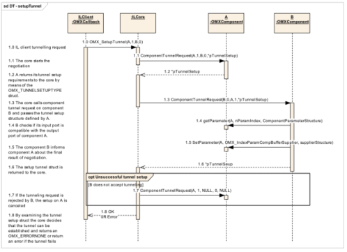

**Figure 3-5. Tunnel Setup**
The IL client shall start the data setup process by calling the OMX_SetupTunnel
function of the IL core when the components that are being tunneled are in the
OMX_StateLoaded state (step 1.0).

As a result, the IL core shall call the ComponentTunnelRequest methods of
component A and B in sequence. The structure OMX_TUNNELSETUPTYPE defined in
section 3.1.2.9 shall be passed by the IL core to the component with the output port first.
The component receiving such a call shall fill in the structure and return it to the core. If
the ComponentTunnelRequest call returns successfully, the IL core shall call the
same function on the second component (1.3), passing the OMX_TUNNELSETUPTYPE
structure that was filled in by the first component. The component also shall check that
the output port of the peer component is compatible with its input port (i.e., the data type
should be the same) (1.4). If the tunnel setup parameters included in the structure are
agreed to by the second component, the ComponentTunnelRequest call will send
back to the first component the result of negotiation (1.5) and returns successfully (1.6).
The IL core shall check that both calls of ComponentTunnelRequest did not return
errors. If so, the initial OMX_SetupTunnel will return successfully.

If the call to ComponentTunnelRequest on component B fails, component A will
be set to not tunnel by a second call to ComponentTunnelRequest with a pointer to
NULL in place of the component B handle and pTunnelSetup parameter.


After the successful tunnel setup, the IL client may override the buffer supplier
negotiation with the procedure illustrated in Figure 3-6:

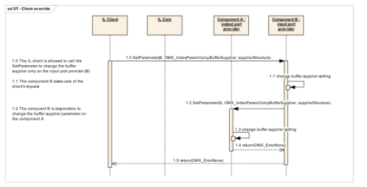

**Figure 3-6. IL Client Buffer Supplier Override**

If the IL client wants to override the negotiation of tunneled components that specifies
which component is the buffer supplier, it shall call the function SetParameter on the
component that provides the input port. That component is responsible for signaling to
the other tunneled component the new buffer supplier, with the same call to
SetParameter.

The last step of the tunnel initialization phase is the state transition from
OMX_StateLoaded to OMX_StateIdle that also involves the buffer allocation and
assignment. Figure 3-7 illustrates the state transition behavior in which the tunnels are
already created and configured.


**Figure 3-7. Tunneling Example**

Component A is tunneled with component B, and component B is the buffer supplier.

Component B is tunneled with component C, and component C is the buffer supplier.

Figure 3-8 illustrates the behavior of each tunneled component during the state transition.


**Figure 3-8. State Transition to Idle in the Case of Tunneled Component s**

Each supplier port on a component shall pass its buffers to the non-supplier port it is
tunneling with via OMX_UseBuffer. After all of its supplier ports have passed buffers,
the component waits until all of its non-supplier ports have received all of their buffers
via OMX_UseBuffer.

In Figure 3-8, component A receives the state transition request from the IL client.
Component A is tunneled with component B. The input port of B is set as buffer supplier
for the tunnel. In this case, component A shall wait until its output port receives all of the
needed buffers.

Meanwhile, the IL client asks component B to change its state. In this case, component B
has a port that is a buffer supplier, the input port, and it shall call UseBuffer on the
output port of component A. Then, component B waits for all of the needed buffers on its
output port.

Now component A has all of the needed buffers, so it can perform the state transition to
OMX_StateIdle. The exact sequence of transitions can be different, since it depends on
the platform, the operating system, and the implementation. The only rule is to wait until
all the resources are available.

The IL client requests that component C change its state. Component C behaves like
component B: Component C gives the buffers needed to component B, and then can
change its state, since it does not need any other buffers.

Finally, component B can change its state to OMX_StateIdle since it has obtained all of
the needed buffers.

###3.4.2 Data Flow
OpenMAX defines two means of data communication:

- Tunneled communication, where a port exchanges data directly with a port on another component
- Non-tunneled communication, where a port exchanges data only with the IL client 

A port may implement data tunneling via proprietary communication, taking advantage of platform-specific features. The following sections describe the data flow inherent to each means of communication.

####3.4.2.1  Non-tunneled Data Flow
An IL client that has a data buffer to deliver to a component input port shall issue an OMX_EmptyThisBuffer call.

Conversely, for the component output port, the IL client shall initially provide one or
more empty buffers into which the component can write output data; the
OMX_FillThisBuffer call accomplishes this task. As soon as one buffer is available
from the component output port, the component shall send an OMX_FillBufferDone
callback. The component is aware of the callback entry point from the earlier SetBacks
call.

Note that the IL client is entirely responsible for moving data buffers among components
if data tunneling is not used.

Figure 3-9 illustrates the dynamic behavior related to data flow.


**Figure 3-9. Data Flow Between Non-tunneled Components**

####3.4.2.2  Tunneled Data Flow
In data tunneling, OpenMAX components directly pass data buffers among themselves
without returning them to the IL client. This data flow uses a different convention from
the situation where all data buffers are exchanged with the IL client.

If the buffer supplier is the output component, it shall call OMX_EmptyThisBuffer on
the other tunneled component to pass the buffer that is to be emptied. When the input
component has terminated the operation, it shall return the buffer to the output
component by calling OMX_FillThisBuffer on it.

If the buffer supplier is the input component, the communication mechanism is the same
but is initiated by calling OMX_FillThisBuffer on the output component. Figure 3-
10 illustrates this process.

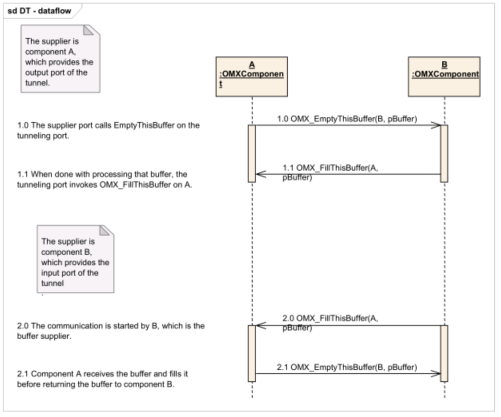

**Figure 3-10. Data Flow Between Tunneled Components**

####3.4.2.3  Proprietary Communication
On some platforms data tunneling among components can be optimized by proprietary
communication mechanisms, which can be based on specific hardware such as DMA or
shared memory. Such resources are set up in a proprietary manner during the standard
data tunneling setup phase. Although the IL client uses the standard
OMX_SetupTunnel call, platform-specific optimizations can prepare optimized
transport channels among components.

Assuming a chain of components A, B, and C that support proprietary communication,
the resulting data flow would appear as illustrated in Figure 3-11.

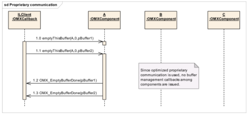

**Figure 3-11. Data Flow with Proprietary Communication Between Components**
Assuming that all components are in the OMX_StateExecuting state, the IL client sends
two buffers to component A using the OMX_EmptyThisBuffer call (steps 1.0 and
1.1). Given the data tunnel setup, the output of component A is sent to the input port of
component B. The output of component B is sent to the input port of component C, which
is the sink.

No callbacks will be invoked since the components will use their proprietary mechanisms
to move data.

The OMX_EmptyBufferDone callback will be issued to the IL client only when
component A has finished processing buffers.

Even though buffer-related callbacks are not used in this use case, note that components
may still generate events to the IL client using the OMX_EventHandler callback entry
point.

###3.4.3 De-Initialization
This section describes tunneled and non-tunneled component de-initialization.

####3.4.3.1  Non-tunneled De-initialization
When the IL client decides to stop the execution and dispose of the components, it should
first switch the components to the OMX_StateIdle state so that all buffers are returned to
their suppliers.

When the transition to OMX_StateIdle is completed, the IL client can request the
component to change its state to OMX_StateLoaded. The IL client shall free all of the
component’s buffers by calling OMX_FreeBuffer for each buffer. The
OMX_FreeBuffer function requires that the component remove the specified buffer
from the specified port. If the component allocated the buffer with an
OMX_AllocateBuffer call, the component shall also free the buffer memory. If the
IL client allocated the buffer and assigned it to the component with an OMX_UseBuffer call, then the IL client shall de-allocate the buffer memory after
calling OMX_FreeBuffer.

When all of the buffers have been freed, the component shall complete the state transition.
Finally, the IL client calls the OMX_FreeHandle function that disposes of the
component.

This procedure is performed for each non-tunneled port. Figure 3-12 illustrates non-
tunneled de-initialization.


**Figure 3-12. De-initialization of Non-tunneled Components**

A port that is tunneled shall follow the component de-initialization procedure illustrated
in section 3.4.3.2.

####3.4.3.2  Tunneled De-Initialization
Figure 3-13 illustrates the component de-initialization for a port that is tunneled.


**Figure 3-13. De-initialization of Tunneled Components**

###3.4.4 Port Disablement and Enablement
Disabling a port causes it to behave as if its component transitioned to the
OMX_StateLoaded state. Thus, all of the port’s buffers are returned to their suppliers,
and any buffers the disabled port allocated are freed. The act of enabling a port inverts
this process, putting a port that is effectively in the OMX_StateLoaded state into the
component’s state. Thus, if the component is in a state where its ports have buffers, then
an enabled port will acquire buffers. Likewise, if the component is exchanging buffers, an
enabled port will begin exchanging buffers.

Note that if a port is disabled when the component is in the OMX_StateLoaded state, the
port’s effective state is still made disjoint from the component’s state. Thus, when a
component transitions from OMX_StateLoaded to OMX_StateIdle, any disabled port will
not acquire buffers but, instead, will effectively remain in OMX_StateLoaded.
The description of port disablement and enablement is divided into tunneling and non-
tunneling cases.

####3.4.4.1  Tunneled Ports Disablement and Enablement
Figure 3-14 illustrates the behavior of enabling and disabling tunneled ports.


**Figure 3-14. Disablement and Enablement of Tunneled Ports**

####3.4.4.2  Non-tunneled Port Disablement and Enablement
Figure 3-15 illustrates the case of the disablement and enablement procedure for a non-
tunneled port. A detailed discussion of OMX_AllocateBuffer, OMX_UseBuffer,
and OMX_FreeBuffer is omitted here; for more detailed descriptions of the use of
these functions, see sections 3.3.15, 3.3.14, and 3.3.16, respectively.


Figure 3-15. Disablement and Enablement of Non-tunneled Ports

###3.4.5 Dynamic Port Reconfiguration
This section describes how a component may change its port settings dynamically.

The following examples show where this functionality is typically needed:

- A video decoder parses a sequence header and discovers the frame size of the output pictures, so buffers associated with its output ports shall be rearranged.
- The parameters of an audio stream vary dynamically, and a decoder should change its port settings.
 
Figure 3-16 shows how a video decoder and a video renderer, both of which exchange
data through the IL client, should dynamically change their port settings.

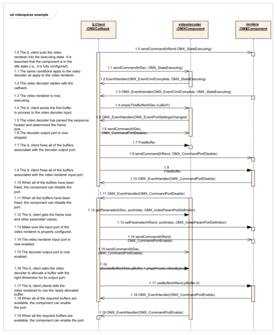

**Figure 3-16. Dynamic Port Reconfiguration**

The sequence starts with the IL client putting a video renderer and a video decoder in the
OMX_StateExecuting state (1.0 through 1.3). At this stage, the output port of the video
decoder and the input port of the renderer are not yet configured, since the dimension of the output frame is unknown a priori. The decoder needs to start parsing the input bit
stream to derive such information.

In fact, the IL client sends the first buffer to the decoder in step 1.4. Assuming that the
video sequence header is included in that first buffer, the OpenMAX decoder component
will parse it and change its output port settings accordingly.
The OpenMAX decoder component shall then notify the IL client by generating the
OMX_PortSettingsChanged event (step 1.5). As soon as the IL client receives this
callback, it shall disable the output port of the video decoder and the input port of the
video renderer (steps 1.6 through 1.11).

The IL client shall then read the new port settings with OMX_GetConfig and allocate
one or more buffers with the right dimensions for the output port. Once the buffers are
allocated, they will be also communicated to the video renderer using OMX_UseBuffer
(1.17). The input port of the video renderer shall also be set up with OMX_SetConfig
(1.18).

Finally, ports can be enabled and normal processing resumes.

###3.4.6 Resource Management
This section describes the entry points for resource management. The interface between
components and the resource manager are presented only as an example. Only the
interface between the IL client and the components is part of the OpenMAX standard
definition. An IL client may use the resource manager entry points.

Figure 3-17 proposes the behavior of an IL client that ignores the resource manager. The
resource manager handles the component internally only, and the IL client has to take no
special action.

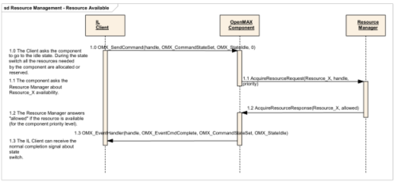

**Figure 3-17. Transition from Loaded to Idle with Resource Management**

In Figure 3-17, the IL client is unaware of the existence of a resource manager. In the
implementation of the OpenMAX component, an asynchronous call to the resource
manager is implemented.


The OpenMAX component provides a callback to the resource manager, which receives
the signal for the completion of the request.

Figure 3-17 represents a possible implementation of a resource manager, and shows how
it can be transparent to the client. The functions AcquireResourceRequest and
AcquireResourceResponse are examples. This specification is concerned only
about the interface between the IL client and the components. Details of the interactions
between the components and the vendor/specific manager(s) are outside the scope of this
specification.

Figure 3-18 presents a more complex use case.


**Figure 3-18. Busy Resource Management**

In Figure 3-18, two different OpenMAX components, A and B, need the same resource to
work, and they have different priorities. Here, as in the preceding example, the IL clients
use the standard transition from Loaded to Idle to set up the component and allocate all of
the required resources.

The first component, component A, takes ownership of the resource, requesting it from
the resource manager. Component A switches to the idle state and is ready to execute.

The second component, component B, asks for the same resource, but in this case the
resource manager denies it since a higher priority component, component A, has that
resource. This event is reported to the IL client with an error message including the value
OMX_ErrorInsufficientResources. If IL client Y decides that it needs to be
notified when this resource becomes available again, it may direct component B to
change state to OMX_StateWaitForResources. This action puts component B in a
waiting queue until the resource X will become available. Alternatively, IL client Y may
request component B to switch back to the Loaded state.

Figure 3-18 also shows the behavior of components when resource X becomes available.
Component A changes state to Loaded and releases all of the resources. The resource
manager becomes aware of the available resource and calls Component B, which is
already in the waiting queue.

When the resource manager provides the component with all the resources it is waiting
on, the component informs the IL client that all resources needed are available with an
OMX_EventResourcesAcquired event. The IL client shall now provide all of the
needed buffers to the component. Then, the component can change state by itself to
OMX_StateIdle and alert the client about the state change. This waiting queue represents
a unique case of automatic state change.

In Figure 3-18, the priorities of components A and B are not compared within the IL
layer, and no preemption mechanism is implemented or proposed; an external policy
manager, which should communicate with the resource manager, should have this
responsibility. The description of such a policy manager is outside the scope of this
document and the OpenMAX standard in general.

Figure 3-19 presents an example of a client that actively uses the resource management
API.

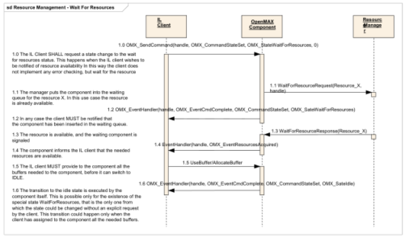

**Figure 3-19. State Change from Loaded to WaitForResources**

The IL client may request a state change from OMX_StateLoaded to
OMX_StateWaitForResources in case the IL client wants to be notified when the
resource becomes available again. For an explanation of OMX_StateWaitForResources,
see section 3.1.1.2.5.

In this case, the client puts the component into a waiting queue, handled by the resource
manager; the change to the idle state happens effectively when the resource will become available or if it is available immediately. In any case, the client receives two different
OMX_EventHandler callbacks that correspond to two different state changes.

The two functions WaitForResourceRequest and
WaitForResourceResponse in Figure 3-19 are not defined in this specification but
are examples of an interaction between components and the resource manager.

The IL client may decide to stop waiting at a certain time. In this case, it shall request the
component to change state back to Loaded, as shown in Figure 3-20.


Figure 3-20. Remove Component from Waiting Status